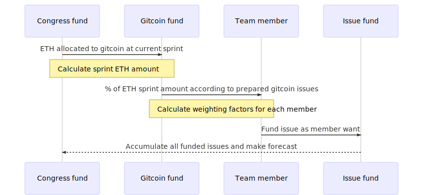

# Gitcoin processes

As an opensource development team we want to use gitcoin.co service with our projects. Here we propose processes of gitcoin using.

Every sprint we allocate amount of ETH and distribute it for a team to active using gitcoin.

> For our first attempt of using this service we distribute 1 ETH for each member.

At the next sprints we want to forecasting general amount of ETH what we want to distribute. Also we'll calculate weighting factors in dependence with issues what prepared to gitcoin push.

where:
- Em it's ETH per team member to gitcoin push ;
- Ipr it's issues prepared by member at current sprint to gitcoin push ;
- Iall it's all issues prepared to gitcoin at current sprint ;
- Eall it's ETH for team to gitcoin using.

This is not the final decision. We're stay growing. We'll planned use smart contracts to cover and automate "Gitcoin fund".
