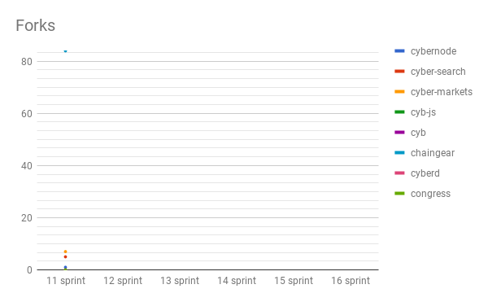

# Sprint 11 by cyber•Search
Start: 2018-05-21

End: 2018-06-01

### Сonclusion
---
We initiate every sprint reporting. Progress till MVP is 17,14%. Storypoints historical record in our team! We start to work with gitcoin.

### Changelog
---
##### [cybernode](https://github.com/cybercongress/cybernode)
##### [cyber-search](https://github.com/cybercongress/cyber-search)
[[0.6.0] - Bitcoin mempool. Improve bitcoin pump performance.](https://github.com/cybercongress/cyber-search/blob/master/CHANGELOG.md#060---bitcoin-mempool-improve-bitcoin-pump-performance)
##### [cyber-markets](https://github.com/cybercongress/cyber-markets)
[[0.3.0] - Exchanges connector, project structure](https://github.com/cybercongress/cyber-markets/blob/master/CHANGELOG.md#030---exchanges-connector-project-structure)
##### [cyb-js](https://github.com/cybercongress/cyb-js)
##### [cyb](https://github.com/cybercongress/cyb)
##### [chaingear](https://github.com/cybercongress/chaingear)
##### [cyberd](https://github.com/cybercongress/cyberd)
##### [congress](https://github.com/cybercongress/congress)
##### [library](https://github.com/cybercongress/Library)

### Developers metrics
---
##### Epics done:
- [Setup Bitcoin mempool indexation cyber-search#21](https://github.com/cybercongress/cyber-search/issues/21)
- [Store raw exchanges data cyber-markets#194](https://github.com/cybercongress/cyber-markets/issues/194)
- [Recalculate tickers using old trades cyber-markets#198](https://github.com/cybercongress/cyber-markets/issues/198)
- [Setup Ethereum mempool indexation cyber-search#22](https://github.com/cybercongress/cyber-search/issues/22)
- [Orderbooks managing cyber-markets#176](https://github.com/cybercongress/cyber-markets/issues/176)
- [Make presentation about cybernode for developers in Kiev congress#47](https://github.com/cybercongress/congress/issues/47)

##### Epics next sprint TODO:
- [Custom {chainName} support cyber-search#102](https://github.com/cybercongress/cyber-search/issues/102)
- [Unit/Integration Testing cyber-search#179](https://github.com/cybercongress/cyber-search/issues/179)
- [Cleanup docs congress#34](https://github.com/cybercongress/congress/issues/34)
- [Initial release of chaingear chaingear#960](https://github.com/cybercongress/chaingear/issues/960)
- [Token VWAP Ticker Calculation cyber-markets#192](https://github.com/cybercongress/cyber-markets/issues/192)
- [Found cyber•Congress congress#13](https://github.com/cybercongress/congress/issues/13)
- [Browser shell cyb#105](https://github.com/cybercongress/cyb/issues/105)
- [Design cyber•Style congress#32](https://github.com/cybercongress/congress/issues/32)
- [Main page cyb#108](https://github.com/cybercongress/cyb/issues/108)
- [Address balances API cyber-search#45](https://github.com/cybercongress/cyber-search/issues/45)
- [0x protocol support cyber-markets#177](https://github.com/cybercongress/cyber-markets/issues/177)
- [Work with IPFS cyber-markets#178](https://github.com/cybercongress/cyber-markets/issues/178)
- [Setup genesis CLI cybernode#24](https://github.com/cybercongress/cybernode/issues/24)

##### Till MVP progress is 17,14% (`done epics amount / epics amount`)

Burndown | Storypoints
:---: | :---:
 | 

Stars | Forks | PRs
:---: | :---: |:---:
 |  | 

##### KPI's

- cybernode: $$$ amount of pumps & dumps;

- cyber-search: 189866123 TX's in index;

- cyber-markets: $$$ trades in index (tokens);

- cyb-js: $$$ `npm` installs;

- cyb: $$$ apps + $$$ user's TX's;

- chaingear: $$$ registries total revenue;

- cyberd: $$$ chains amount

- congress: valuation;

- library: $$$ of papers;

##### Community:

- [Telegram channel](https://t.me/fuckgoogle): 0 subscribers;
- [Telegram devChat](https://t.me/fuckgoogle): 0 subscribers;
- [Steemit](): 0 subscribers;
- [Medium](https://medium.com/cyber-search): 0 subscribers;
- [Reddit](): 0 subscribers;
- [Twitter](): 0 subscribers;
- [YouTube](): 0 subscribers;

##### Gitcoin Community:

We are pleased to announce that we start to work actively with gitcoin.co. For now is 3 issues is ready for push to gitcoin and this is just beginning! We have allocate ETH for every sprint in order to active using of this service!
