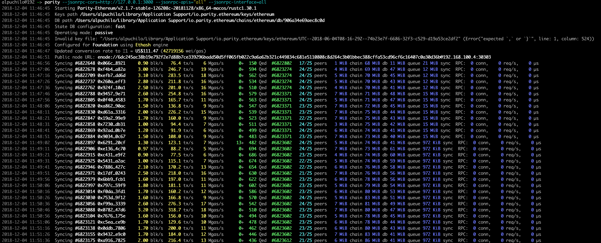

# How to add own ETH node to your Cyb

by [@savetheales](https://cyb//0x00CA47db1BE92C1072e973fd8DC4A082f7d70214.eth)

Hi! As we know from [an earlier post](https://steemit.com/web3/@savetheales/how-to-add-custom-ipfs-node-to-your-cyb) we need 3 green lights on the right side of the footer. Today we'll add ETH node to Cyb. We'll use Parity node as an example, but you can try Geth node if you feel strong enough.

### Installing Parity-node

The easiest way to install the stable version of Parity is [Homebrew](https://brew.sh/). Run this command in terminal:

`brew tap paritytech/paritytech`

`brew install parity`

Additional methods you can explore [here](https://wiki.parity.io/Setup), but I still recommend you [Homebrew](https://brew.sh/) :)

### Syncing

After successfull installation run:

`parity --jsonrpc-cors="all" --jsonrpc-apis="all" --jsonrpc-interface=all`

this command starts syncing of Parity. Actually, the node is available for use by address

`http://127.0.0.1:8545`

it can sync for 48 hours and more, it depends on your hardware and internet connection. The total size of the synced node at that moment is approximately 80 Gb. After syncing you should see something like this:

As you see `Syncing` is switched to `Imported`. It means that the node in a valid state.

### Adding port to Cyb

Launch Cyb, latest version you can download [here](https://github.com/cybercongress/cyb/releases) if you still not have it :). Type `settings.cyb` in a search field or click on a gear at the top right side.

You need to insert this address `http://127.0.0.1:8545` opposite `ETH NODE` like this:

That's it ;)

Now you run your own node and use it with Cyb ;)

2 of 3, move on! ;)

