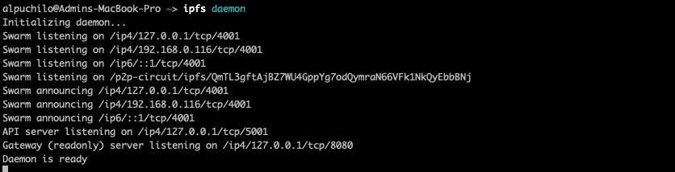
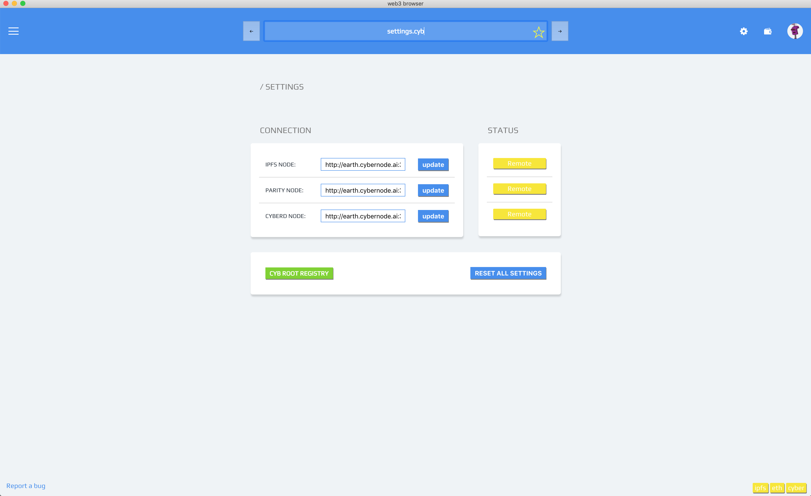
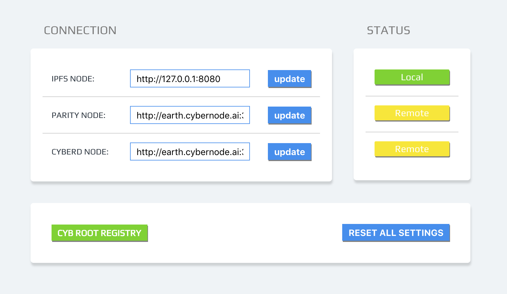

# How to add custom ipfs node to your Cyb

by [@savetheales](cyb://0x00CA47db1BE92C1072e973fd8DC4A082f7d70214.eth)

[← Previous post](https://steemit.com/web3/@savetheales/how-to-open-ipfs-link-using-cyb)

Hey everyone! Today we'll make the glorious step into adulthood! The greatest level of Cyb using is when you have 3 greenlights on the right side of footer ;)

Cyb uses color indication to show your connection status. Green indicator means that you have connection to local node, yellow one is for remote node and red one is for no connection at all.

So today we intend to add local IPFS node to our Cyb.

1. IPFS installing

First of all we need to install and initiate IPFS node. If you've  already did it, you can skip this section.

The easiest way to install IPFS is [homebrew](https://docs.brew.sh/Installation). All you need is just to run in your terminal

`brew install ipfs`,

 and then run

 `ipfs init` commands.

Other methods you can explore [here](https://docs.ipfs.io/introduction/install/), but I recommend you homebrew :)

Just for test you can write

`ipfs cat /ipfs/QmYwAPJzv5CZsnA625s3Xf2nemtYgPpHdWEz79ojWnPbdG/readme`

and if you see following text, everything is alright. ;)

2. Start IPFS daemon

So it's time to go online now. Write in your terminal

`ipfs daemon`

wait a few seconds. Now you should see

Good job!

3. The last step is adding local IPFS node to Cyb.

    3.1 Download [latest release](https://github.com/cybercongress/cyb/releases) according to your platform.

    3.2 Type in search field `settings.cyb` and press `Enter`. You should see something like this:
    

    `settings.cyb` means that you open settings page in `.сyb` app (same as `Qm.....Dvd.ipfs` command opens ipfs hash in app `.ipfs`.

    3.3 Here you can see addresses of your connections. Default connection type is for our cybernodes. So let's change it!. Put this `http://127.0.0.1:8080` in IPFS connection filed and click on `update` button. If everything is correct you should see:

    

Awesome!!! Now you can use your local IPFS node in Cyb!
Welcome to your adult life!

In the next post we will learn how to import Metamask account in Cyb;)

**Subscribe for our blogs:**

Steemit https://steemit.com/@cybercongress

Reddit https://www.reddit.com/r/cybercongress/

Twitter https://twitter.com/cyber_devs

Telegram channel https://t.me/cybercongress

devChat https://t.me/fuckgoogle

[← Previous post](https://steemit.com/web3/@savetheales/how-to-open-ipfs-link-using-cyb)
