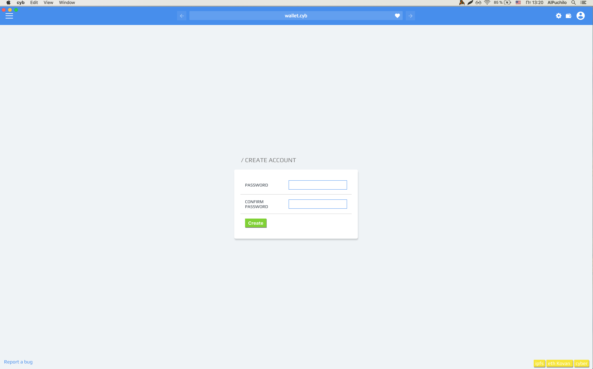
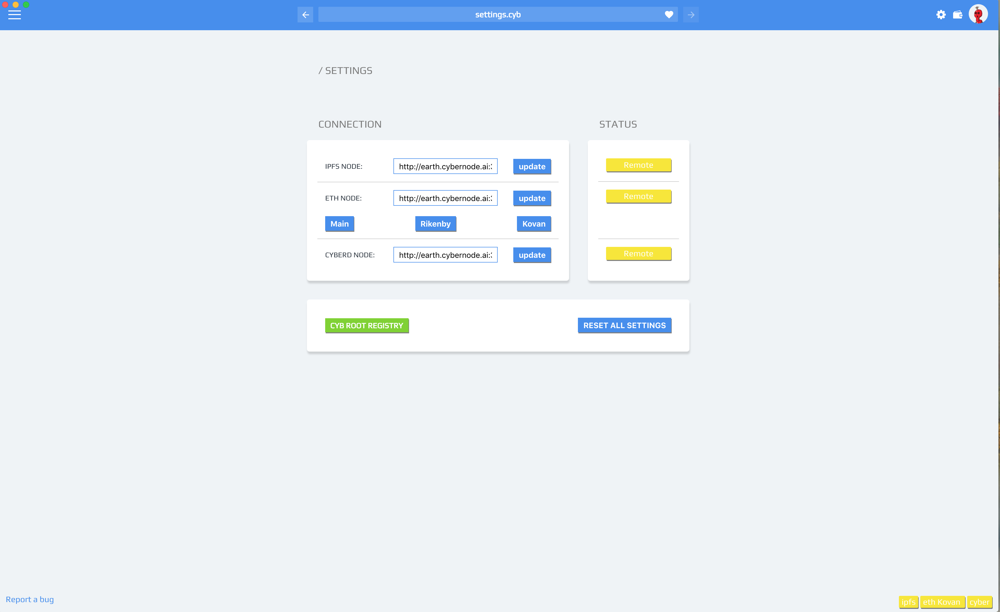

# How to play in Dragonereum with Cyb

by @savetheales and @xhipster

This article for Dragonereum players who was faced with trouble around Chrome, Mozilla, Opera + Metamask using. We want to explain why and how to play Dragonereum with a pure web3 browser.

The first question we want to address is why someone may need to use another browser instead of Chrome?

## Speed

The truth is that real blockchain gaming is brand new thing. We know that gaming require fast interactions. Blockchain interactions are slow. There is only one way to reduce issues of slow interactions in any ethereum-based application: to have a full Ethereum node :smiley: It weight some gigs, it eat some bandwidth, it eats processor for verifications. But there is one very important thing: In games like this relation of write requests to read requests is roughly about 1/100. E.g. if you do 100 tx you will probably do 10000 request. That is a lot. Hence it is better do this read requests using local verified state privately. I promise that will save you a lot of time and bring joy, gameplay and security. For free you will have tough backend to web3 backbone right on your machine. Through the history amazing gaming required better computers. Dragonereum can not be cheap by design (not yet). So if you want to become kinda professional Dragonereum gamer its better you to have a good computer with full Ethereum node.

Of course you will always be able to use some workarounds (like Infura or friends or some good folks from the game) but you always must understand that you can have better experience with better computer and broadband. I think that low comfort level is 512 GB SSD, 32 GB RAM and not so fast but stable 1 mBit connection. Average CPU and GPU is perfectly ok.

## Signing experience

That ugly Metamask window. You perfectly can live with it if you do couple of confirmations per day, but it become we biggest pain in the ass if you do 100 transactions per day. It disrupts experience of Dragon Master. Cyb signing experience right now is much more pleasant, but in future will become even better.

## Reliability

Usually gamers rely on admins to distribute the application itself. With chrome you rely on DNS. Cyb is built on top of IPFS: radically new way of file distribution across the globe. Using Cyb you will continue to play even if the site dragonerium.io one day disappears! There is nobody between you and the game! Wow! You only need to know content address of a game like this QmSGdNQFXvKhWpeGbDjWDF8hH8ujz3C5FyJhX3w7KLfk9a or use something like dragonereum.eth (to be implemented in future) and have connection to your Ethereum node! That is! you will be able to play without any exceptions.

Okey, now we can explain how to do it. Please be patient. Technology is new and nothing  works perfectly yet. C'mon, lets do it!

## 1. Launch Cyb

First of all download and install [the latest release](https://github.com/cybercongress/cyb/releases) of Cyb and don't forget about star ;)

You should see something like this:

## 2. Create password

Click on the wallet and create a password for Cyb.

Remember this password to avoid balance missing.

## 3. Backup or import private key

For playing in Dragonereum you need ETH account. Cyb created it already. You can use it or [import](https://steemit.com/web3/@savetheales/how-to-import-eth-wallet-from-metamask-to-cyb) yours.

IF YOU DECIDE TO PLAY WITH PROVIDED ACCOUNT YOU MUST BACKUP PRIVATE KEY. IF NOT => FORGET ABOUT YOUR DRAGONS! YOU STORE IT, NOT CYB!

For example: I want to import my account from Metamask. So I export private key from Metamask, here is [manual](https://steemit.com/web3/@savetheales/how-to-import-eth-wallet-from-metamask-to-cyb) how to do it.

Then click import account button in Cyb, insert private key and after few second I can see my account:

Don't worry about balance value! We'll fix it. Click on `MAKE MAIN` button to make this account active.

## 4. Establish connection

Follow this articles:
- [IPFS node in Cyb](https://steemit.com/web3/@savetheales/how-to-add-custom-ipfs-node-to-your-cyb)
- [ETH node in cyb](https://steemit.com/web3/@savetheales/how-to-add-own-eth-node-to-your-cyb)

Don't forget about the `UPDATE` button.

 Click on the `gear` button at the right top part of the screen. You must see this:

If 2 of 3 lighting green you made it!

## 5. Go back to your wallet. Now balances are valid.

## Play!

It's Dragons time! Now put following hash `QmSGdNQFXvKhWpeGbDjWDF8hH8ujz3C5FyJhX3w7KLfk9a.ipfs` in the search field and press `Enter`.

here is the Magic!

Don't forget to click the `heart` to pin game to side menu.

Good luck Dragon Master!

P.S. Cyb in Ethereum Mainnet may not be secure yet. We recommend operating accounts with small balance at your own risk.
