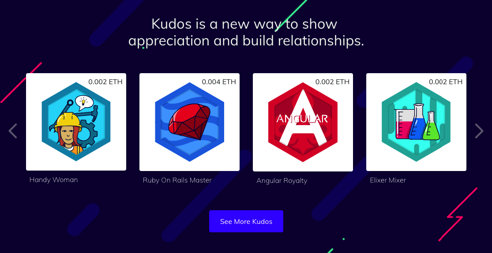
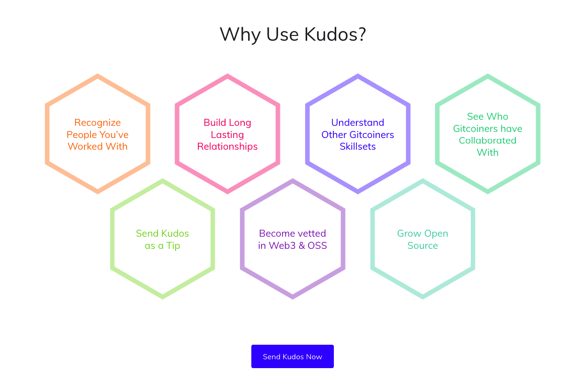

# > Warm things in cold winter
by [@savetheales](cyb://0x00CA47db1BE92C1072e973fd8DC4A082f7d70214.eth)

As I promised [here](cyb://QmPQz9DTMTKrW3vBs19wt3xn2zaecq68VbUBfA5Nw7a88v.ipfs) today I want to start series of posts around [gitcoin](https://gitcoin.co). In this article I want to tell about small but nice things what we learned at devcon iv in Prague.

So I want to ask a question: if I want to give some present to special someone to show my good attitude may I present him money or it's better to give him personal present? Keep the answer in your mind. Gitcoin want to create special bonds between developers and customers. I believe that Kudos is right way to do that. It more than working relationship. It's exactly what strong open-source community needs. Let's move inside...

Not long ago [Kudos](https://medium.com/gitcoin/introducing-kudos-10077a4f2def) was announced. It's small cards with artworks, memes, special skills and so on. For 2018/11/21 they numbered about 145 unique cards. Every card have limited quantity of copies that you can mint and send to everyone who have ETH address. All of them are available at [Kudos marketplace](https://gitcoin.co/kudos/marketplace/). So each Kudos is semi-fungible ERC721 token. I don't want to explains here tech details. If you are interested in such things you can research their [tech FAQ](https://github.com/gitcoinco/web/blob/master/docs/KUDOS.md) around smart contract.

Isn't it great? You can send kind of tips to coworker who do best and it will be more than just tips. You can confirm tech skills and you can see them! Finally you can send Kudos just for fun and collect them like stamps or whatever. This small warm things can revive development process in open-source. Moreover Kudos have own economics model:

> Creating limited production runs of Kudos allows us to manage the unit economics of Kudos. For example, it costs us $20 to pay our illustrator to create a new piece of artwork. Nobody is going to pay $20 for a Kudos NFT, so we instead offer a limited production run of 200 Kudos which are priced at $0.40 each. When that production run sells out, the artist has made gross $40 in revenue, which nets out to $20 in profit. [1]

145 exclusive Kudos is not as much as you think. I didn't find any information about how quickly new badges are developed but I have find 2 ways to create Kudos that you want.

1. You can make an [issue](https://github.com/gitcoinco/kudosbadges/issues/new) with title, inspiration picture for their designer, metadata, ETH address for GEN0 mint and small payment like 0.05 ETH or more to illustrator. How long's the wait in mainnet is unknown. For now at 2018/11/21 [there are](https://github.com/gitcoinco/kudosbadges/issues) 111 opened issues vs 1 closed :) but you can try. Actually most of them were opened by Kevin Owocki :) Full picture you can see [here](https://github.com/gitcoinco/kudosbadges/projects/1).

2. By [this method](https://github.com/gitcoinco/kudosbadges#to-create-a-new-kudos) you can create you own Badge according to latest [styleguide](https://github.com/gitcoinco/creative/blob/master/kudos_guide/kudosguide_latest.pdf) and make PR.

I will ask for our illustrator to create one and will tell you how long it was ;)

And one more sad thing around Kudos: few people use it. I understand that is just begun so we will see ;) Guys propose to  integrate Kudos in every dApp you want just by [opening an issue](https://github.com/OpenKudos/) but it is still empty. So for now Kudos is used just on Gitcoin platform and this is good I believe!

As a **conclusion** few thesis:
- you can collect and earn kawaii cards. love love love unicorns :)
- no strong decentralized mechanism of creating and minting kudos :(
- ERC721 memes :)))
- just 145???!!!
- [rubber ducky](https://gitcoin.co/kudos/145/rubber_ducky). :)))

That is for now. Join for our blogs to be on this:

Steemit https://steemit.com/@cybercongress

Reddit  https://www.reddit.com/r/cybercongress/

Twitter https://twitter.com/cyber_devs

Telegram Channel https://t.me/cybercongress

devChat https://t.me/fuckgoogle

# Links:

1. https://github.com/gitcoinco/web/blob/master/docs/KUDOS.md#are-kudos-unique
