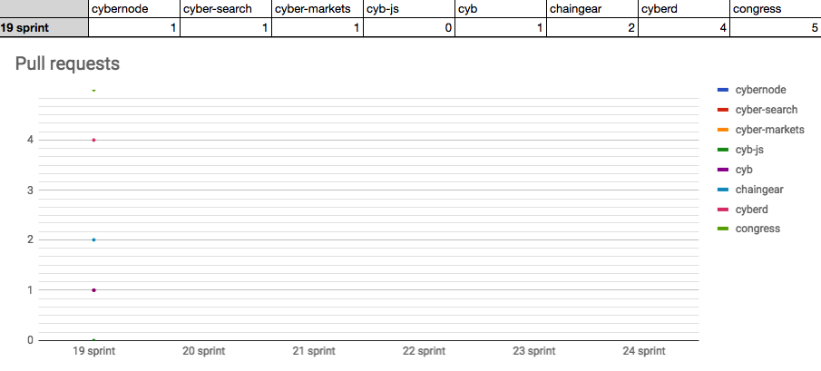

# Sprint 20 by cyber•Congress
Start: 2018-09-17

End: 2018-09-28

### Сonclusion

---
### Changelog
 - #### [First PoC of cyberd](https://github.com/cybercongress/cyberd/blob/master/CHANGELOG.md#001-2018-09-25)
 - #### [First release of Cyb](https://github.com/cybercongress/cyb/releases/tag/0.0.1)
 ---
### Developers metrics

##### Epics done:
- [CYB initial desktop release #9](https://github.com/cybercongress/cyb/issues/9)

##### Epics next sprint TODO:

- [IPFS integration #40 in cyb](https://github.com/cybercongress/cyb/issues/40)
- [Cyb navigation #41](https://github.com/cybercongress/cyb/issues/41)
- [Whitepaper 0.3 #25 of cyb](https://github.com/cybercongress/cyberd/issues/25)
- [Create cyberd PoC based on Cosmos SDK #37](https://github.com/cybercongress/cyberd/issues/37)

Burndown | Storypoints done
:---: | :---:
 | 92

Stars | Forks | PRs
:---: | :---: |:---:
 |  | 

##### KPI's
- cyberd: 1 of the 7 PoC iterations;
- cyb: yes release;
- chaingear: 0 ETH take from chaingear;
- #23 organization on gitcoin.co;
- 30 of 1000 devs in [devChat](https://t.me/fuckgoogle);

##### Community:

- [Telegram channel](https://t.me/cybercongress): 20 subscribers;
- [Telegram devChat](https://t.me/fuckgoogle): 30 subscribers;
- [Steemit](https://steemit.com/@cybercongress): 2 subscribers;
- [Reddit](https://www.reddit.com/r/cybercongress): 2 subscribers;
- [Twitter](https://twitter.com/cyber_devs): 9 subscribers;
