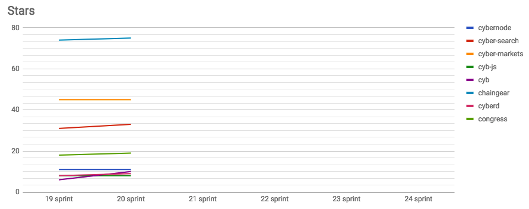

# Thorny path of open source development

Start: 2018-10-01

End: 2018-10-11

### Сonclusion

Yet another sprint where we tried to fess up to.

With our attempts to create cyberd PoC based on Cosmos SDK we [hit at performance bug of Tendermint and Cosmos](https://github.com/cybercongress/cyberd/issues/50). Moreover it's huge problems with multithreading. For now we want to add current implementation to Cyb for tests. But in spite of performance problems we'll not give up the Cosmos SDK as a base for cyberd in the near future. We intend to use it for mechanic experience in first PoC.

@xhipster analyzed 73 implementations consensus computers on a github so we have a chance to chose the best solution for us.

> Let's clean this list by following criteria:
> - highload
> - efficiency
> - public design PoS consensus
> - something about architecture
>
> Bottom line is:
> - EOS by Dan
> - Substrate by Gavin
> - Rchain by Greg
> - Solana by Anatoly
> - Cosmos by Buhman
>
> 1) I would eliminate EOS because is too lazy to redo consensus (DPOS is a piece of shit) and it cannot be over 5000 TPS.
>
> 2) Substrate is same thing. There is framework but there is no consensus. Possibility to conduct huge number of transactions is unknown.
>
> 3) Nothing bad about Rchain. Potential well thing. But there no info about performance. Need to learn new ver raw language.
>
> Remains only Solana what has none of the disadvantages. It very tiny, rapidly growing, quality designed and most importantly fast. Is not only fast as comparing with another platforms. It fast from a point of theoretical limits what possible on ONE chain [1].

As a next step we looking for Solana as base for cyberd PoC.

Next release of Cyb [was held](https://github.com/cybercongress/cyb/releases/tag/0.0.2). We added navigation for queries to cyb and cyberd. Also we added menu with apps for "Settings" button and made search bar redesign. Also fixed few bugs from previous version.

In parallel we start to work on own version Cyb based on Electron. @Pechalka propose next 10 reasons to turn down Parity UI:

> 1) Huge codebase what need to support
>
> 2) Poor integration in web3. They have own library with entangled code
>
> 3) Slow app work
>
> 4) Working just with Parity node what required installation
>
> 5) All apps stored locally on an users machines. Where no integration with IPFS. In my version I propose to open app if it on IPFS.
>
> 6) Every new version of Parity not supported by Parity UI
>
> 7) Codebase is so complicated. It's more easy to write many things from scratch.
>
> 8) Where is no good tests for all we need.
>
> 9) Where is no browser logic. It was clearly view when I attach base navigation to IPFS: no load screen, no opening file processes as pdf, video, mp3 and obvious "next", "previous", "refresh" buttons. Parity UI haven't this features and they don't think about them.
>
> 10) No possibility to work with URL's without Parity and IPFS installation. I believe it's cool feature for web3 get started. This is not clearly how to do this with their library and clear with web3 library [2].

At the current sprint we are preparing for DevCon. We want to show our Cyb with [navigation](https://github.com/cybercongress/cyb/issues/41), new version of [Whitepaper](https://github.com/cybercongress/cyberd/issues/25), [built-in keystore](https://github.com/cybercongress/cyb/issues/39) and [web3 positioning](https://github.com/cybercongress/cyb/issues/55). Also we preparing to show built-in [Chaingear](https://github.com/cybercongress/chaingear) in Cyb with updated UI.

P.S. We had a kayaking at the last weekend! :)

---
### Changelog
 - #### [Next stage of cyberd](https://github.com/cybercongress/cyberd/blob/master/CHANGELOG.md#002-2018-10-05)
 - #### [Second release of Cyb](https://github.com/cybercongress/cyb/releases/tag/0.0.2)

 ---
### Developers metrics
##### Epics done:

##### Epics next sprint TODO:

- [Web3 positioning](https://github.com/cybercongress/cyb/issues/55)
- [Cyb navigation #41](https://github.com/cybercongress/cyb/issues/41)
- [Whitepaper 0.3 #25 of cyb](https://github.com/cybercongress/cyberd/issues/25)
- [Create cyberd PoC based on Cosmos SDK #37](https://github.com/cybercongress/cyberd/issues/37)
- [Built-in keystore](https://github.com/cybercongress/cyb/issues/39)

Burndown | Storypoints done
:---: | :---:
 | 68

Stars | Forks | PRs
:---: | :---: |:---:
 |  | 

---

### KPI's
- cyberd: [1 of the 7](https://github.com/cybercongress/cyberd/blob/master/CHANGELOG.md#001-2018-09-25) PoC iteration;
- cyb: yes [release](https://github.com/cybercongress/cyb/releases/tag/0.0.2);
- chaingear: 0 of 100 ETH take from chaingear;
- [#17](https://gitcoin.co/profile/cybercongress) organization on gitcoin.co as at 2018/10/15;
- 30 of 1000 devs in [devChat](https://t.me/fuckgoogle).

---

### Community:

- [Telegram channel](https://t.me/cybercongress): 20 subscribers;
- [Telegram devChat](https://t.me/fuckgoogle): 30 subscribers;
- [Steemit](https://steemit.com/@cybercongress): 2 subscribers;
- [Reddit](https://www.reddit.com/r/cybercongress): 2 subscribers;
- [Twitter](https://twitter.com/cyber_devs): 9 subscribers;

### Links:

1. @xhipster about situation with Cosmos SDK
2. @pechalka about Parity UI
