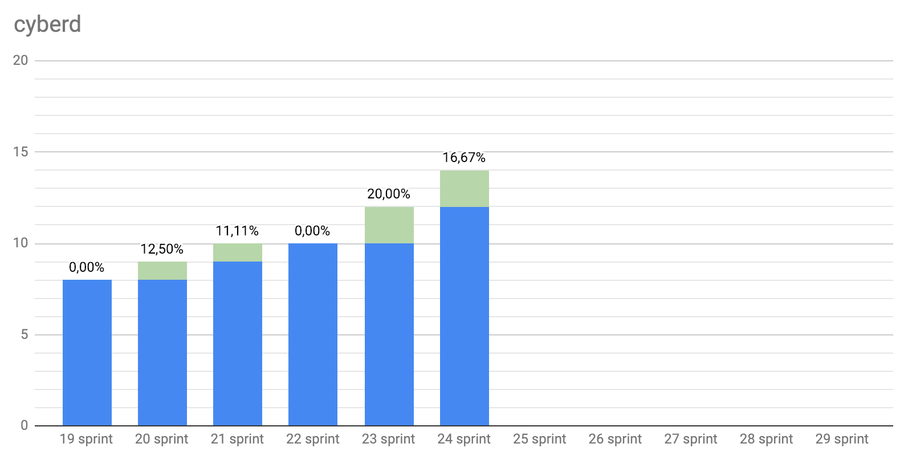
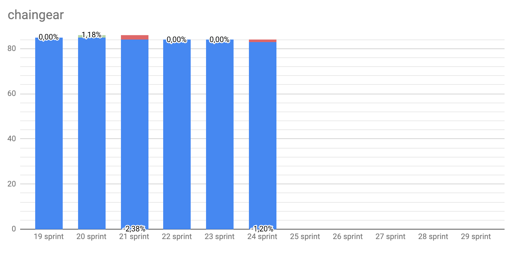
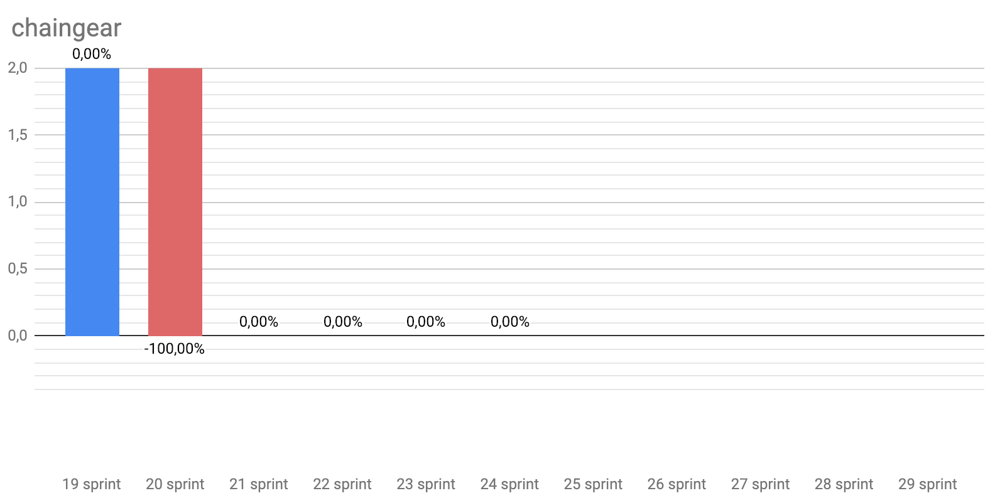
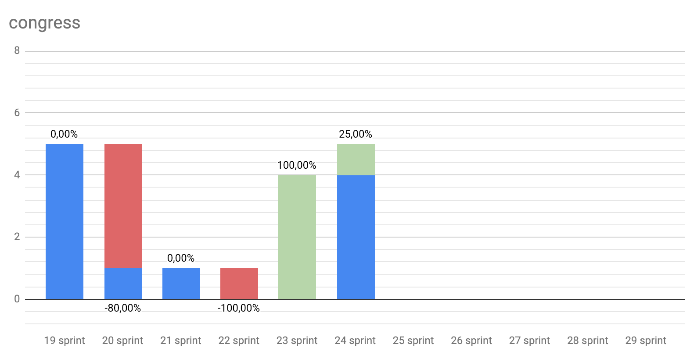

# Title

Start: 2018-11-26

End: 2018-12-17

### Сonclusion

### Changelog
 - #### [Minor fixes at cyberd](https://github.com/cybercongress/cyberd/blob/master/CHANGELOG.md#unreleased)
 - #### [Cyb Euler pre-release](https://github.com/cybercongress/cyb/releases/tag/v0.1.0)

 ---
### Developers metrics
##### Epics done:

- [Support of Dragonereum #35 cyb](https://github.com/cybercongress/cyb/issues/35)

##### Epics next sprint TODO:
- [Basic .help app #44 cyb](https://github.com/cybercongress/cyb/issues/44)
- [Launch registry of apps #998 chaingear](https://github.com/cybercongress/chaingear/issues/998)
- [Launch testnet Euler #73 cyberd](https://github.com/cybercongress/cyberd/issues/73)
- [Whitepaper 0.3 #25 cyberd](https://github.com/cybercongress/cyberd/issues/25)
- [Distribution #27 cyberd](https://github.com/cybercongress/cyberd/issues/27)
- [Update UI for chaingear app #1029 chaingear](https://github.com/cybercongress/chaingear/issues/1029)

Burndown | Storypoints done
:---: | :---:
 | 191

Stars | Forks | PRs
:---: | :---: |:---:
 | |
 | |
 | |
 | |

---

### KPI's as at 2018/12/17
- cyberd: [1 of the 7](https://github.com/cybercongress/cyberd/blob/master/CHANGELOG.md#007-2018-10-25) PoC iteration;
- cyb: yes [release](https://github.com/cybercongress/cyb/releases/tag/v0.1.0);
- chaingear: 0 of 100 ETH take from chaingear;
- [#34](https://gitcoin.co/profile/cybercongress) organization on gitcoin.co;
- 39 of 1000 devs in [devChat](https://t.me/fuckgoogle).

---

### Community:

- [Telegram channel](https://t.me/cybercongress): 27 subscribers;
- [Telegram devChat](https://t.me/fuckgoogle): 39 subscribers;
- [Steemit](https://steemit.com/@cybercongress): 9 subscribers;
- [Reddit](https://www.reddit.com/r/cybercongress): 6 subscribers;
- [Twitter](https://twitter.com/cyber_devs): 22 subscribers.

Steemit | Dev Chat | Telegram Channel
:---: | :---: |:---:
 | |

Twitter | Reddit
:---:|:---:|
|
