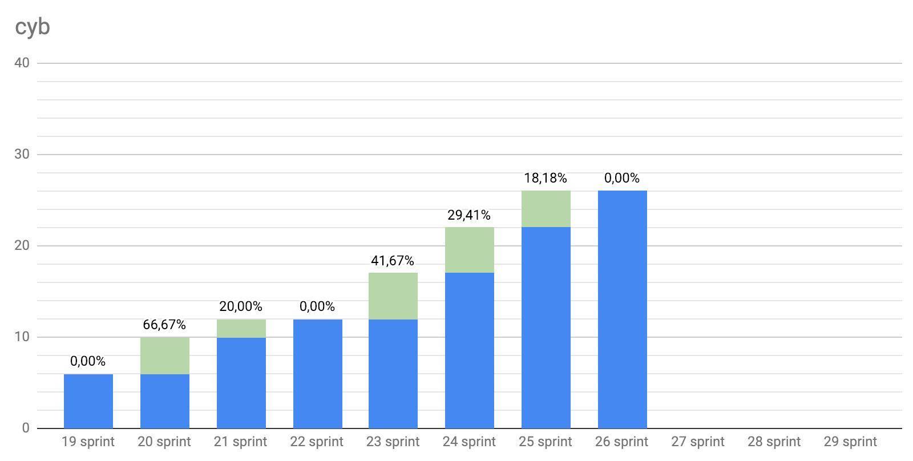
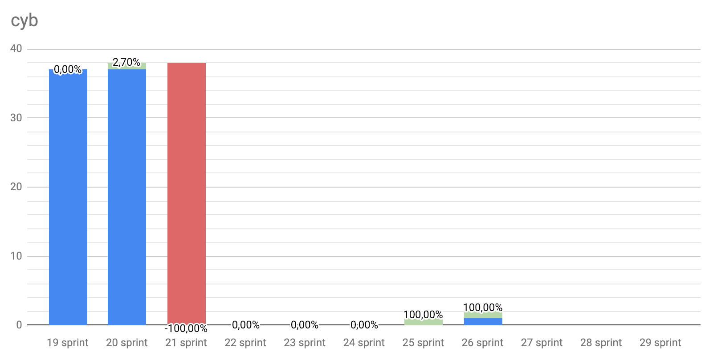
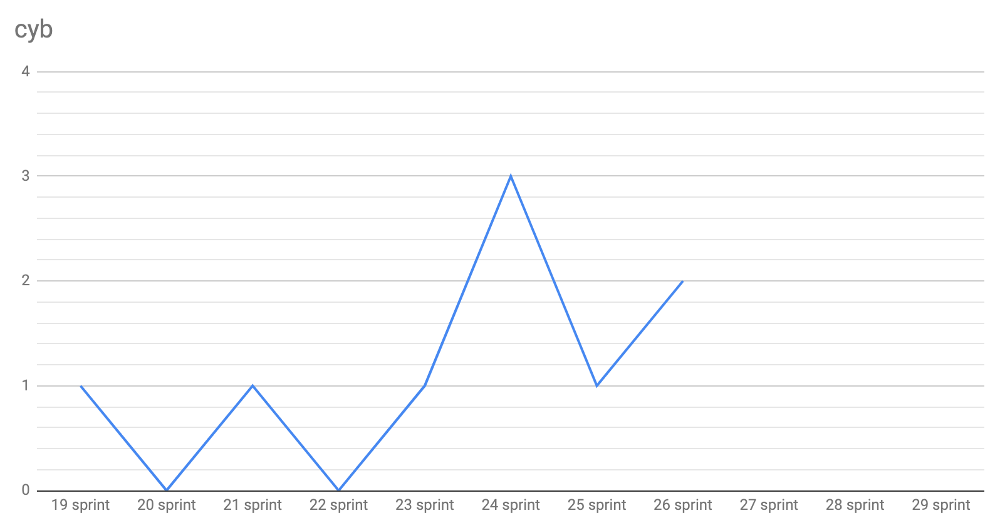
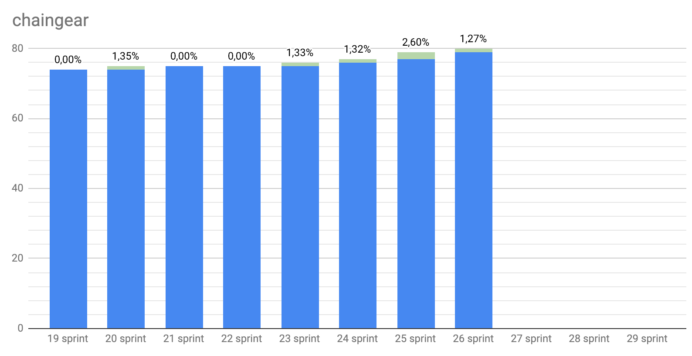

# Let's code in paradise

Start: 2019-01-08

End: 2019-01-21

### Сonclusion

Briefly.

After a successful launch we have faced a few problems with our blockchain:
- not enough validators
- rapid blocks generation
- confused naming

Good news: we have solved it already, but validators are still [welcome](https://github.com/cybercongress/cyberd/blob/master/docs/run_validator.md)!

Secondly, we've prepared a [whitepaper 0.4](https://github.com/cybercongress/cyberd/blob/master/docs/cyberd.md). It's still immature, but for launched testnet with economic incentives it makes sense.

I need to remind once again for all who care about web3 and decentralized search engine to join the discussion in our [telegram dev chat](https://t.me/fuckgoogle).

Thirdly we've updated Chaingear UI and soon it will be deployed to mainnet, so probably at my next report, I'll glad to announce you the most expensive database!

For sure it will be available in our [Cyb](https://github.com/cybercongress/cyb/releases).

Finally, our Block is near to the end and we're ready to plan new achievements for the next Block 3. The last sprint of the Block 2 has started. We are on Samui now :)

### Changelog

- #### [Cyberd bugs fixing, import private keys from Ethereum with CLI](https://github.com/cybercongress/cyberd/blob/master/CHANGELOG.md#unreleased)
- #### [Cyb release 0.1.1 bugs fixing, UPD frontend](https://github.com/cybercongress/cyb/releases/tag/v0.1.1)

 ---

### Developers metrics

##### Epics done:
- [Update UI for chaingear app #1029 chaingear](https://github.com/cybercongress/chaingear/issues/1029)
- [Landing pages for key projects #36 congress](https://github.com/cybercongress/congress/issues/36)
- [Whitepaper 0.3 #25 cyberd](https://github.com/cybercongress/cyberd/issues/25)

##### Epics next sprint TODO:
- [Deploy to mainnet #997 chaingear](https://github.com/cybercongress/chaingear/issues/997)
- [Basic articles for help.cyb #44 cyb](https://github.com/cybercongress/cyb/issues/44)
- [Simple .txqueue app #67 cyb](https://github.com/cybercongress/cyb/issues/67)
- [Bandwidth Specification Change #177 cyberd](https://github.com/cybercongress/cyberd/issues/177)
- [Web3 blog of cybercongress #162 congress](https://github.com/cybercongress/congress/issues/162)

Burndown | Storypoints done
:---: | :---:
 | 141

Stars | Forks | PRs
:---: | :---: |:---:
 | |
 | |
 | |
 | |

---

### KPI's as at 2019/01/22

- cyberd: 3 of 146 active validators (+1 jailed)
- cyb: yes [release](https://github.com/cybercongress/cyb/releases/tag/v0.1.1);
- chaingear: 0 of 100 ETH take from chaingear;
- [#39](https://gitcoin.co/profile/cybercongress) organization on gitcoin.co;
- 43 of 1000 devs in [devChat](https://t.me/fuckgoogle).

---

### Community:

- [Telegram channel](https://t.me/cybercongress): 30 subscribers;
- [Telegram devChat](https://t.me/fuckgoogle): 43 subscribers;
- [Steemit](https://steemit.com/@cybercongress): 8 subscribers;
- [Reddit](https://www.reddit.com/r/cybercongress): 6 subscribers;
- [Twitter](https://twitter.com/cyber_devs): 23 subscribers.

Steemit | Dev Chat | Telegram Channel
:---: | :---: |:---:
 | |

Twitter | Reddit
:---:|:---:|
|
