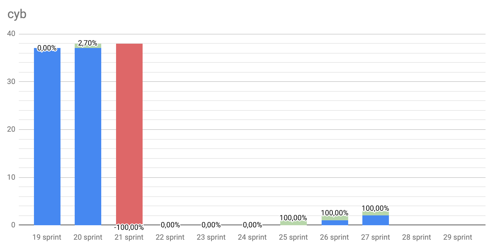
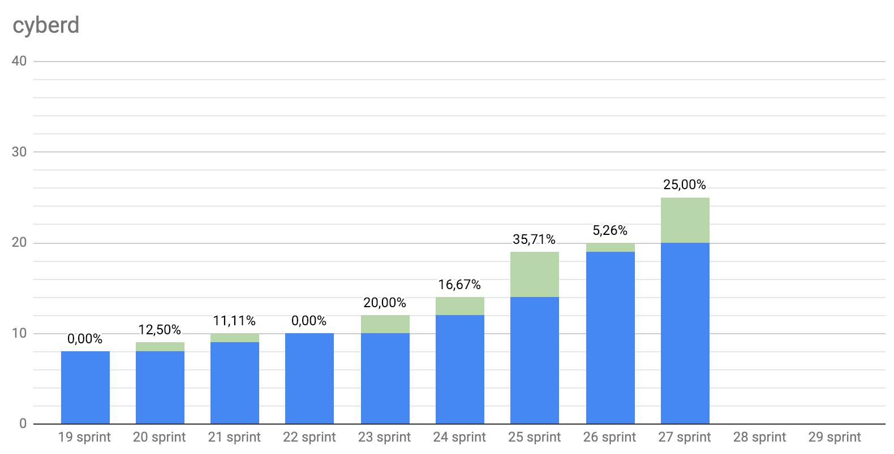
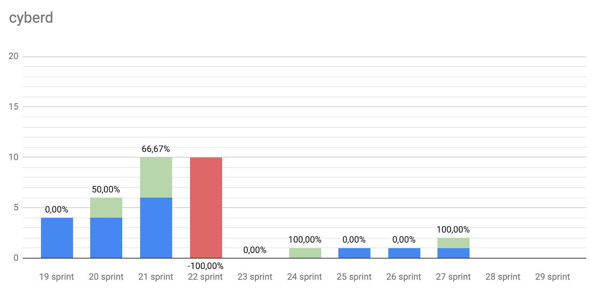
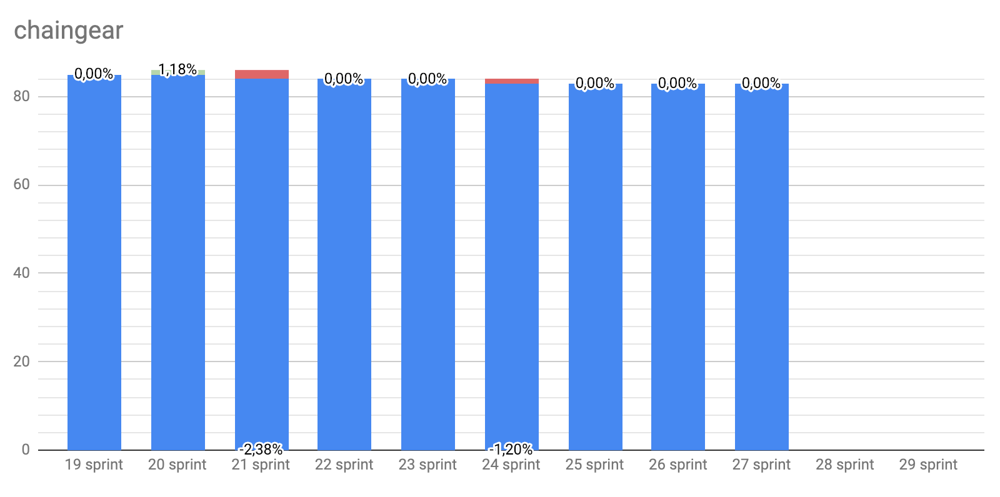
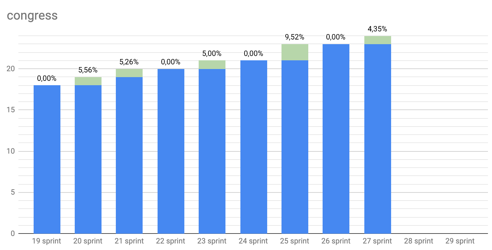
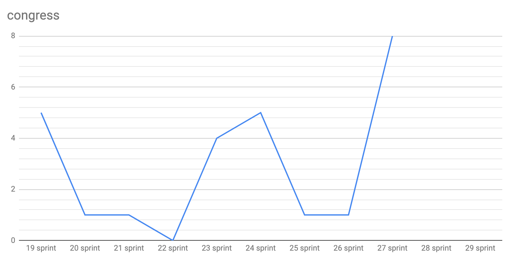
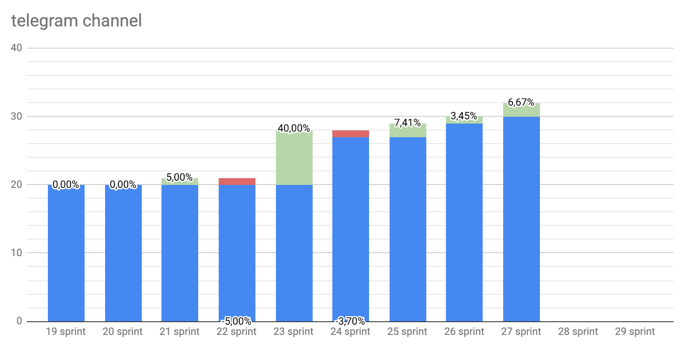
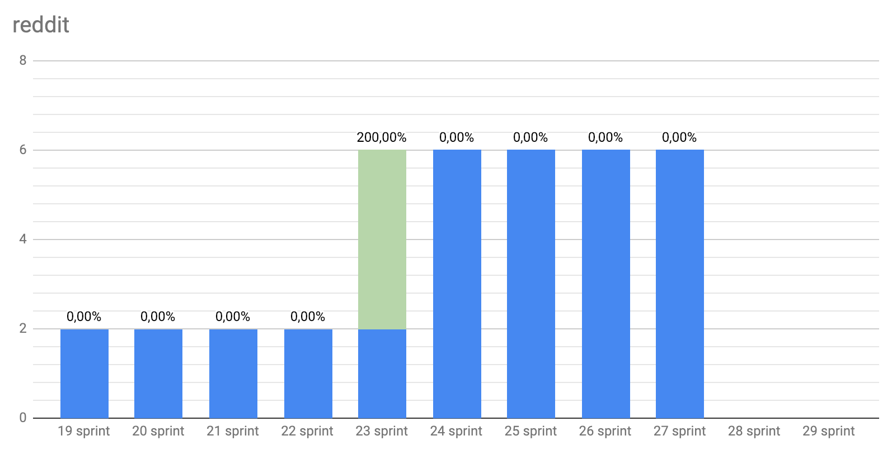

# The show must go on

Start: 2019-01-21

End: 2019-02-01

### Сonclusion

This sprint was not easy for us. We had worked on bug fixing and improvements, and, also, adapted to the new climate.

What exactly is ready?
Testnet [Euler](https://github.com/cybercongress/cyberd/releases/tag/v0.1.1) drives like hell. It's too easy now to [launch own node or validator](https://github.com/cybercongress/cyberd/blob/master/docs/run_validator.md) and start linking principally new Internet.

Is it hard to? Alright! Testnet Euler is now available in [cyb](https://github.com/cybercongress/cyb/releases/tag/v0.1.2). So you can link the new Internet with great UX.

And finally, [Chaingear](https://cloudflare-ipfs.com/ipfs/QmQmQKkPFqLS4iNiicvAqx6aJtRpYookK8iEZjojcfEqib) was deployed to [Mainnet](https://etherscan.io/address/0x02e0c94355562693b3608077732d7437bd7a78ca). This is a good reason to register some popular domain as someone already made. So `.com` and `.porn` are busy already :)

But what am I going to say?

Today, exactly today we can say: "cyber•Search destined to be"! Our 3 repos in the complex formed sustainable entrance point to web3. We have started winter round of private donates from friends because in search we trust!

### Releases

- #### [Cyberd release 0.1.1: 19 features, 10 bugs, 1 epic](https://github.com/cybercongress/cyberd/releases/tag/v0.1.1)
- #### [Cyb release 0.1.2: 4 features, 5 bugs, 1 epic](https://github.com/cybercongress/cyb/releases/tag/v0.1.2)
- #### [Chaingear release 0.1.1 in Mainnet: 1 epic](https://github.com/cybercongress/chaingear/releases)

 ---

### Developers metrics

##### Epics done:

- [Deploy to mainnet #997 chaingear](https://github.com/cybercongress/chaingear/issues/997)
- [Basic articles for help.cyb #44 cyb](https://github.com/cybercongress/cyb/issues/44)
- [Bandwidth Specification Change #177 cyberd](https://github.com/cybercongress/cyberd/issues/177)

##### Epics next sprint TODO:

- [Simple .txqueue app #67 cyb](https://github.com/cybercongress/cyb/issues/67)
- [Landing pages for key projects #36 congress](https://github.com/cybercongress/congress/issues/36)
- [Smart secret storage](https://github.com/cybercongress/cyb/issues/150)

Burndown | Storypoints done
:---: | :---:
 | 139

Stars | Forks | PRs
:---: | :---: |:---:
 | |
 | |
 | |
 | |

---

### KPI's as at 2019/02/03

- cyberd: 9 of 146 active validators (+1 jailed)
- cyb: yes [release](https://github.com/cybercongress/cyb/releases/tag/v0.1.2);
- chaingear: [20 of 100 ETH](https://etherscan.io/address/0x02e0c94355562693b3608077732d7437bd7a78ca) take from chaingear;
- [#34](https://gitcoin.co/profile/cybercongress) organization on gitcoin.co;
- 59 of 1000 devs in [devChat](https://t.me/fuckgoogle).

---

### Community:

- [Telegram channel](https://t.me/cybercongress): 32 subscribers;
- [Telegram devChat](https://t.me/fuckgoogle): 59 subscribers;
- [Steemit](https://steemit.com/@cybercongress): 9 subscribers;
- [Reddit](https://www.reddit.com/r/cybercongress): 6 subscribers;
- [Twitter](https://twitter.com/cyber_devs): 26 subscribers.

Steemit | Dev Chat | Telegram Channel
:---: | :---: |:---:
 | |

Twitter | Reddit
:---:|:---:|
|
