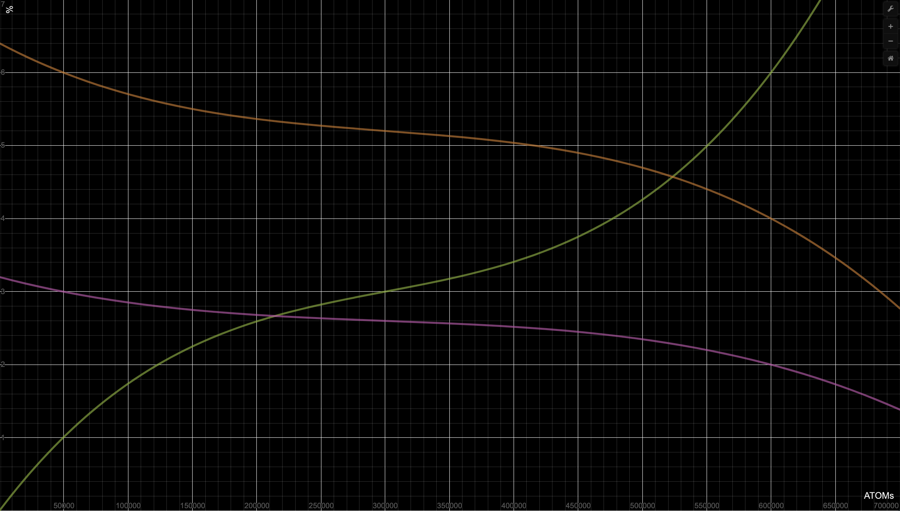

# The Game of Links. Goals, rules and provision.

Welcome to the Game of Links - the incentivize testnet of the `cyber` network run of the cyber~Congress. The main goal of the game is to win as much as possible tokens from cyber~Congress. 

## Intro

Game of Links starts with `euler-5` launch and ends when a snapshot of the network is done after the Game of Links Final. Based on the snapshot Genesis of `cyber` network will be computed independently by every validator who will decide to be a part of Genesis. Key idea of the Game of Links is to establish starting value of relevance in the knowledge graph because its crucual for getting quality search results from the inception of the network. So all disciplines are integral part of preparition and testing network before mainnet.

Goals:

- Public incentivized testing of [`cyberd`](https://github.com/cybercongress/cyberd) and [ethereum contracts](https://github.com/cybercongress/aragon-claim-app) before mainnet
- Demonstrating search with an experimental knowledge graph filled with useful cyberlinks
- Up to 6% CYB distribution for professional validators who will participate in pre-genesis takeoff funding depending on the amount of donated ATOMs
- Up to 4% CYB distribution for participants of 6 disciplines depending on how much participants win from cyber•Congress

> **! Important**

In `euler-5` testnet we'll use special named **EUL** tokens against liquid **CYB** in mainnet and **GOL** tokens against **THC** governmence tokens. EUL tokens have minor value as they serve the basis for rewards calculation during the game. GOL tokens have also tiny value as they will allow to gain some EUL during the game. GOL tokens serve (1) as a means to provide incentivized testing of ethereum contracts and (2) in order to protect faucet from spam. DO NOT spend significant funds for buying GOL during Test of Thrones & test~Auction and EUL over the counter. We'll burn GOL after `euler-5` testnet as well as reset accounts in `euler` experimental networks series.

> **! Important**

We can not guaranty that everything will goes as expected. Software can be vulnerable. So if something goes wrong cyber•Congress as organiser **has the full power** of deciding whether the game must be restarted **without any rewards** or restarted with **partial rewards** depending on circumstances. In this case we are going to count community opinion though. Please read carefully launch protocol in which we defined the rules of faults handling. More details about crisis protocol [here](https://github.com/cybercongress/launch-kit).

In order to remove confusion here is the comparison table of the names for the stuff that will happen.

| during `euler-5` testnet | during `cyber` mainnet |
| --- | --- |
| Test of Thrones | Game of Thrones |
| test\~Auction | cyber\~Auction |
| GOL token  | THC token |
| EUL token  | CYB token |
| Takeoff funding | not applicable|

We believe that such measures will help reduce risks associated with the usage of Aragon contracts, Aragon plugins, cyberd software and multisig accounts involved. Thanks for understanding.

## How to join

There is no face control or KYC for joining the Game. You just need a tool for playing and tokens. You can join the Game as:

- Validator. [Set up]() your own node and start validation.
- Great Web Agent. The builder of Great Web. Migrate the content from web2 to the Great Web or create yours, and make it searchable. You can link your content with [browser extension](), [web app](), and with [CLI]().

How to get tokens you can explore [below](./game-of-links.md/#get-tokens)

## Get tokens

The distribution in the Genesis file in `euler-5` will be next:

| Group | Amount EUL |
| --- | ---: |
| gifts to Ethereum, Cosmos and Urbit communitites | 100,000,000,000,000 |
| test of Thrones in Atoms | 5,000,000,000,000 |
| GOL stakers | 35,000,000,000,000 |
| Takeoff funding | 180,000,000,000,000 |

Total Genesis supply is 320,000,000,000,000 EULs or 320 TEULs.

The distribution across GOL stakers will be:

First of all, you need to check your ETH and ATOM addresses for EULs drop. Good news for Cosmos community: all addresses on **1111000** Cosmos network block snapshot will get EULs for free. You can check it by importing your Cosmos seed phrase to `cyberd cli` or by adding your ledger device to `cyberdcli`. The Ethereum community much more than Cosmos, so they get eight times more of Cosmos. But not all of them. To avoid details let say that all non-contracts addresses with a balance higher than 0.2 ETH and at least one outgoing transaction at Ethereum network block **8080808** snapshot will get the tokens by quadratic distribution rule. For more details welcome to [launch kit](https://github.com/cybercongress/launch-kit). Check the drop by importing your Ethereum private key in `cyberd cli`. Also, you can check your ETH address with Urbit galaxies, stars or planets if you have them. Every account which holds galaxies (30%), stars (30%), or planets (40%) at block *N* according to the number of objects will be bestowed.

Secondly, if you were a validator in previous testnet `Euler-4`, for you allocated 0.27% of Genesis supply. Check your addresses which you setup validator(s) by importing seed phrase in `cyberd cli`.

Finally, if your case not listed above you can buy tokens at the Auction. Every day some percent of tokens will up to the Auction. After daily round tokens will drop to each address participated in the round according to shares of participators.

## Provision of the Game

The Game will start with `euler-5` network launch.

`euler-5` Genesis file will contain:
- all gifts to Ethereum and Cosmos communities
- allocation to cyber\~Congress team, investors, and inventors
- validators lifetime rewards from `Euler-4`

For newcomers, we'll propose to get some EUL tokens during the Test of Thrones, test\~Auction as faucet facilities. We expect that in the test\~Auction, newbies can buy EULs or GOLs for uAtoms and Szabos. 

The takeoff funding will start after approving the government proposal of takeoff funding start and will prolong during 1 of 2 control events happens:

-  90 days will be passed after the takeoff funding start
-  600,000 ATOMs well be donated

After the end of the takeoff funding, we will distribute test EUL tokens for participators of the takeoff funding and the final round of the Game of Links will start.

At this time will come key gamers with significant stakes and make a powerful impact on the Game results.

The final round will be playing for 21 days after EULs distribution.

## Takeoff funding and disciplines incentives

Takeoff funding has 3 key goals:
- bootstrapping genesis validator set
- definition of allocation for seed investment participants
- definition of monetary allocation to Game of Links participants

The development of the project has been done thanks to investments of 8 people. ~3200 ETH has been spent during almost 3 years of development. For that at least 4% CYB is allocated for them by means of THC from cyber•Congress allocation. In order to protect seed investors their share will be defined based on the amount raised during takeoff round. In essence, the funding round curve(green curve) defines the allocation of up to 6% CYB for takeoff participants. If takeoff round get 600k ATOMs than seed investors(orange curve) get 4% of CYB by the means of THC and takeoff participants get 6% of CYB directly. If zero amount will be raised seed investors get 9.7% (10% minus community pool allocation). The interesting thing is that if amount raised will be below 100k ATOMs participants will have better price when seed investors. In such case seed investors get compensation by gaining more stake though.

[link to interactive plot](https://www.desmos.com/calculator/quvf5h7vae)

The same story with cyber~Congress (orange curve) and inventors of the project (purple curve) except at least 2% as protection and 20% of takeoff funding change in additional bonus.

Participants, which want to get CYBs in Genesis file of mainnet but cannot play, can donate ATOMs, therefore, increasing the percentage of payouts for other participants and for themselves.

The Game result and distribution significantly influenced by the Takeoff funding results. If 600k ATOM is raised during takeoff round 10% of CYB will be distributed. The logic is the following: the more amount raised the more rewards game of stakes acquire. The following criteria form a basis for payouts in the Game of Links

| Group | Amount CYB (up to) |
| --- | ---: |
| takeoff funding | 60,000,000,000,000 |
|*disciplines*||
| relevance | 15,000,000,000,000 |
| load | 6,000,000,000,000 |
| delegation | 5,000,000,000,000 |
| lifetime | 2,000,000,000,000 |
| *other* ||
| full validator set | 5,000,000,000,000 |
| `euler-4` rewards | 5,000,000,000,000 |
| community pool | 2,000,000,000,000 |

## Type of disciplines

There are four disciplines for playing in the Game of Links:

-  The relevance of links submitted
-  A bandwidth load of every participant
-  Amount of delegated to validators
-  Life summary of every validator

There are no limits in disciplines quantity participation. By all means.
You can set up your own validator to get a reward for validator's uptime or you can link CIDs  and load network bandwidth. You can create a promotion around your validator and collect stakes from users. You can do all of those things together. Just play and monitor the results.

## Full validator set
If the set of validators will increase up to 100 and this amount can last during 10000 blocks we will allocate an additional 2 TCYB to validators who take part in genesis evenly. If this amount will increase to 146 under the same conditions we will allocate additional 3 TCYB.

## `euler-4` rewards
Thanks for helping our early validators in `euler-4` testnet. They're running their nodes for the year for the Great future 

## Community pool

2 TCYB allocated to the community pool in `cyber` networkd. During euler-5 we expect from community some experiments with governance. All governance decisions of testnet will be migrated to mainnet.

## Monitor funding process

The mainnet Genesis file depends on Funding process in `Euler-5`, in particular, how many tokens will allocate for the Game of Links results. Here is an example table of possible results of funding process:

| ATOMs donated | % of desireble | Lifetime rewards | Load reward | Stake reward | Link reward |
| ---: | ---: | ---: | ---: |---: |---: |
| 600,000 | 100 | 2 TCYB | 6 TCYB | 5 TCYB | 15 TCYB |
| 480,000 | 80  | 1.6 TCYB | 4.8 TCYB  | 4 TCYB | 12 TCYB |
| 240,000 | 40  | 0.8 TCYB | 2.4 TCYB  | 2 TCYB | 4 TCYB  |
| 120,000 | 20  | 0.4 TCYB | 1.2 TCYB  | 1 TCYB | 2 TCYB  |

Other possible cases calculated the same way.

After funding, donaters ATOMs rewards supposed according to their shares and timestamp of donating.

If for any reason the sum of 600,000 ATOMs couldn't be reached the difference goes to the congress team, investors and inventors according to plot above.

## Lifetime summary of every validator

The easiest discipline. You need just set up your validator and monitor its lifetime. The lifetime means validators blocks precommits.

> Important! Your validator should be in the set of active validators! Watch your stake!

By following formula calculated each validator reward in the block *n* if precommit was and 600,000 ATOMs collected:

The *r* is reward for vlidator at block *n*, the  is the latest block of the Game, and *V* the amount of validators on block *n*.

We need to divide the allocated supply to the sum of blocks in the Game period and to the sum of precommits in the current block.

For example, if you have an active validator from the start of the Game of Links till the end without any block missing and other validators do the same way and it funded 600,000 ATOMs on the Auction you will get

in the Genesis file of `cyber` network.

## A bandwidth load of every participant

Easy too. According to our resource credits model, there are no transaction fees. We use bandwidth. The user bandwidth value is the ability of users to send messages, make links and do transactions.

Each message type has assigned bandwidth cost. For this discipline we're using ONLY bandwidth spend to linking.

All bandwidth spending data available at ? RPC/LCD. After the game 6 TCYBs will be distributed to players addresses according to their weight coefficient, other words according to how much they spent. It decreases if the network has a low load and increase if high between 0.01 and inf.

The network has desirable bandwidth in 24 h, so if current bandwidth equals this value it means normal, and the multiplier parameter is 1.00. In other cases, the multiplier is correcting for uploading or downloading the network.

The multiplier value recalculates every minute according to network load last 24 h window. You can always find it on the Game monitors.

User bandwidth depends on its stake as :

formula

The genesis  param available at [launch-kit](https://github.com/cybercongress/launch-kit/tree/0.1.0/params) repo.

## Amount of delegated to validators

Validators can earn a reputation in their lifetime rate and infrastructure. It's somekind of promoting their services in early community. We'll allocate up to 5 TCYBs proportionally staked tokens on validators at the last block in the Game.

## The relevance of links submitted

The most interesting part of the Game. Users can link everything that they believe important for the future web.

There are up to 15 TCYBs allocated for the top 1000 CIDs and top 10 agents linked with that CIDs.

CYBs will be distributed by top CID by a power law:

This way we can calculate allocation to the top one CID with Euler's method for the sum of harmonic series like:

Where  is Euler–Mascheroni constant =0.57721...,  which approaches 0 as *k* goes to infinity. 

Then, those CYBs will be distributed to top 10 agents by time of submitted links.

> Notice! Only available for reading hashes take part in the Game. Make sure that your content pinned and responded.

## Conclusion