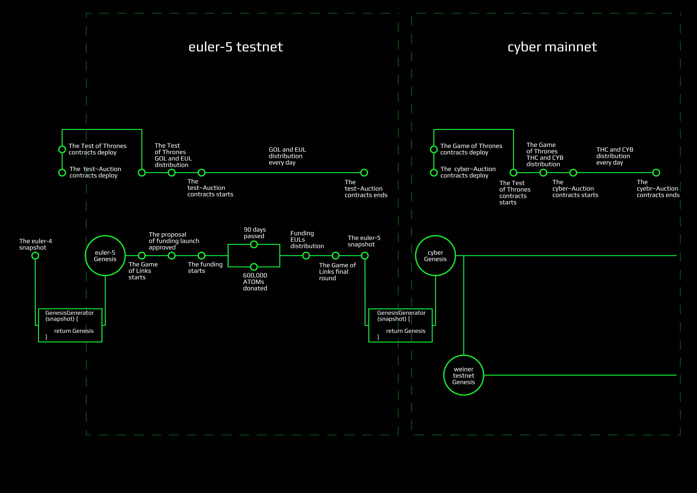
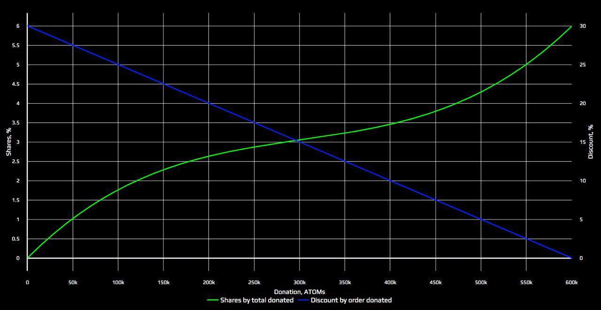
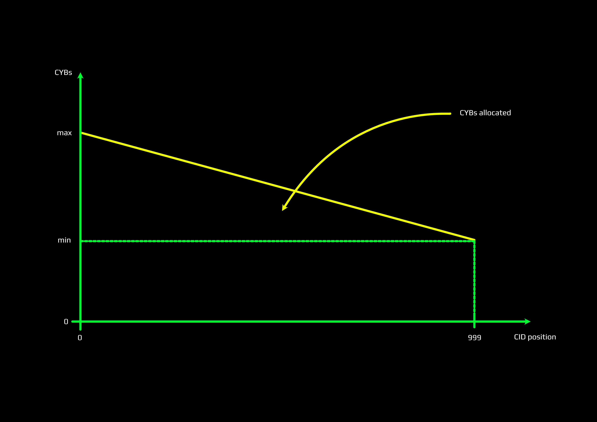

# The Game of Links. Goals, rules and provision.

## Intro

Game of Links starts with `euler-5` launch and ends when a snapshot of the network is done after the Game of Links Final. Based on the snapshot Genesis of `cyber` network will be computed independently by every validator who will decide to be a part of Genesis. Key idea of the Game of Links is to establish starting value of relevance in the knowledge graph because its crucual for getting quality search results from the inception of the network. So all disciplines are integral part of preparition and testing network before mainnet.

Goals:

- Public incentivized testing of [`cyberd`](https://github.com/cybercongress/cyberd) and [ethereum contracts](https://github.com/cybercongress/aragon-claim-app) before mainnet
- Demonstrating search with an experimental knowledge graph filled with useful cyberlinks
- Up to 6% CYB distribution for professional validators who will participate in pre-genesis takeoff funding depending on the amount of donated ATOMs
- Up to 4% CYB distribution for participants of 6 disciplines depending on how much participants win from cyber•Congress

> **! Important**

In `euler-5` testnet we'll use special named **EUL** tokens against liquid **CYB** in mainnet and **GOL** tokens against **THC** governmence tokens. EUL tokens have minor value as they serve the basis for rewards calculation during the game. GOL tokens have also tiny value as they will allow to gain some EUL during the game. GOL tokens serve (1) as a means to provide incentivized testing of ethereum contracts and (2) in order to protect faucet from spam. DO NOT spend significant funds for buying GOL during Test of Thrones & test~Auction and EUL over the counter. We'll burn GOL after `euler-5` testnet as well as reset accounts in `euler` experimental networks series.

> **! Important**

We can not guaranty that everything will goes as expected. Software can be vulnerable. So if something goes wrong cyber•Congress as organiser **has the full power** of deciding whether the game must be restarted **without any rewards** or restarted with **partial rewards** depending on circumstances. In this case we are going to count community opinion though. Please read carefully launch protocol in which we defined the rules of faults handling.

In order to remove confusion here is the comparison table of the names for the stuff that will happen.

| during `euler-5` testnet | during `cyber` mainnet |
| --- | --- |
| Test of Thrones | Game of Thrones |
| test\~Auction | cyber\~Auction |
| GOL token  | THC token |
| EUL token  | CYB token |
| Takeoff funding | not applicable|

We believe that such measures will help reduce risks associated with the usage of Aragon contracts, Aragon plugins, cyberd software and multisig accounts involved. Thanks for understanding.

## Provision of the Game

As shown in figure above the Game start with `euler-5` launch and the Game of Thrones auction.

`euler-5` Genesis file will contain:
- all gifts to Ethereum and Cosmos communities
- allocation to cyber\~Congress
- validators lifetime rewards from `Euler-4`

For newcomers, we'll propose to get some EUL tokens during the Test of Thrones, test\~Auction as faucet facilities. We expect that in the test\~Auction, newbies can buy EULs or GOLs for uAtoms and Szabos.

The Funding will start after approving the government proposal of Funding start and will prolong during 1 of 2 control events happens:

-  90 days will be passed after the Game start
-  600,000 ATOMs well be donated after funding start

After the end of the Funding, we will distribute test EUL tokens for participators of the Funding and the final round of the Game of Links will start.

At this time will come key gamers with significant stakes and make a powerful impact on the Game results.

## Takeoff funding and disciplines incentives

Takeoff funding has 3 key goals:
- bootstraping genesis validator set
- definition of allocation for seed investment participants
- definition of monetary allocation to Game of Links participants

The development of the project has been done thanks to investments of 8 people. ~3200 ETH has been spend during almost 3 years of development. For that at least 4% CYB is allocated for them by means of THC from cyber•Congress allocation. In order to protect seed investors their share will be defined based on the amount raised during takeoff round. In essence the funding round curve defines allocation of up to 6% CYB for takeoff participants. If takeoff round get 600k ATOMs than seed investors get 4% of CYB by the means of THC and takeoff participants get 6% of CYB directly. If zero amount will be raised seed investors get 9.7% (10% minus community pool allocation). The interesting thing is that if amount raised will be below 100k ATOMs participants will have better price when seed investors. In such case seed investors get compensation by gaining more stake though.

Participants, which want to get CYBs in Genesis file of mainnet but cannot play, can donate ATOMs, therefore, increasing the percentage of payouts for other participants and for themselves.

The Game result and distribution significantly influenced by the Takeoff funding results. If 600k ATOM is raised during takeoff round 10% of CYB will be distributed. The logic is the following: the more amount raised the more rewards game of stakes acquire. The following criteria form a basis for payouts in the Game of Links

- Funding: up to 60 TCYB
- The relevance of links submitted: up to 20 TCYB
- Load of every participant: up to 10 TCYB
- Uptime of validators: up to 5 TCYB
- Full validator set: 7 TCYB
- Amount of delegated to validator: up to 5 TCYB
- Community pool: 3 TCYB

## Community pool

3 TCYB allocated to the community pool both in euler-5 and cyber networkd. During euler-5 we expect from community some experiments with governance. All governance decisions of testnet will be migrated to mainnet.

## Full validator set
If the set of validators will increase up to 100 and this amount can last during 10000 blocks we will allocate an additional 2 TCYB to validators who take part in genesis evenly. If this amount will increase to 146 under the same conditions we will allocate additional 5 TCYB.

## Get tokens

First of all, you need to check your ETH and ATOM addresses for CYBs drop. Good news for Cosmos community: all addresses on **N** Cosmos network block snapshot will get CYBs for free and it would be 1% of Genesis supply. You can check it by importing your Cosmos seed phrase to `cyberd cli`. The Ethereum community much more than Cosmos, so they get 9% of Genesis supply. But not all of them. To avoid details let say that all non-contracts addresses with a balance higher than 0.2 ETH and at least one outgoing transaction at Ethereum network block **F** snapshot will get the tokens. For more details welcome to [Genesis generation tool]. Check the drop by importing your Ethereum private key in `cyberd cli`.

Secondly, if you were a validator in previous testnet `Euler-4`, for you allocated 0.27% of Genesis supply. Check your addresses which you setup validator(s) by importing seed phrase in `cyberd cli`.

Finally, if your case not listed above you can buy tokens at the Auction. Every day some percent of tokens will up to the Auction. After daily round tokens will drop to each address participated in the round according to shares of participators.

> ***Few words about cyber~Auction and Funding mechanics***

## Choose disciplines for playing

There are four disciplines for playing in the Game of Links:

-  Uptime summary of every validator
-  A bandwidth load of every participant
-  Amount of delegated to validators
-  The relevance of links submitted

There are no limits in disciplines quantity participation. By all means.
You can set up your own validator to get a reward for validator's uptime or you can link CIDs  and load network bandwidth. You can create a promotion around your validator and collect stakes from users. You can do all of those things together. Just play and monitor the results.

## Monitor funding process

The mainnet Genesis file depends on Funding process in `Euler-5`, in particular, how many tokens will allocate for the Game of Links results. Here is an example table of possible results of funding process:

ATOMs donated | % of desireble | LT reward | Load reward | Stake reward | Link reward |
--- | --- | --- | --- |--- |--- |
600,000 | 100 | 3 TCYB | 3 TCYB | 3 TCYB | 6 TCYB |
480,000 | 80 | 2.4 TCYB | 2.4 TCYB | 2.4 TCYB | 4.8 TCYB |
240,000 | 40 | 1.2 TCYB | 1.2 TCYB | 1.2 TCYB | 2.4 TCYB |
120,000 | 20 | 0.6 TCYB | 0.6 TCYB | 0.6 TCYB | 1.2 TCYB |

Other possible cases calculated the same way.

After funding, donaters ATOMs rewards supposed according to their shares and timestamp of donating.

If by any reasons the sum of 600,000 ATOMs couldn't be reached the difference goes to proportionally to congress, investors and inventors.

> ***more explanations about the plot***

## Lifetime summary of every validator

The easiest discipline. You need just set up your validator and monitor its lifetime. The lifetime means validators blocks precommits.

> Important! Your validator should be in the set of active validators! Watch your stake!

By following formula calculated each validator reward in the block *k*:

We need to divide the allocated supply to the sum of blocks in the Game period and to the sum of precommits in the current block.

For example, if you have an active validator from the start of the Game of Links till the end without any block missing and other validators do the same way and it funded 500,000 ATOMs on the Auction you will get `3 TCYB / 146  = 20.55 GCYBs` in the Genesis file of mainnet.

## Load

Easy too. According to our resource credits model, there are no transaction fees. We use bandwidth. The user bandwidth value is the ability of users to send messages, make links and do transactions. The main goal of that model is to reduce daily network growth to given constant.

Each message type has assigned bandwidth cost. You can see it in the table below:

Paramtre | % of desireble | LT reward |
--- | --- | --- |
MinimumPriceMultiplier | 0.01 | minimum price number (1 means normal price) |
LinkCost | 100 | link message cost |
NonLinkCost | 5 * LinkCost | non link message cost (send, f.e.) |
TxCost | 3 * LinkCost | tx cost |
DesirableNetworkLoad | 2000 * 1000 * LinkCost | how much all users in average can spend for recover period (24h)

This way, you can calculate how much bandwidth you need to spend for, let say link something. You need to pay for the message, for the transaction and multiple it by multiplier:

The `multiplier` value recalculates every minute according to network load last 24 h window. You can always find it on the Game monitors.

> Important! The not valid transaction also consume bandwidth, but we count only bandwidth which used for successful linking.

> ***User's bandwidth calculation according to stake***

Thus, with the Game start, we'll start tracking bandwidth spent per account and after the game, distribute proportionally burned bandwidth allocated CYBs.

**Amount of delegated to validators.** Validators can earn a reputation in their lifetime rate and infrastructure. It's somekind of promoting their services in early community. We'll allocate from 0 to 3 TCYBs of Genesis mainnet supply proportionally staked tokens on validators at the last block in the Game.

## The relevance of links submitted

The most interesting part of the Game. We need to load the knowledge graph with relevant links. By relevant links means whole domains of content and knowledge as like science papers, blogs, knowledgebases and so on.

Users can link everything that they believe important for the future web.

> ***How rank works***

There are 0 to 6 TCYBs allocated for top 1000 CIDs like Google trends f.e. The difference is top 1000 will be ranked by web3 agents or users and counted during the Game.

As on picture above, you can see four accounts link some CIDs with top 1 CID with the rank 999. If it will last till the end of the Game those four accounts will get a reward proportionally their shares in Genesis file.

The same situation with all top 1000 CIDs.

The reward for the top 1000 CIDs will be decreasing slowly linearly as shown in the picture above

> Notice! Only available for reading hashes take part in the Game. Make sure that your content pinned and responded.

## Conclusion
