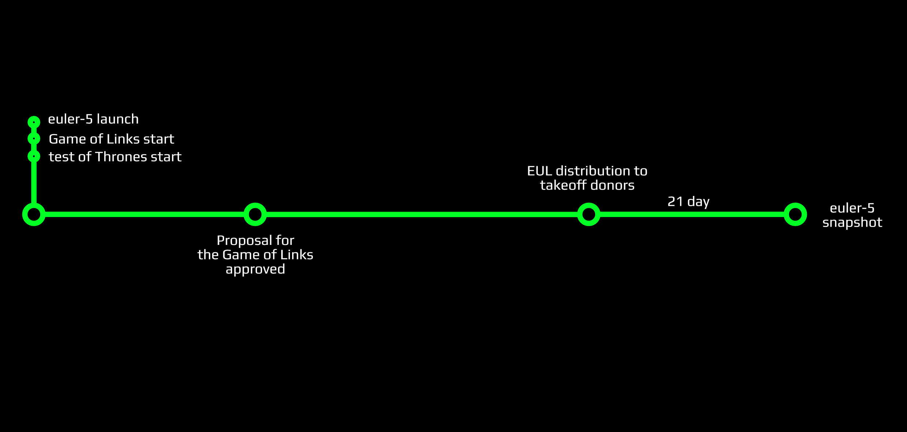
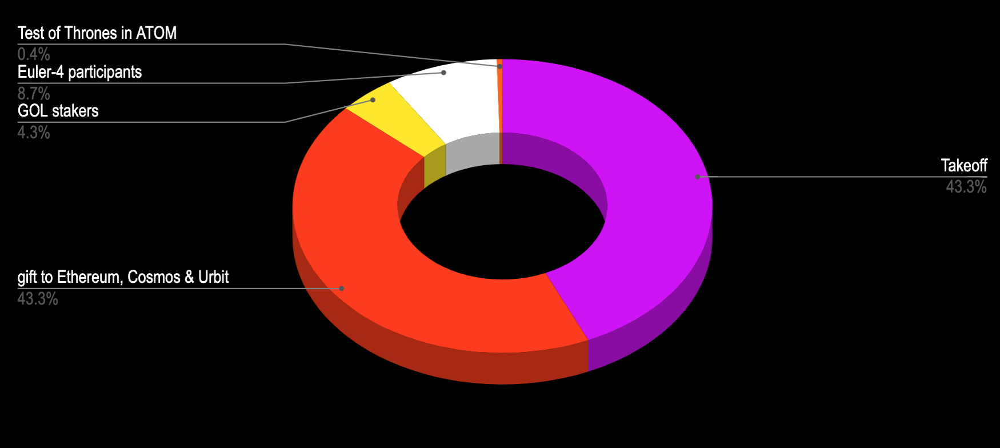
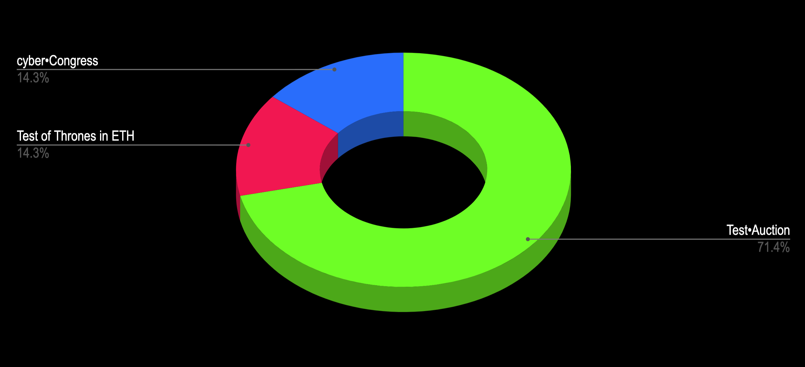
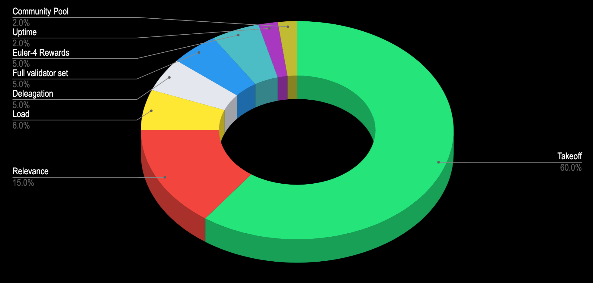

# Game of Links 
**Rules, Provision, Description and Participation**

Welcome to the Game of Links!

The game is part of the distribution games planned in our [whitepaper](https://ipfs.io/ipfs/QmceNpj6HfS81PcCaQXrFMQf7LR5FTLkdG9sbSRNy3UXoZ). In this document, we describe the purpose, the rules and the tools that are required to participate in the Game. `euler-5` is the technical name of our incentivized testnet that is required for the launch of the `cyber` network. The Game of Links is going to be held as part of the `euler-5` testnet. The game is organized by cyber\~Congress. The main goal of the participants is to win, as many tokens as possible, from cyber\~Congress and its seed donators.

## Intro

 The key idea behind the Game of Links is to establish a starting value of relevance on the knowledge graph. It is crucial for getting quality search results from the inception of the network. All the disciplines are an integral part of the preparation and testing the network before its mainnet launch.

Goals:
- To carry out publicly incentivized testing of [cyberd](https://github.com/cybercongress/cyberd) and [Ethereum contracts](https://github.com/cybercongress/aragon-claim-app) before mainnet launch
- To demonstrate the search, with the use of an experimental knowledge graph filled with useful cyberlinks
- To distribute up to 6% of CYB tokens to the validators who will participate in pre-genesis takeoff donations. The amount is dependent on the number of donated ATOMs
- To distribute up to 4% of CYB tokens to the participants of 7 disciplines of the game, depending on how many participants win against cyber\~Congress

## Provision for the Game

The Game of Links starts with the launch of `euler-5` and ends with a snapshot of the network which will be produced after the grand-finale of the Game! Based on the Genesis snapshot of `cyber` the network will be computed independently by each validator who will decide to become a part of the Genesis.

The takeoff donation will start after the approval of the governance proposal of the takeoff donation start. It will last until 1 of 2 of the controlling events happens:
- 90 days have passed after the takeoff donations start
- 600,000 ATOMs well be donated

After the end of the takeoff donations, we will distribute EUL tokens to participators of the takeoff. This will kick-off the final round of the Game of Links.

At this time, key players with significant stakes will have a powerful impact on the results of the Game.

The final round will be played for 21 days after EUL token distribution. 

## Distribution

The distribution for `euler-5` in the Genesis file, will be the following:

| Group | Amount of EUL |
| --- | ---: |
| Takeoff donations | 100,000,000,000,000 |
| Gifts to Ethereum, Cosmos and Urbit communities | 100,000,000,000,000 |
| Euler-4 validators | 20,000,000,000,000 |
| GOL stakers | 10,000,000,000,000 |
| Community pool | 2,000,000,000,000 |
| Test of Thrones in ATOMs | 1,000,000,000,000 |

The total Genesis supply is 233,000,000,000,000 EULs or 233 TEULs.

The distribution to those staking GOL tokens will be the following:

| Group | Amount of EUL |
| --- | ---: |
| test\~Auction | 6,000,000,000,000 |
| cyber\~Congress | 3,000,000,000,000 |
| Test of Thrones in ETH | 1,000,000,000,000 |

## How to participate in the Game

There is no face control, captchas or KYC to join the Game. All you need is a tool for playing and some tokens.

You may join the Game as a:
- Validator. [Set up]() your own node and start validating
- Great Web Agent. The builder of the Great Web. Migrate content from web2 to the Great Web or create your own and make it searchable. You can link your content with the help of a [browser extension](), a [web app]() or with the use of [CLI]()
- Developer. Create cool things and claim your rewards via spend proposals from the community pool

How to get the tokens and which tools to use?

There are several ways to get tokens (and several tools that you can use):
- **Gifts**. There are 100 TEULs allocated as a gift to the Cosmos, Ethereum and Urbtit communities. This is 43.3% of the `euler-5` Genesis supply. You can check your balance using `cyberdcli`, the [cyber.page]() app or via the [cyb-virus]() extension. Simply add your address to the cyber.page app to check your balance. Or, import your private key (for Ethereum) or seed phrase (for Cosmos) to the CLI or to the extension. You can also use your Ledger device with the [cyber.page](cyber.page) app and from the CLI.

The gifting rules are defined in the [whitepaper](https://ipfs.io/ipfs/QmceNpj6HfS81PcCaQXrFMQf7LR5FTLkdG9sbSRNy3UXoZ). The gifting mechanism is implemented in the [launch kit]() repo.

- **Faucets**. We want to test the production of the auction app during `euler-5` and this is a great opportunity for creating a faucet based on this app. You can obtain GOL tokens and claim EUL tokens to participate in the game. We expect a low price valuation for GOL, so you can fill your stake with Szhabos() and uAtoms(1 millionth of an ATOM).

- **Takeoff round**. You can get tokens if you will participate in the takeoff donations. There are 100 TEULs allocated for takeoff donation participants during `euler-5`. Those will be distributed at the end of the takeoff donation round and account for 43,3% of the Genesis supply. Therefore, their valuation should be much hotter in the end.

- **Be a validator**. You can obtain tokens through inflation as a validator. The `euler-4` validators get 20 TEULs in `euler-5` for their support of the network.

> **! Important**

The `euler-5` testnet will use 2 special testnet tokens. One is called `EUL`, which is a match for the liquid `CYB` mainnet token. And the second is named `GOL`, which is a match for the mainnet `THC` governance token.

The EUL tokens have little value (in regards to price value). Their main purpose is to serve as the basis for reward calculation during the Game of Links. The GOL tokens also have no significant value in terms of price. They will allow gaining EUL tokens during the game - if vested. Non-vested GOL tokens do not have any value at all. GOL tokens serve (1) as a means to provide incentivized testing of Ethereum contracts, and (2) as a spam protection mechanism for the faucet. DO NOT spend a significant amount of funds buying GOL during Test of Thrones & test~Auction and/or EUL over the counter. GOL tokens will be burned after the `euler-5` testnet is over. All accounts in the `euler` experimental networks series will be reseted. All ETH and ATOM sent to the faucet during the Game of Links are donated to cyber\~Congress.

To remove any confusion, here is a comparison table of the different naming during the test and the mainnet:

| During `euler-5` testnet | During `cyber` mainnet |
| --- | --- |
| Test of Thrones | Game of Thrones |
| test\~Auction | cyber\~Auction |
| GOL token | THC token |
| EUL token | CYB token |
| Takeoff donations | Not applicable|

These measures will help to reduce the risks associated with the use of Aragon contracts, Aragon plugins, cyberd software and the multisig accounts involved.
Thanks for understanding.

## Faucets

During the Game of Links will available consistently the Test of Thrones and test\~Auction apps as faucets. It will help us to test the contracts before mainnet launch and make easy for participants without tokens or with a small number of tokens join the Game. We've allocated 1 TEUL and 1 TGOL for Cosmos and Ethereum communities respectively for the Test of Thrones and 6 TGOL for test\~Auction. The Test of Thrones, in fact, the zero round of test\~Auction. It would last for 18 days (until 7 Jan 2020). At that time cosmonauts and ethereums can donate their native tokens, after that the EULs and GOLs will be distributed. Then retains the possibility to donate only in ETHs and claim GOLs daily for 60 days.

## Takeoff donations and disciplines incentives

The takeoff donations has 3 key goals:
- bootstrapping the genesis validator set
- definition of allocation for cyber\~Congress participants
- definition of allocation to the Game of Links participants

The results of the Game and the allocation are significantly influenced by the result of the takeoff donations. If 600k ATOM tokens have been donated during the takeoff round, 10% of CYB tokens will be allocated to the Game of Links. The logic is the following: the more has been donated, the more rewards the participants acquire, the less CYB tokens are allocated back to cyber\~Congress.

Participants that want to get CYB tokens in the Genesis file of the mainnet but cannot play can donate ATOMs. Therefore, increasing the percentage of payouts to other participants and themselves. The following formula defines the allocation for takeoff donors:

$$ f(x)= 0.000740464x^3+666.418x^2+233280000x+0.000343014$$

where $f(x)$ is the Genesis supply of CYBs allocated to takeoff donors, $x$ is the ATOMs donated during the takeoff donation round.

The development of the project has been done thanks to donations from 10 people. ~3200 ETH has been spent during the last 3 years of development. For those donations, at least 4% of CYB tokens are allocated to them via the means of THC tokens from cyber\~Congress . To protect the seed donators their share will be defined accordingly to the amount donated during the takeoff round. The donations round curve (green curve) defines the allocation of up to 6% of CYB tokens for takeoff participants. If the takeoff round gets 600k ATOMs than seed donators (blue curve)  and cyber\~Congress (orange dotted curve) get 4% of CYB supply per group via the means of THC tokens, and takeoff participants will get 6% of CYB tokens. If nothing has been donated the remaining CYB tokens are allocated to cyber\~Congress and distributed to seed donators and cyber\~Congress proportionally.

The following criteria are applied to the Game of Links allocation:

| Group | Amount CYB (up to) |
| --- | ---: |
| takeoff donations | 60,000,000,000,000 |
|*disciplines*||
| relevance | 15,000,000,000,000 |
| load | 6,000,000,000,000 |
| delegation | 5,000,000,000,000 |
| full validator set | 5,000,000,000,000 |
| `euler-4` rewards | 5,000,000,000,000 |
| lifetime | 2,000,000,000,000 |
| community pool | 2,000,000,000,000 |

## Types of disciplines

There are seven disciplines to participate in the Game of Links, which are subdivided further into 2 different types:

Depending on takeoff donations:
- The relevance of links submitted (the higher the rank of the content, the better)
- The bandwidth load of every participant (the more you link, the better)
- Life summary of every validator (the longer your uptime is, the better)
- The amount delegated to each validator (the more a validator is delegated, the better)

Independent of takeoff donations:
- Full validator set (the more validators there are, the better)
- Community pool (experiment and participate in governance)
- `euler-4` validator rewards (rewards distributed to validators for the last testnet)

There are no limits for participating. You can set up your validator node to get a reward for validators uptime or you can link CIDs and load network bandwidth. You can create any promotion around your validator and collect stakes from users. You can do all of those things together. Simply play and monitor the results.

## The relevance of links submitted

This is the most difficult discipline of the Game. Users may link everything that they believe is important for the future of the web.

Each CID has a rank with a certain weight (depending on the dynamic parameters outlined in the whitepaper). In the end, those ranks get ranged according to their weight. The higher the better.

There are up to 15 TCYBs allocated for the top 1000 CIDs and the top 10 agents that linked those CIDs.

CYB tokens will be distributed to the top 1000 CID proportionally to their ranks.

In case 600,000 ATOMs are donated:

$$ reward_{CID} = \frac{rank_{CID}}{rank_{top1000}}\cdot 15\ TCYB $$

Then the rewards will be distributed between 10 Agents in order of submitting links in accordance to the [power law](https://en.wikipedia.org/wiki/Power_law):

$$\sum\limits_{i=1}^{10}\frac{a}{i}=reward_{CID} $$

This way we can calculate allocation for the top CID using [Euler's method](https://en.wikipedia.org/wiki/Euler_method) for the sum of harmonic series:

$$a\sum\limits_{i=1}^{10}\frac{1}{i}=reward_{CID} \Rightarrow$$
$$a=\frac{reward_{CID}}{\sum\limits_{i=1}^{10}\frac{1}{i}}=\frac{reward_{CID}}{\ln i+\gamma+\epsilon_{i}}$$

Where $\gamma$ is Euler–Mascheroni constant =0.57721..., $\epsilon_{i}\sim\frac{1}{2i}$ .

> Notice! Only retrievable CIDs take part in the Game. We assume Agents should also be content providers and responsible for content availability. Please make sure that your content is pinned and responding.

## The bandwidth load of every participant

According to our resource credits model, there are no transactional fees. We use bandwidth. The value of the users' bandwidth is the ability of a user to send messages, make links and transact.

Each message type has an assigned bandwidth cost. For this discipline we're using ONLY bandwidth spend on linking.

All bandwidth spending data is available at `account_bandwidth?address=` RPC. After the game 6 TCYBs will be distributed to players addresses according to their weight coefficient (of spend bandwidth). In other words, per how much bandwidth they have spent on linking during the Game. It decreases if the network has a low load and increases if the load is high - between 0.01 and inf. That's mean you can spend the same amount of bandwidth for 1000 links in low network load as with 10 links. The bandwidth spent on linking call Karma.

The network has a desirable bandwidth of \~17280 blocks (\~24 h). If the current bandwidth is equal to this value it means everything is normal, and the multiplier parameter is 1.00. In all other cases, the multiplier is corrected dependent on the upload or the download of the network.

The value of the multiplier is recalculated every \~12 blocks (1 minute) according to the load of the network and has a \~17280 blocks (\~24 h) window. You can always find it on the Game monitors.

A users bandwidth depends on their stake:

$$ bandwidth_{user} = \frac{stake_{user}}{supply_{current}} \cdot bandwidth_{desirable}$$

The genesis $bandwidth_{desirable}$ params are available in the [launch-kit](https://github.com/cybercongress/launch-kit/tree/0.1.0/params) repo.

Users rewards, in case 600,000 ATOMs have been donated, are calculated in the following way:

$$ reward_{user} = \frac{bandwidthSpent_{user}}{bandwidthSpent_{all}}\cdot6\ TCYB $$

## Lifetime summary of every validator

The easiest discipline. You just need to set up your validator node and monitor its lifetime. The lifetime means blocks precommits of a validator.

> Important! Your validator should be in the set of active validators! Watch your stake!

The following formula calculates each validator reward in block *n* if the was a precommit, and if 600,000 ATOMs have been donated:

$$r_{n}=\frac{\frac{1}{block_{max}}\cdot 2\ TCYB}{V_{n}}$$

The *r* is a reward for validator at block *n*, the $block_{max}$ is the latest block of the Game, and *V* is the number of validators on block *n*.

We need to divide the allocated supply by the sum of the blocks during the period of the Game and by the sum of the precommits of the current block.

For example, if you have an active validator from the start of the Game of Links till its end. Haven’t missed any block. All the other validators achieve the same result. And 600,000 ATOMs have been donated on the Auction, you will get:
$$ R = \frac{2\ TCYB}{146} \approx 13.7\ GCYB$$
in the Genesis file of `cyber` network.

## Amount of delegated to each validator

Validators can earn a reputation based on their lifetime rate and infrastructure. This works as a promotion of their services to the early community. We'll allocate up to 5 TCYB, proportionally to the staked tokens on validators at the last block of the Game. If 600,000 ATOMs have been donated, every validator will get:

$$ revard_{validator} = \frac{staked_{validator}}{staked_{all}}\cdot 5\ TCYB $$

## Full validator set
If the set of validators will increase over or is equal to 100, and this number of validators can last for 10000 blocks, we will allocate an additional 2 TCYB to validators who take part in genesis. If the number of validators will increase to or over 146, under the same conditions we will allocate an additional 3 TCYB. All rewards in that discipline will be distributed to validators per capita.

## Community pool

2 TCYB are allocated to the community pool within the `cyber` network. During euler-5 we expect from the community some experiments with governance. All governance decisions of community pool spend of the testnet will be migrated to the mainnet. The issues for claiming rewards are very various. It can be features development, explorers, graph store and ranking algorithm improvements. Also, it can be marketing tasks like posting, users involving, guides and so on. Finally, it can be community building like meetups, online meetings, dev meetings, conferences, etc.

## `euler-4` rewards
A thank you to our early validators for helping to test and secure the `euler-4` testnet. They have kept their nodes running for a year for a Great future.

## Crisis protocol

We can not guarantee that everything will go as expected. The software can be vulnerable. If anything goes wrong, cyber/~Congress as the organiser of the game, **has the full power** of deciding whether the game must be restarted **without any rewards** or restarted with **partial rewards**, depending on the circumstances. In the case, such a circumstance shall arise we are going to count with community opinions.

Please read the [launch protocol]() very carefully. It defines the rules for fault handling. We define 2 danger zones with probabilities to unexpected behaviour and one zone as an intersection of the defined zones:
- Network running
- Contracts running
- The intersection of the two above

In case anything goes wrong, we've prepared a crisis protocol.

If the network will fail:
1. Stop the contracts (claim app)
2. Save `euler-5` snapshot
3. Relaunch `euler-5` with `euler-5` genesis.json
4. Start the contracts (claim app)

If the contracts will fail:
1. Stop the contracts (claim app)
2. Pool bounty
3. Redeploy the contracts (claim app)
4. Continue the auction

If everything gets fucked up from both ends, then:
1. Stop the contracts (claim app)
2. Save `euler-5` snapshot
3. One week pause for community discussions. And for cyber\~Congress to make a decision

## Conclusion

At first glance, the `euler-5` distribution and the Game rules look pretty complex. This is not true. A nice UI of [cyber.page](cyber.page) app is intended to make playing easy and clear. We expect the `cyber` network to launch with a loaded knowledge graph and a nice distribution curve. The Game will help to achieve this. This is a good chance for everyone to become an early adopter of the #fuckgoogle philosophy and the Great Web. Do it. Cyber it.

## References
1.
2.