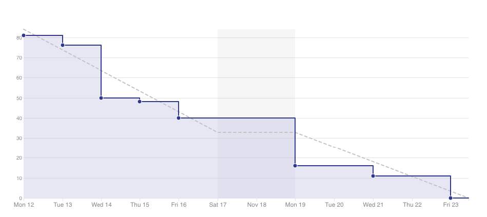
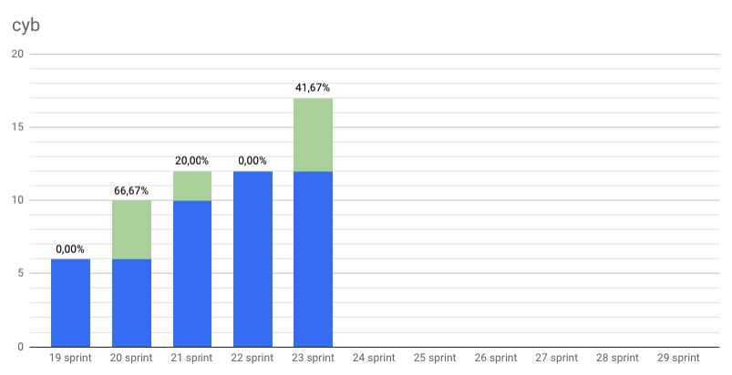
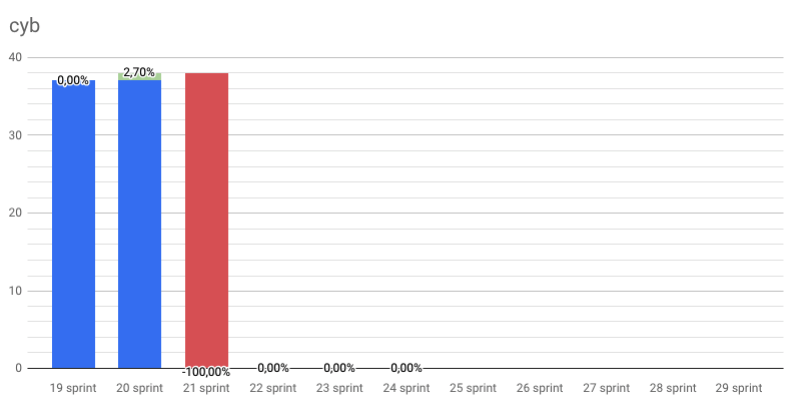
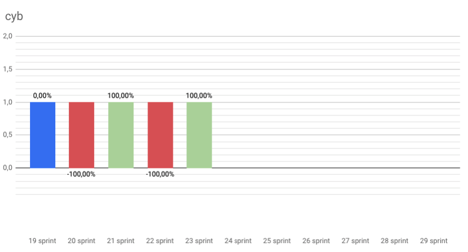
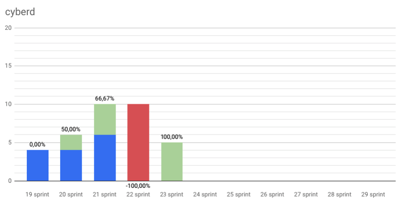
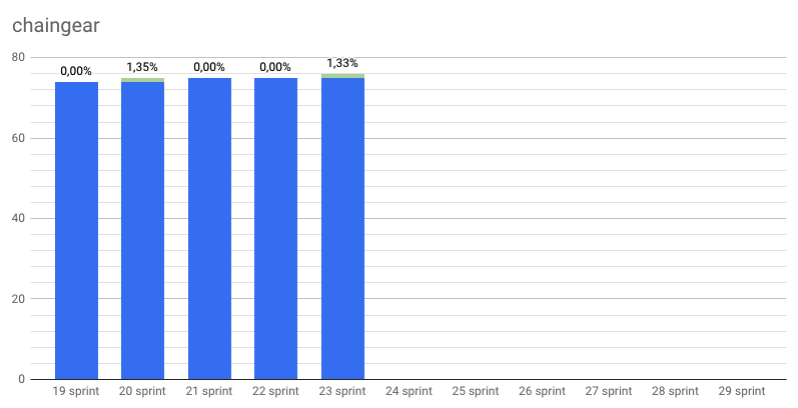
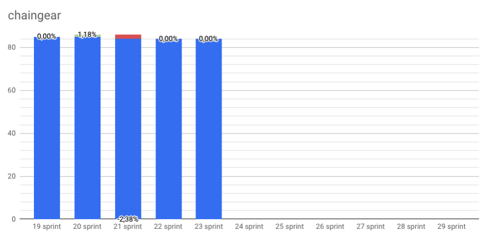
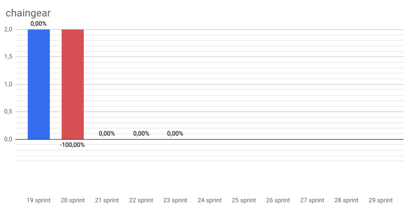
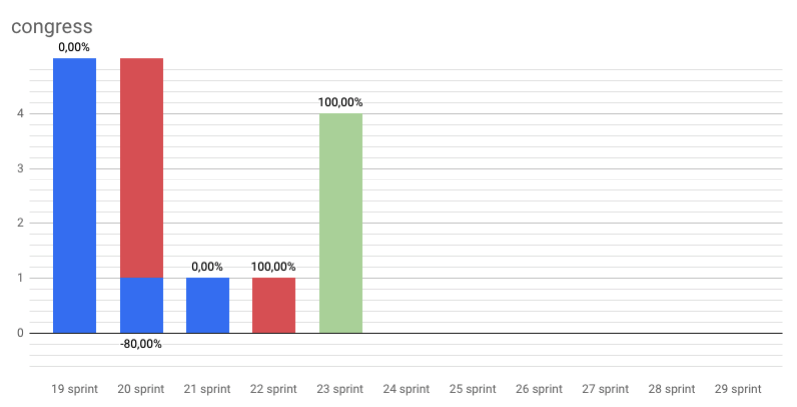
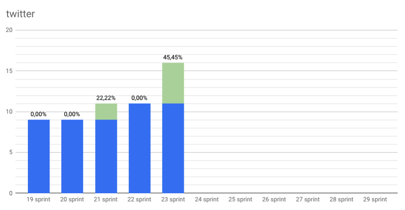

# Organic growth

Start: 2018-11-12

End: 2018-11-23

### Сonclusion

So, first of all, what are we looking for? We want a growth. Slowly, patiently, organic growth. Thats's we're looking for.

That is why our focus now on Cyb. We start to support our first 3rd-party app [Dragonereum](https://dragonereum.io/). Don't think it's all pleasure, there are a lot of troubles there. But we want to use Cyb at Dragonereum genesis, so the next couple of days will be hard ;) Also we need to add some security measures to make it more safer (not safe, sorry) in the mainnet. Actually you can try to add Dragonereum app to your Cyb just get the lay of the land. IPFS hash is attached [QmYgxz2Tb74yBeF5ms4rN3N2QFy7cd27iJpYKq2bv6BmCn](cyb://QmYgxz2Tb74yBeF5ms4rN3N2QFy7cd27iJpYKq2bv6BmCn.ipfs). Also you can install IPFS UI in our Cyb by following hash [QmSDgpiHco5yXdyVTfhKxr3aiJ82ynz8V14QcGKicM3rVh](cyb://QmSDgpiHco5yXdyVTfhKxr3aiJ82ynz8V14QcGKicM3rVh.ipfs). And finally we add custom web3 provider for ETH operation.

On cyberd side we have made great strides with [rank calculating with GPU](https://github.com/cybercongress/cyberd/pull/83). Now it's faster than CPU kind of 100x - 1000x. Validators must have GPUs in our network if they want to validate. Awesome, right?

Also we had started [Cyb tutorials](https://steemit.com/web3/@savetheales/how-to-open-ipfs-link-using-cyb) in our blogs. It's purpose to help you to involve in our magic ;) Besides, we had started to blogging! Yeah, we exclude medium from our post channels. We don’t endorse Medium’s censorship policy and we cannot guaranty that everything we want to tell you we will be able to tell. Also Medium censors web3 links such as web3://, dura:// or cyb:// so posts on Medium are published without links.

And finally... The great announcement about first decentralized search engine conference is coming!

Growth for open source! ..organic ;)

### Changelog
 - #### [Minor fixes at cyberd](https://github.com/cybercongress/cyberd/blob/master/CHANGELOG.md#unreleased)
 - #### [Cyb release with chaingear and accounts import](https://github.com/cybercongress/cyb/releases/tag/v0.0.22)

 ---
### Developers metrics
##### Epics done:

>Working on minor tasks & bug fixing.

- [Custom web3 provider #6 cyb](https://github.com/cybercongress/cyb/issues/6)

##### Epics next sprint TODO:
- [Support of Dragonereum #35 cyb](https://github.com/cybercongress/cyb/issues/35)
- [Custom web3 provider #6 cyb](https://github.com/cybercongress/cyb/issues/6)
- [Launch testnet Euler #73 cyberd](https://github.com/cybercongress/cyberd/issues/73)
- [Whitepaper 0.3 #25 cyberd](https://github.com/cybercongress/cyberd/issues/25)
- [Distribution #27 cyberd](https://github.com/cybercongress/cyberd/issues/27)
- [Update UI for chaingear app #1029 chaingear](https://github.com/cybercongress/chaingear/issues/1029)

Burndown | Storypoints done
:---: | :---:
 | 84

Stars | Forks | PRs
:---: | :---: |:---:
 | |
 | |
 | |
 | |

---

### KPI's as at 2018/11/26
- cyberd: [1 of the 7](https://github.com/cybercongress/cyberd/blob/master/CHANGELOG.md#007-2018-10-25) PoC iteration;
- cyb: yes [release](https://github.com/cybercongress/cyb/releases/tag/0.0.29);
- chaingear: 0 of 100 ETH take from chaingear;
- [#26](https://gitcoin.co/profile/cybercongress) organization on gitcoin.co;
- 36 of 1000 devs in [devChat](https://t.me/fuckgoogle).

---

### Community:

- [Telegram channel](https://t.me/cybercongress): 28 subscribers;
- [Telegram devChat](https://t.me/fuckgoogle): 36 subscribers;
- [Steemit](https://steemit.com/@cybercongress): 7 subscribers;
- [Reddit](https://www.reddit.com/r/cybercongress): 6 subscribers;
- [Twitter](https://twitter.com/cyber_devs): 16 subscribers.

Steemit | Dev Chat | Telegram Channel
:---: | :---: |:---:
 | |

Twitter | Reddit
:---:|:---:|
|
