# Sacred Rave

Start: 2018-11-26

End: 2018-12-17

### Сonclusion

We have a rich and crazy sprint. A lot of things happened during the last three weeks. And... You know what? We want to collect just good things among the array of events.

First of all, let's speak about our products state. Soon, on Bitcoin genesis block 10th year anniversary, 2019.01.03,  we'll launch cyberd first testnet - Euler, Cyb 0.1.0 Euler release, and Chaingear mainnet with updated UI. It should be a great step to the new world.

Cyb serves as the rabbit hole of Web3 World with decentralized search, games, services, storage, databases and so on. So far, Cyb shows the best user experience in playing a Web3 game which is Dragonereum. It is a good sign.

Few words about [Dragonereum](https://dapp.dragonereum.io/genesis) as a first Cyb game. Eggs distribution is almost over and I believe that in two weeks I'll write about Gladiators Battles launch.

And finally, about [cyberc0n](https://ipfs.io/ipfs/QmWPEkwyTThzQSdky4gje2HhkHU7R5E9WWmazuGBjo8gZd/). It was our first conference around Web3 and decentralized search. We're very proud of this event from cyber•Congress side and cyber•Academy. Firstly it was an almost Web3-organized conference on Ethereum smart contract. More details about a conference will be in my next post. Secondly... We thrilled with people who came to us. Be well aware of new decentralized world building difficulty we were happy to understand that we are not alone, but with a strong community.  Not so huge, but really strong. Thanks to all who came!

And sure, if you want to join the discussion around decentralized search, welcome to our [telegram dev chats](https://t.me/fuckgoogle) :)

### Changelog
 - #### [Minor fixes at cyberd](https://github.com/cybercongress/cyberd/blob/master/CHANGELOG.md#unreleased)
 - #### [Cyb Euler pre-release](https://github.com/cybercongress/cyb/releases/tag/v0.1.0)

 ---
### Developers metrics
##### Epics done:

- [Support of Dragonereum #35 cyb](https://github.com/cybercongress/cyb/issues/35)
- [Simple history.cyb #62 cyb](https://github.com/cybercongress/cyb/issues/62)
- [Cyb shell design update #9 cyberdesign](https://github.com/cybercongress/cyberdesign/issues/9)

##### Epics next sprint TODO:
- [Basic .help app #44 cyb](https://github.com/cybercongress/cyb/issues/44)
- [Launch registry of apps #998 chaingear](https://github.com/cybercongress/chaingear/issues/998)
- [Launch testnet Euler #73 cyberd](https://github.com/cybercongress/cyberd/issues/73)
- [Whitepaper 0.3 #25 cyberd](https://github.com/cybercongress/cyberd/issues/25)
- [Distribution #27 cyberd](https://github.com/cybercongress/cyberd/issues/27)
- [Update UI for chaingear app #1029 chaingear](https://github.com/cybercongress/chaingear/issues/1029)

Burndown | Storypoints done
:---: | :---:
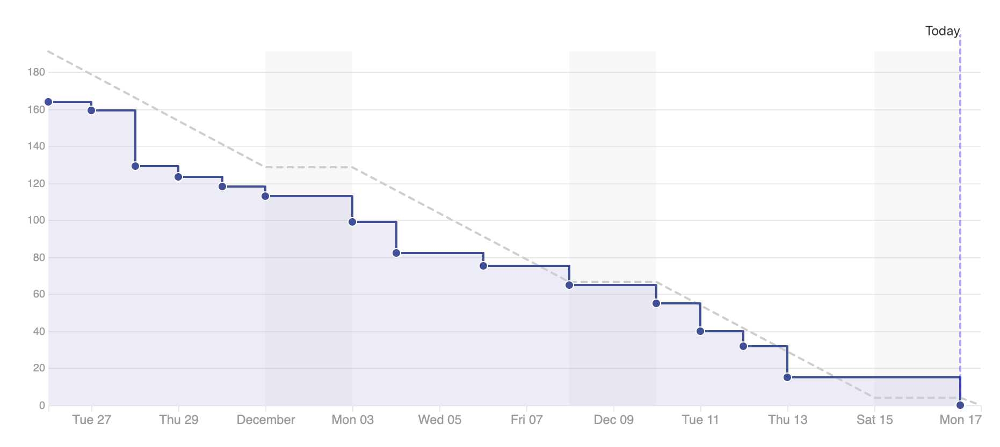 | 191

Stars | Forks | PRs
:---: | :---: |:---:
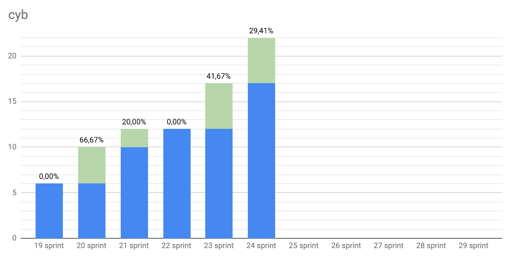 |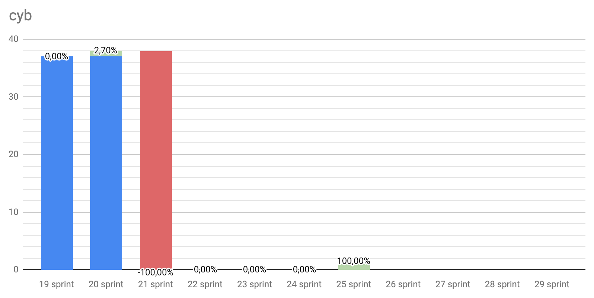 |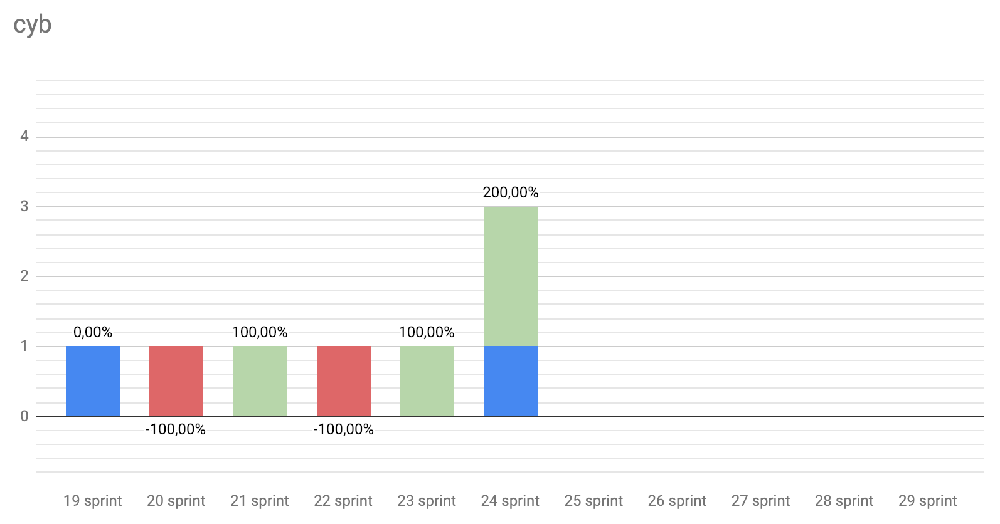
 |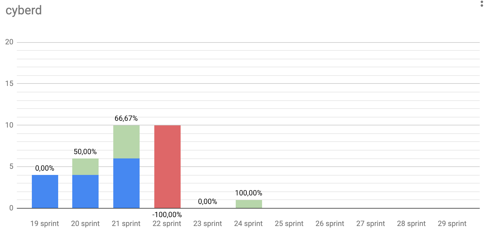 |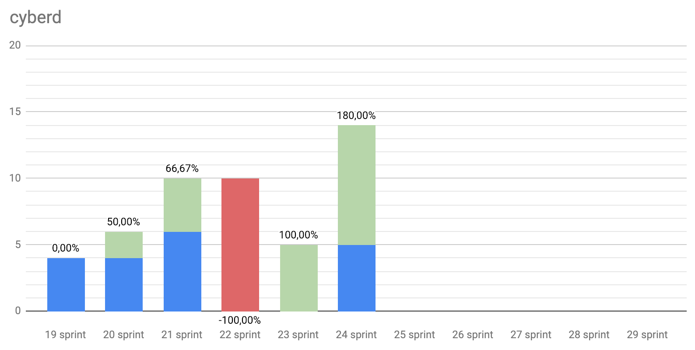
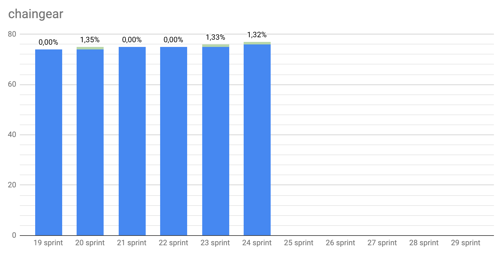 | |
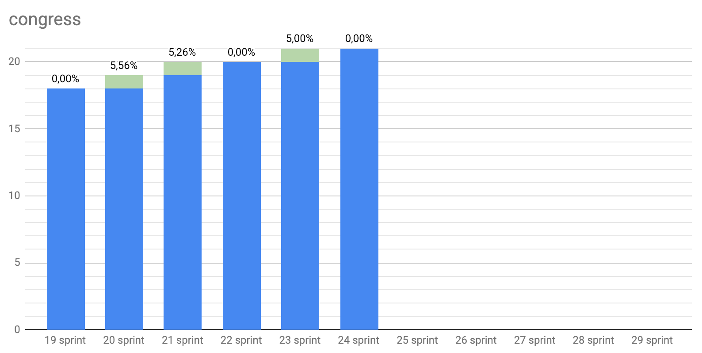 |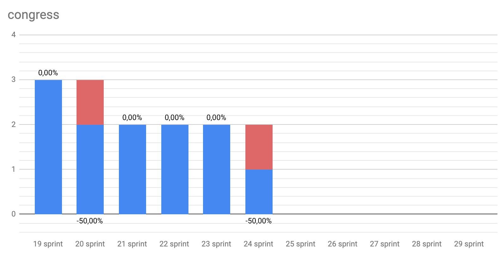 |

---

### KPI's as at 2018/12/17
- cyberd: [1 of the 7](https://github.com/cybercongress/cyberd/blob/master/CHANGELOG.md#007-2018-10-25) PoC iteration;
- cyb: yes [release](https://github.com/cybercongress/cyb/releases/tag/v0.1.0);
- chaingear: 0 of 100 ETH take from chaingear;
- [#34](https://gitcoin.co/profile/cybercongress) organization on gitcoin.co;
- 39 of 1000 devs in [devChat](https://t.me/fuckgoogle).

---

### Community:

- [Telegram channel](https://t.me/cybercongress): 27 subscribers;
- [Telegram devChat](https://t.me/fuckgoogle): 39 subscribers;
- [Steemit](https://steemit.com/@cybercongress): 9 subscribers;
- [Reddit](https://www.reddit.com/r/cybercongress): 6 subscribers;
- [Twitter](https://twitter.com/cyber_devs): 22 subscribers.

Steemit | Dev Chat | Telegram Channel
:---: | :---: |:---:
 | |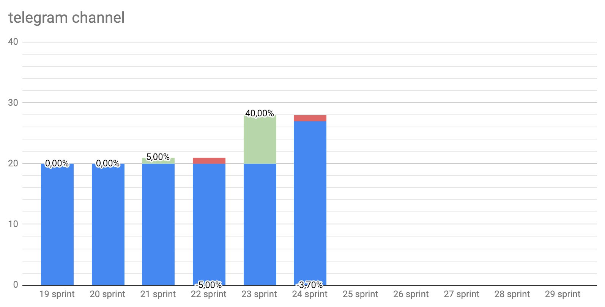

Twitter | Reddit
:---:|:---:|
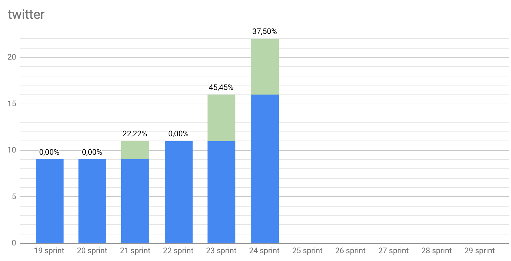|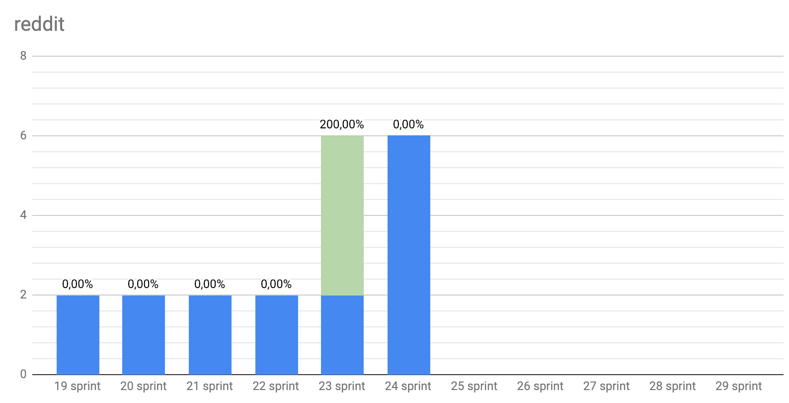
