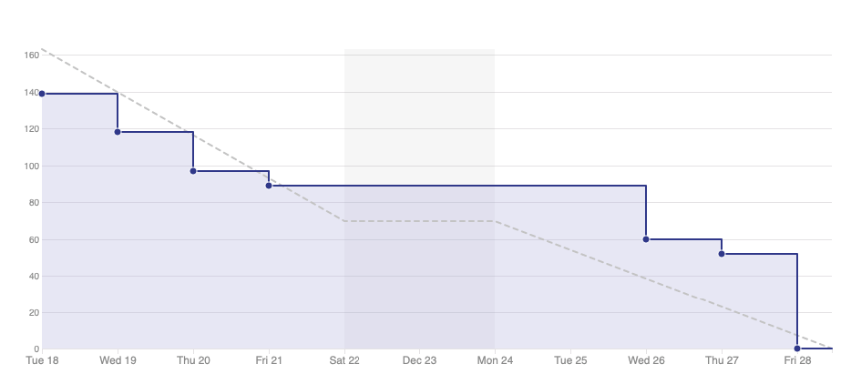
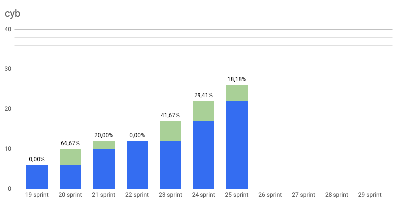
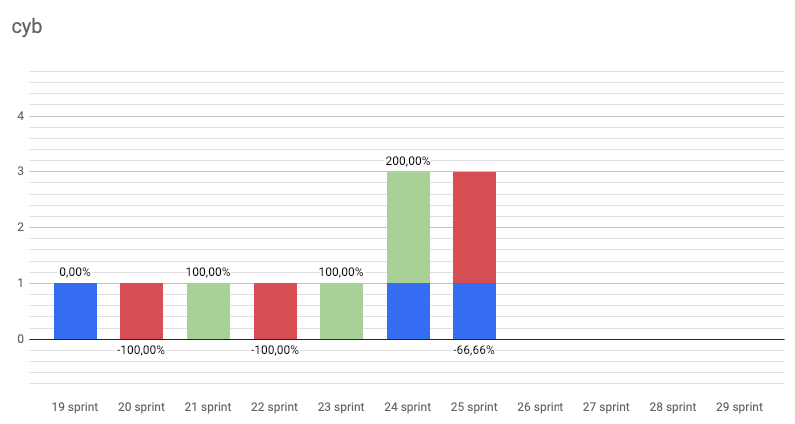
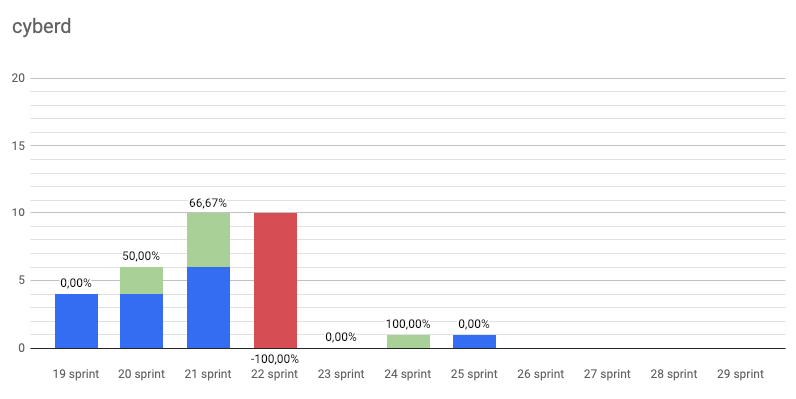
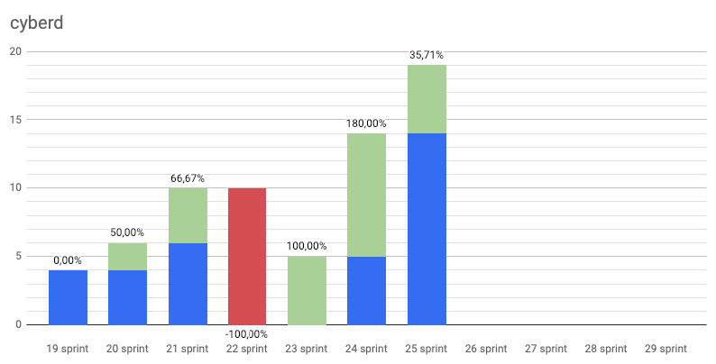
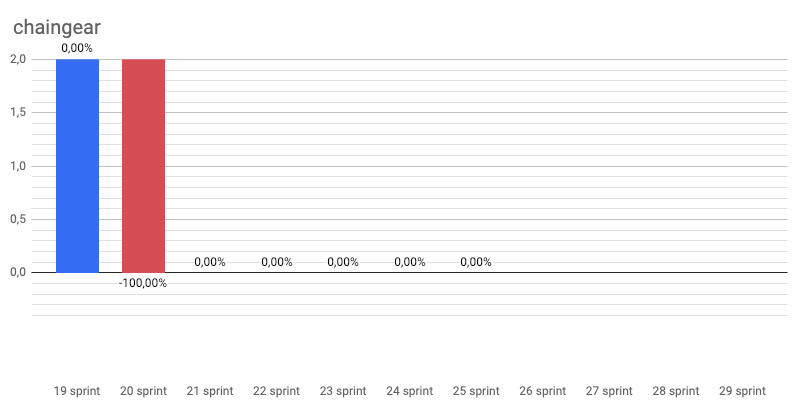
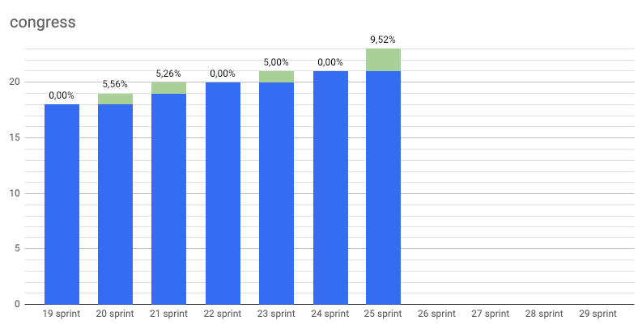
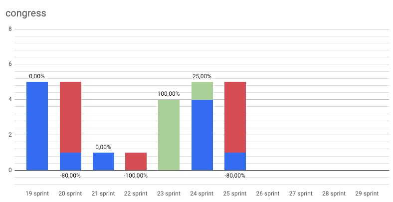
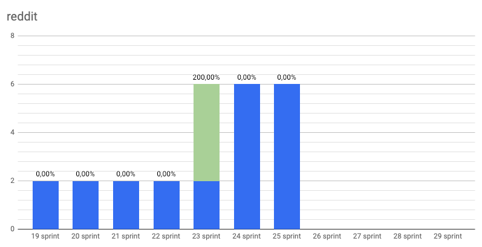

# 42

Start: 2018-12-17

End: 2018-12-28

### Сonclusion

42 . This number has haunted us. I'm not kidding. 42 participants came to our conference, cyberc0n, and now there are 42 members in our dev chat. Mystic...

However it was a new year sprint! We have done quite a lot in this sprint and are proud of that!

What exactly we are proud of? [First public testnet](https://github.com/cybercongress/cyberd/releases/tag/0.1.0). What does it mean for you? You can do your best for the future Internet with testing our chain as a validator. Follow full explanation [here](https://github.com/cybercongress/cyberd/blob/master/docs/run_validator.md) and join our [dev Chat](https://t.me/fuckgoogle) finally!

Future of browsers has it first serious release :) Welcome to [Cyb 0.1.0 - Euler](https://github.com/cybercongress/cyberd/releases)! For us, it's the best way to experience web3 at this moment. Try Chaingear in Kovan with Cyb, explore IPFS content and finally play Dragonereum with Cyb! We're waiting for your bug reports and feature requests as soon as possible! We have [tutorials](https://steemit.com/web3/@savetheales/how-to-open-ipfs-link-using-cyb) for you, so don't hesitate to contact us.

Good news is that Chaingear has deployed to mainnet, but we need some more polishments before you can actually use it.

Finally, we're glad to announce our substance! It guarantees everyone a warm place in Genesis of Cyber protocol. This substance called CBD and is accounted [here](https://etherscan.io/token/0x136c1121f21c29415d8cd71f8bb140c7ff187033#balances). This substance is not the final product and serves as transparency tool for Genesis and decision-making in cyberFoundation. Oh yeah. Yeeeeeh! Now we have [cyberFoundation - the Aragon organization](https://mainnet.aragon.org/#/cyberfoundation.aragonid.eth/0xf4d85b5a1650a335b30072d178f6dcb611f05a3e)!

The purpose of this organization is to empower community around Cyber protocol. The upcoming golas are:
- distribution of CBD substance
- formation of community in Aragon organization around cyber:// protocol development
- boost utility of CBD tokens through integration with current Ethereum projects of cyberCongress

That is it! :) One sprint left before the current block and we'll departure to Thailand for brainstorming, planning, and development. It just got a few loose ends to tie up and... continue to work :)

### Changelog
 - #### [Cyberd release 0.1.0 - Euler](https://github.com/cybercongress/cyberd/releases/tag/v0.1.0)
 - #### [Cyb release 0.1.0 - Euler](https://github.com/cybercongress/cyb/releases/tag/v0.1.0)

 ---
### Developers metrics
##### Epics done:
- [Launch testnet Euler #73 cyberd](https://github.com/cybercongress/cyberd/issues/73)
- [Release notes for 0.1 #109 cyb](https://github.com/cybercongress/cyb/issues/109)

##### Epics next sprint TODO:
- [Deploy to mainnet #997 chaingear](https://github.com/cybercongress/chaingear/issues/997)
- [Basic .help app #44 cyb](https://github.com/cybercongress/cyb/issues/44)
- [Whitepaper 0.3 #25 cyberd](https://github.com/cybercongress/cyberd/issues/25)
- [Distribution #27 cyberd](https://github.com/cybercongress/cyberd/issues/27)
- [Update UI for chaingear app #1029 chaingear](https://github.com/cybercongress/chaingear/issues/1029)
- [Design refactoring #18 cyberdesign](https://github.com/cybercongress/cyberdesign/issues/18)
- [Landing pages for key projects #36 congress](https://github.com/cybercongress/congress/issues/36)
- [Simple .txqueue app #67 cyb](https://github.com/cybercongress/cyb/issues/67)

Burndown | Storypoints done
:---: | :---:
 | 163

Stars | Forks | PRs
:---: | :---: |:---:
 | |
 | |
 | |
 | |

---

### KPI's as at 2019/01/08
- cyberd: [1 of the 7](https://github.com/cybercongress/cyberd/blob/master/CHANGELOG.md#010-2019-01-03) PoC iteration;
- cyb: yes [release](https://github.com/cybercongress/cyb/releases/tag/v0.1.0);
- chaingear: 0 of 100 ETH take from chaingear;
- [#41](https://gitcoin.co/profile/cybercongress) organization on gitcoin.co;
- 42 of 1000 devs in [devChat](https://t.me/fuckgoogle).

---

### Community:

- [Telegram channel](https://t.me/cybercongress): 29 subscribers;
- [Telegram devChat](https://t.me/fuckgoogle): 42 subscribers;
- [Steemit](https://steemit.com/@cybercongress): 8 subscribers;
- [Reddit](https://www.reddit.com/r/cybercongress): 6 subscribers;
- [Twitter](https://twitter.com/cyber_devs): 22 subscribers.

Steemit | Dev Chat | Telegram Channel
:---: | :---: |:---:
 | |

Twitter | Reddit
:---:|:---:|
|
