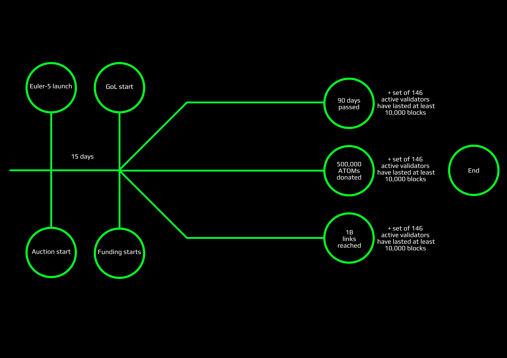
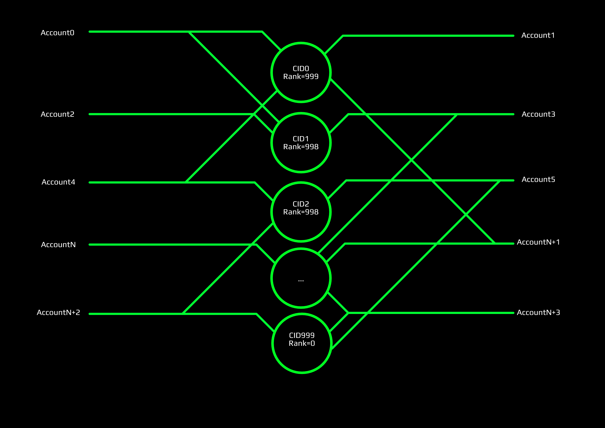

# The Game of Links. Goals, rules and provision.

## Intro

The `Euler-5` launch and the Game of Links are two integral parts of preparing and testing network before mainnet. 

Goals: 

- Public incentivized testing of `[cyberd](https://github.com/cybercongress/cyberd)` before mainnet
- Testing all distribution processes before mainnet
- Demonstrating search with an experimental knowledge graph filled with useful cyberlinks
- 5% CYB distribution for professional validators who will participate in pregenesis round in ATOMs
- 5% CYB distribution for game participants

> **! Important**
> In Euler-5 testnet we'll use special named **EUL** tokens against liquid **CYB** in mainnet and **GOL** tokens against **THC** government tokens. 
**GOL** tokens are valueless. **DO NOT** spend significant funds for buying them on cyber~Auction. We'll burn them after Euler-5 testnet. 

We want to reproduce the whole process of mainnet launch in `Euler-5` for testing cyber~Auction, cyber~Drops and all distribution models.

## General provision of the Game

As shown in figure above the Game start with `Euler-5` launch and the Game of Thrones auction. 

`Euler-5` Genesis file will contain all drops to Ethereum and Cosmos communities. Furthermore,  it will contain validators lifetime rewards from `Euler-4`. For newcomers, we'll propose to get EUL tokens at the cyber~Auction just for less. In the cyber~Auction, newbies can buy EULs or GOLs for uAtoms and Szabos. 

> **! Important**
> In Euler-5 testnet we'll use special named **EUL** tokens against liquid **CYB** in mainnet and **GOL** tokens against **THC** government tokens. 
**GOL** tokens are valueless. **DO NOT** spend significant funds for buying them on cyber~Auction. We'll burn them after Euler-5 testnet.

The Funding will start after approving the government proposal of Funding start and will prolong during 1 of 2 control events happens:

-  90 days will be passed after the Game start
-  600,000 ATOMs well be donated after funding start

After the end of the Funding, we will distribute test EUL tokens for participators of the Funding and the final round of the Game of Links will start. 

At this time will come key gamers with significant stakes and make a powerful impact on the Game results.

The Game result and distribution significantly influenced by the Funding results. The following criteria form a basis for payouts in the Game of Links:

-  Uptime summary of every validator: 0 TCYB - 3 TCYB
-  A load of every participant: 0 TCYB - 3 TCYB
-  Amount of delegated to validator: 0 TCYB - 3 TCYB
-  The relevance of links submitted: 0 TCYB - 6 TCYB

Up to 15 TCYB allocated for different performance indicators during GoL proportionally to donation-based allocation. All remaining CYB allocated to a community pool.

Also, 5 TCYB allocated to the community pool which can be used during testnet for experimenting with governance. All governance decisions of testnet will be migrated to mainnet.

One more achieve point we want to propose for validators: if the set of validators will increase up to 100 and this amount can last during 10000 blocks we will allocate an additional 0.5% of total supply mainnet tokens to validators in proportional their stakes. If this amount will increase to 146 under the same conditions we will allocate additional 1% of total supply mainnet tokens to validators in proportional their stakes.

---

## How to start

**1. Get tokens.**

First of all, you need to check your ETH and ATOM addresses for CYBs drop. Good news for Cosmos community: all addresses on **N** Cosmos network block snapshot will get CYBs for free and it would be 1% of Genesis supply. You can check it by importing your Cosmos seed phrase to `cyberd cli`. The Ethereum community much more than Cosmos, so they get 9% of Genesis supply. But not all of them. To avoid details let say that all non-contracts addresses with a balance higher than 0.2 ETH and at least one outgoing transaction at Ethereum network block **F** snapshot will get the tokens. For more details welcome to [Genesis generation tool]. Check the drop by importing your Ethereum private key in `cyberd cli`.

Secondly, if you were a validator in previous testnet `Euler-4`, for you allocated 0.27% of Genesis supply. Check your addresses which you setup validator(s) by importing seed phrase in `cyberd cli`.

Finally, if your case not listed above you can buy tokens at the Auction. Every day some percent of tokens will up to the Auction. After daily round tokens will drop to each address participated in the round according to shares of participators. 

> ***Few words about cyber~Auction and Funding mechanics***

**2. Choose disciplines for playing.**

There are four disciplines for playing in the Game of Links:

-  Uptime summary of every validator
-  A bandwidth load of every participant
-  Amount of delegated to validators
-  The relevance of links submitted

There are no limits in disciplines quantity participation. By all means. 
You can set up your own validator to get a reward for validator's uptime or you can link CIDs  and load network bandwidth. You can create a promotion around your validator and collect stakes from users. You can do all of those things together. Just play and monitor the results. 

**3. Monitor funding process.**

The mainnet Genesis file depends on Funding process in `Euler-5`, in particular, how many tokens will allocate for the Game of Links results. Here is an example table of possible results of funding process:

ATOMs donated | % of desireble | LT reward | Load reward | Stake reward | Link reward | 
--- | --- | --- | --- |--- |--- |
600,000 | 100 | 3 TCYB | 3 TCYB | 3 TCYB | 6 TCYB |
480,000 | 80 | 2.4 TCYB | 2.4 TCYB | 2.4 TCYB | 4.8 TCYB |
240,000 | 40 | 1.2 TCYB | 1.2 TCYB | 1.2 TCYB | 2.4 TCYB |
120,000 | 20 | 0.6 TCYB | 0.6 TCYB | 0.6 TCYB | 1.2 TCYB |

Other possible cases calculated the same way. 

Participants, which want to get CYBs in Genesis file of mainnet but cannot play, can donate ATOMs, therefore, increasing the percentage of payouts for other participants and for themselves. The relationship between donated ATOMs and percentage of CYBs allocated you can see below:

After funding, donaters ATOMs rewards supposed according to their shares and timestamp of donating. 

If by any reasons the sum of 600,000 ATOMs couldn't be reached the difference goes to proportionally to congress, investors and inventors. 

> ***more explanations about the plot***

## More about disciplines

**Uptime summary of every validator.** The easiest discipline. You need just set up your validator and monitor its lifetime. The lifetime means validators blocks precommits.

> Important! Your validator should be in the set of active validators! Watch your stake! 

By following formula calculated each validator reward in the block *k*:

We need to divide the allocated supply to the sum of blocks in the Game period and to the sum of precommits in the current block.

For example, if you have an active validator from the start of the Game of Links till the end without any block missing and other validators do the same way and it funded 500,000 ATOMs on the Auction you will get `3 TCYB / 146  = 20.55 GCYBs` in the Genesis file of mainnet. 

**A bandwidth load of every participant.** Easy too. According to our resource credits model, there are no transaction fees. We use bandwidth. The user bandwidth value is the ability of users to send messages, make links and do transactions. The main goal of that model is to reduce daily network growth to given constant. 

Each message type has assigned bandwidth cost. You can see it in the table below:

Paramtre | % of desireble | LT reward | 
--- | --- | --- | 
MinimumPriceMultiplier | 0.01 | minimum price number (1 means normal price) | 
LinkCost | 100 | link message cost | 
NonLinkCost | 5 * LinkCost | non link message cost (send, f.e.) |
TxCost | 3 * LinkCost | tx cost | 
DesirableNetworkLoad | 2000 * 1000 * LinkCost | how much all users in average can spend for recover period (24h)

This way, you can calculate how much bandwidth you need to spend for, let say link something. You need to pay for the message, for the transaction and multiple it by multiplier:

The `multiplier` value recalculates every minute according to network load last 24 h window. You can always find it on the Game monitors. 

> Important! The not valid transaction also consume bandwidth, but we count only bandwidth which used for successful linking.

> ***User's bandwidth calculation according to stake***

Thus, with the Game start, we'll start tracking bandwidth spent per account and after the game, distribute proportionally burned bandwidth allocated CYBs.

**Amount of delegated to validators.** Validators can earn a reputation in their lifetime rate and infrastructure. It's somekind of promoting their services in early community. We'll allocate from 0 to 3 TCYBs of Genesis mainnet supply proportionally staked tokens on validators at the last block in the Game.

**The relevance of links submitted.** The most interesting part of the Game. We need to load the knowledge graph with relevant links. By relevant links means whole domains of content and knowledge as like science papers, blogs, knowledgebases and so on. 

Users can link everything that they believe important for the future web.

> ***How rank works***

There are 0 to 6 TCYBs allocated for top 1000 CIDs like Google trends f.e. The difference is top 1000 will be ranked by web3 agents or users and counted during the Game. 

As on picture above, you can see four accounts link some CIDs with top 1 CID with the rank 999. If it will last till the end of the Game those four accounts will get a reward proportionally their shares in Genesis file. 

The same situation with all top 1000 CIDs.

The reward for the top 1000 CIDs will be decreasing slowly linearly as shown in the picture above

> Notice! Only available for reading hashes take part in the Game. Make sure that your content pinned and responded.

## Conclusion
