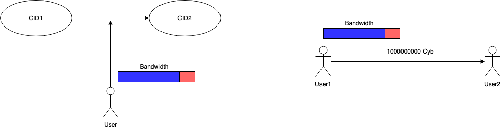

# Introduction to cyberd economy

`Cyberd` or interplanetary search engine & knowledge consensus computer is cosmos SDK based blockchain with unique property creating bonds between IPFS CIDs and storing them at knowledge graph with weighted ranks. To understand the **economic structure** of `cyberd` we should look closely at the **key principles of the cyberd**, **basic incentives for all different participants** and ** the possible influence of these principles on their behavior**.

## ... key principles of the cyberd ...

In other words, `cyberd` is application-specific blockchain or Cosmos Zone with sovereign economic and specifications. `Cyberd` represents a knowledge graph as a weighted graph of directed links between content addresses or content identifications or CIDs.

Like a Cosmos ecosystem, `cyberd` utilizes Tendermint - practical Byzantine fault tolerance (PBFT) consensus mechanism. It means that finalizing blocks depends on 2/3 plus one quorum of all validators agreed on the current state of the network in order to reach the consensus.

## ... basic incentives for all different participants ...

#### Validators
For `cyberd`, there are 146 possible validators, who are responsible for proposing new blocks and validating transactions. This number will constant until they're ready to increase it or decrease with a government proposal. If there are more validators then the right to participate in consensus will have participants with a higher amount of CYBs bonded.

`Cyberd` validators have the highest impact on network security. They must actively participate in governance and are required to vote on every proposal.

This group have enough knowledge and resources to maintain infrastructure and are interested in generating maximum long-term gains from CYB inflation and validation commission. That is why validators care about healthy and sustainable ecosystem development. They should act in interests of their delegators if they want to keep them loyal and increase the voting power in the long term. There're no transaction or message fees in `cyberd` instead it have resource credits, in `cyberd` it calls bandwidth (about this later).

And the primary responsibility of validators is continuous rank recalculation in knowledge graph. Every 100 blocks in depends on linker stake, the rank value is assigned to the link and all weights are recalculated by validators GPUs.

#### Delegators
This group consists of CYB token holders who have not enough skills or resources to run and maintain the infrastructure but still want to increase the network security and earn a share of the inflationary reward by bonding tokens to the validators. It boosts the voting power of validator and the frequency of being chosen as block proposer. In fact, by bonding CYB to validator delegators choose one of the pillars of the blockchain so their choice is very important and affects the level of decentralization.
Delegators are eligible for inflation reward as well but they have to pay commission, which varies within existing validators. There is no way for validators to steal bonded tokens but there are still other risks related to choosing the validator. Decisions based solely on a low commission rate is not always the best decision for delegators.

#### Users
If we compare cyberd network with some search engine, users are consumers and service providers. Developers, entrepreneurs, SEO, buyers, and searchers who want to utilize the advantages of a decentralized search engine. Here we're putting `bandwidth` definition. `Cyberd` refused to the transaction or message fees in favor of resource credits as a method of decreasing network load. The main goal of that model is to reduce daily network growth to given constant, say less than 3gb per day. Bandwidth value depends on the network load and account balance, namely, the less network load, the cheaper bandwidth price, or the bigger your balance the bigger your bandwidth value. The activity of this group measures the overall value of the network and can have a significant impact on demand for the token.

Decreasing bandwidth value with sending transaction or linking. No commission

Full user bandwidth recovering goes in 24h.

## ... economic structure ... and reward distribution

Like the Cosmos Hub economy and reward distribution, `cyberd` relies on the inflationary approach. Unlike Cosmos, in `cyberd` inflation constantly seek to ~7%. It's achieved by tuning `TokensPerBlock` parameter at genesis setup. Given that the network has 1-second target block time and ~7% target inflation the starting parameter will be 50 MCYB.

There are one fundamental stream of revenue for validators - inflation.

#### Block reward
Block reward distributing amongst all validators proportionally to their voting power. This reward is paid in CYBs.

#### Validator’s commission rate
Represents a percentage from both streams of revenue that delegators pay to a validator. Delegators reward streams are the same as for validators less the commission percentage.

## ... the possible influence of these principles on their behavior ...

In some circumstances occurs slashing of bonded CYBs. Penalties should increase the responsibility level of participants who are directly involved in decisions associated with network security. Validators have no control over delegator’s stake but if such an event happens both parties lose a percentage of their tokens. This is in order to prevent misbehavior and negligence from validators and bring incentives to delegators to diversify amongst them, perform proper due diligence and choose wisely.

- The first reason a stake can be slashed is double-signing a block. This means that a malicious node is broadcasting two blocks with different content for the same height. The penalty for that is currently set at 20% and the validator who is responsible for that drops out of validators set. All CYBs enter an unbonding (the process of undelegating CYBs from validator) period that lasts for 21 days and within this period the stake will not earn provisions and transaction fees.

- If a validator fails to sign more than 70% blocks in a window of 1800 blocks due to inactivity, 0.1% of the bonded CYBs will be lost and the validator will be jailed without allowance to participate in consensus and be eligible for rewards during the unjail transaction.

If slashing happens, it decreases stake and leads to fewer CYBs paid as a reward.

## Conclusion

Here is a brief explanation of how economic goes in `cyberd` at the current moment. This is not a final economic decision, also, it can be changed after euler-5 and mainnet. Moreover, it can be changed with governance. General specs values are very similar to Cosmos Hub ecosystem, but it has key differences, such us resource credits, for example. Before you decide validator for staking make sure that it has security and fault tolerance node :)
