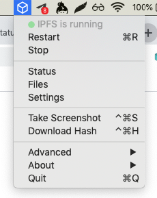
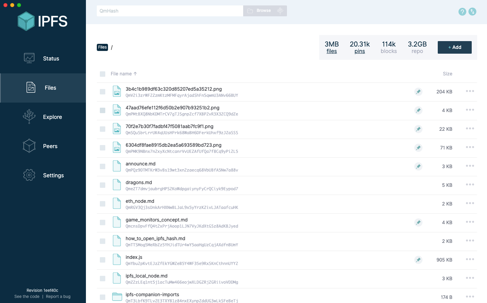
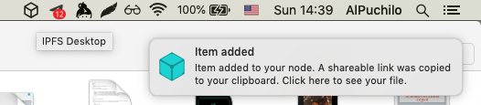

# IPFS desktop guide

An unobtrusive and user-friendly desktop application for IPFS on Windows, Mac and Linux. https://ipfs.io. You don't need the command line to run an IPFS node. Just install IPFS Desktop and have all the power of IPFS in your hands. Powered by Web UI. IPFS Desktop allows you to run your IPFS Node on your machine without having to bother with command line tools. With it, you have the power of Web UI on tip of your hands plus a handful of shortcuts you can find on settings.

## Download the latest release

- Mac - [IPFS-Desktop-0.10.3.dmg](https://github.com/ipfs-shipyard/ipfs-desktop/releases/download/v0.10.3/IPFS-Desktop-0.10.3.dmg) or `brew cask install ipfs`
- Windows - [IPFS-Desktop-Setup-0.10.3.exe](https://github.com/ipfs-shipyard/ipfs-desktop/releases/download/v0.10.3/IPFS-Desktop-Setup-0.10.3.exe) or `choco install ipfs-desktop`
- Linux - see the install section for available options



`Restart` and `Stop` commands will restart or stop your IPFS node. `Status`, `Files` and `Settings` commands will open Web UI of IPFS client where you can explore your IPFS node status, added and pinned files to IPFS, and change the IPFS desktop settings. Also are available `Take Scrennshot` and `Download Hash` commands for getting display screenshot and getting a file by IPFS hash saved in a clipboard.

Added files you can explore at `Files` section:


## Features

- IPFS daemon always running

IPFS Desktop's main feature is to allow you to have the IPFS daemon always running in the background. But fear not! If you need to stop it, you can do it just by clicking on 'Stop'.

- Handle `ipfs://`, `ipns://` and `dweb`: links

If you come across a link to any of the protocols above, IPFS Desktop will be able to open them and redirect them to your default browser.

- Adds ipfs to your system

If you're using macOS or Windows and don't have ipfs installed on your system, IPFS Desktop will automatically install it so it is available through the command line. If you're using Linux, or already have ipfs installed, you can tell IPFS Desktop to take care of it (and keep it up to date!) by toggling the option on Settings.

- Easy add to IPFS

You can easily add files and folders to IPFS:
On Windows, you can right click on files to add them to IPFS through IPFS Desktop.
On macOS, you can drag and drop them to the tray icon.
Download copied hashes
You can enable, on Settings, a shortcut to download an hash on the keyboard.



- Auto-add screenshots

You can enable, on Settings, a shortcut to take screenshots and add them automatically to IPFS.

## Install

Download the latest release of IPFS Desktop for your OS, below.

| Platform | Download link | Download count
|---------:|---------------|---------------
| **Windows**  | [IPFS-Desktop-Setup-0.10.3.exe](https://github.com/ipfs-shipyard/ipfs-desktop/releases/download/v0.10.3/IPFS-Desktop-Setup-0.10.3.exe) | [](https://github.com/ipfs-shipyard/ipfs-desktop/releases/download/v0.10.3/IPFS-Desktop-Setup-0.10.3.exe)
| **Mac**    | [IPFS-Desktop-0.10.3.dmg](https://github.com/ipfs-shipyard/ipfs-desktop/releases/download/v0.10.3/IPFS-Desktop-0.10.3.dmg) | [](https://github.com/ipfs-shipyard/ipfs-desktop/releases/download/v0.10.3/IPFS-Desktop-0.10.3.dmg)

We provide multiple _experimental_ installers for **Linux** and **FreeBSD**:

| Package | Download link | Download count
|---------:|---------------|---------------
| tar | [ipfs-desktop-0.10.3-linux-x64.tar.xz](https://github.com/ipfs-shipyard/ipfs-desktop/releases/download/v0.10.3/ipfs-desktop-0.10.3-linux-x64.tar.xz) | [](https://github.com/ipfs-shipyard/ipfs-desktop/releases/download/v0.10.3/ipfs-desktop-0.10.3-linux-x64.tar.xz)
| deb | [ipfs-desktop-0.10.3-linux-amd64.deb](https://github.com/ipfs-shipyard/ipfs-desktop/releases/download/v0.10.3/ipfs-desktop-0.10.3-linux-amd64.deb) | [](https://github.com/ipfs-shipyard/ipfs-desktop/releases/download/v0.10.3/ipfs-desktop-0.10.3-linux-amd64.deb)
| rpm | [ipfs-desktop-0.10.3-linux-x86_64.rpm](https://github.com/ipfs-shipyard/ipfs-desktop/releases/download/v0.10.3/ipfs-desktop-0.10.3-linux-x86_64.rpm) | [](https://github.com/ipfs-shipyard/ipfs-desktop/releases/download/v0.10.3/ipfs-desktop-0.10.3-linux-x86_64.rpm)
| AppImage | [ipfs-desktop-0.10.3-linux-x86_64.AppImage](https://github.com/ipfs-shipyard/ipfs-desktop/releases/download/v0.10.3/ipfs-desktop-0.10.3-linux-x86_64.AppImage) | [](https://github.com/ipfs-shipyard/ipfs-desktop/releases/download/v0.10.3/ipfs-desktop-0.10.3-linux-x86_64.AppImage)
| freebsd | [ipfs-desktop-0.10.3-linux-x64.freebsd](https://github.com/ipfs-shipyard/ipfs-desktop/releases/download/v0.10.3/ipfs-desktop-0.10.3-linux-x64.freebsd) | [](https://github.com/ipfs-shipyard/ipfs-desktop/releases/download/v0.10.3/ipfs-desktop-0.10.3-linux-x64.freebsd)

Or you can use your favorite package manager:

- **Homebrew** - `brew cask install ipfs`
- **Chocolatey** - `choco install ipfs-desktop`
- **Snap** - `snap install ipfs-desktop`
- **AUR** - [`ipfs-desktop` package](https://aur.archlinux.org/packages/ipfs-desktop/) maintained by [@alexhenrie](https://github.com/alexhenrie)

> Using package managers? Please head to [our package managers page](https://github.com/ipfs-shipyard/ipfs-desktop/issues/691) and help us add support for yours!

You can find releases notes and older versions on the [releases](https://github.com/ipfs-shipyard/ipfs-desktop/releases) page.

### Install from Source

To install it from source you need [Node.js](https://nodejs.org/en/) `>=10.4.0` and
need [npm](npmjs.org) `>=6.1.0` installed. This uses [`node-gyp`](https://github.com/nodejs/node-gyp) so **you must take a look** at their [platform specific dependencies](https://github.com/nodejs/node-gyp#installation).

Then the follow the steps below to clone the source code, install the dependencies and run it the app:

```bash
git clone https://github.com/ipfs-shipyard/ipfs-desktop.git
cd ipfs-desktop
npm ci
npm start
```

The IPFS Desktop app will launch and should appear in your OS menu bar.

***The content partially copied from https://github.com/ipfs-shipyard/ipfs-desktop/blob/master/README.md***