# Contracts Overview

## Design rationale

Main design principle goes from ERC721 NFT tokenization of Registries (in Chaingear) and Entries (in custom Registry). 

In reason of Registries tokenization in Chaingear which allows token holder acts as administrator of their Registry, Chaingear acts to Registry as owner, which sets holder as administrator on creation phase, changes administrator when holder transfers token to another user, and transfers ownership when user unregister Registry in Chaingear, giving them full control to contract. Registry deep-linked to Chaingear registry token. In other words, token ownership means control to Registry. Also, Chaingear supports multiple Registry Creators, and allows Chaingear owners provide different kind and versioning of Registries.

In reason of providing user functionality to describe their custom registry data structures and CRUD operations, a user creates their custom smart-contract, which implements the EntryBasic interface. This contract acts as inner storage and Registry acts them on token operations (creating and deleting). A user may deploy erroneous or vulnerable EntryCore contract, but this should not crash Chaingear-Registry NFT-token logic and Registry inner entry NFT-logic too.

This brings us to tokenized (**C** _RU_ **D**) operations in Registry and public (_C_ **RU** _D_) actions / inner private (**C** _RU_ **D**) in EntryCore.

## Chaingear inheritance 


## Registry inheritance


##### PS: OZ stands to Open Zeppelin contracts

### /chaingear
- **_Chaingear_** allows any user to create his own registry. Building fee is collecting by new registry creation. All builded registries are tokenized with ERC721 NFT token standard and saved in Chaingear metaregistry with registry metainformation. Creator of registry may transfer tokenized ownership of registry and destroy registry with token burning. Tokenized registries Entries may collect funds by users. Chaingear supports multiple benefitiaries witch have access to collected fees. 

- **_ChaingearCore_** holds general logic of Chaingear. Allows change chaingear's metainformation, amount of registration fee, adding multiple registry creator contracts based on versioning or/and functionality.

- **_RegistryBase_** holds struct of data with describes registry metainformation which associated with token, views function for registry metainformation.

- **_RegistryCreator_** contains the code of specified version of Registry. This code used by Chaingear for Registry creation process. Registry Creator should be added with specified version and description to Chaingear Registry Creators inner registry. Chaingear contract should be added as builder to Registry Creator with reason to allow creation calls only by Chaingear contact.

### /common
- **_IPFSeable_** contains logic which allows view and save links to CID in IPFS with ABI, source code and contract metainformation.

- **_RegistySafe_** allows inherited contract transfer ETHs to safe and client claim from safe, accounting logic holded by inherited contract.

- **_SplitPaymentChangeable_** allows add beneficiaries to contract (addresses and shares amount) and change payee address. Beneficiaries can claim ETHs from contract proportionally to their shares.

- **_Adminable_** implements the same logic as Ownable, but based on transaction origin creator.

### /registry
- **_Chaingeareable_** holds basic logic of Registry as registry basic information, balance and fees amount. Contains getters and setters for registry name, description, tags, entry base address.

- **_EntryBasic_** interface for _EntryCore_. Holds entry metainformation and interfaces of functions (**C** _R_ **UD**) which should be implemented in _EntryCore_. Uses for interaction between Registry and EntryCore.

- **_EntryCore_** partially code-generated contract where registry creator setup their custom entry structure and setters/getters. _EntryCore_ then initializes in Registry by their creator (as admin) and completes Registry setup process. Provides public (_C_ **RU** _D_) actions for users and inner (**C** _RU_ **D**) tokenized actions for Chaingear.  Registry goes as owner of contract (and acts as proxy) with entries creating, token-based transferring and deleting.

- **_Registry_** contract witch tokenize entries as NFT tokens via ERC721 standard. Users can create tokenized empty entries according to entry access policy setted in Registry. Registry provides tokenized (**C** _RU_ **D**) actions, after creation of token and empty registry object, user should initialize them in EntryCore. Also users can fund entries with ETHs which send to _RegistrySafe_ where owner of entry token can claim funds.

- **_RegistryAccessControl_** holds logic of controlling registry and accessing to entries creation. Policy options to entries creation are OnlyAdministrator, Whitelist, AllUsers. Chaingear acts as owner of Registry and creator of registry acts of administrator with separated policies to Registry functions.

#### EntryBasic interface (should be implemented in user EntryCore contract)
```js
pragma solidity 0.4.23;


contract EntryBasic {

    struct EntryMeta {
        address owner;
        address creator;
        uint createdAt;
        uint lastUpdateTime;
        
        //TODO think about move this vars to Registry
        uint currentEntryBalanceETH;
        uint accumulatedOverallEntryETH;
    }

    function entriesAmount() public view returns (uint256 entryID);

    function createEntry() public returns (uint256 entryID);
    function deleteEntry(uint256 _entryIndex) public;

    function updateEntryOwnership(uint256 _entryID, address _newOwner) public;
    function updateEntryFund(uint256 _entryID, uint256 _amount) public;
    function claimEntryFund(uint256 _entryID, uint256 _amount) public;

    function entryOwnerOf(uint256 _entryID) public view returns (address);
    function creatorOf(uint256 _entryID) public view returns (address);
    function createdAtOf(uint256 _entryID) public view returns (uint);
    function lastUpdateTimeOf(uint256 _entryID) public view returns (uint);
    function currentEntryBalanceETHOf(uint256 _entryID) public view returns (uint);
    function accumulatedOverallEntryETHOf(uint256 _entryID) public view returns (uint);

    function entryMeta(uint256 _entryId)
        public
        view
        returns (address, address, uint, uint, uint, uint)
    {
        return (
            entryOwnerOf(_entryId),
            creatorOf(_entryId),
            createdAtOf(_entryId),
            lastUpdateTimeOf(_entryId),
            currentEntryBalanceETHOf(_entryId),
            accumulatedOverallEntryETHOf(_entryId)
        );
    }

}
```

#### Example EntryCore (with example custom structure and required functions)
```js
pragma solidity 0.4.23;

import "../common/EntryBasic.sol";
import "openzeppelin-solidity/contracts/math/SafeMath.sol";
import "openzeppelin-solidity/contracts/ownership/Ownable.sol";

//todo remove from here. Maybe move into /contracts/test??
/**
* @title Entries engine for Chaingear
* @author Cyber•Congress
* @dev not recommend to use before release!
*/
contract EntryCore is EntryBasic, Ownable {

    using SafeMath for uint256;

    /*
    * @dev original structure of entry for example
    */
    struct Entry {
        address expensiveAddress;
        uint256 expensiveUint;
        int128 expensiveInt;
        string expensiveString;

        EntryMeta metainformation;
    }

    // @dev initial structure of entries
    Entry[] internal entries;

    modifier onlyEntryOwner(uint256 _entryId) {
        require(entries[_entryId].metainformation.owner == msg.sender);
        _;
    }

    /**
    * @dev entries amount getter
    * @return uint256
    */
    function entriesAmount()
        public
        view
        returns (uint256 entryID)
    {
        return entries.length;
    }

    /**
    * @dev example of custom variables getters
    */
    function expensiveAddressOf(uint256 _entryId)
        public
        view
        returns (address)
    {
        return entries[_entryId].expensiveAddress;
    }

    function expensiveUintOf(uint256 _entryId)
        public
        view
        returns (uint256)
    {
        return entries[_entryId].expensiveUint;
    }

    function expensiveIntOf(uint256 _entryId)
        public
        view
        returns (int128)
    {
        return entries[_entryId].expensiveInt;
    }

    function expensiveStringOf(uint256 _entryId)
        public
        view
        returns (string)
    {
        return entries[_entryId].expensiveString;
    }

    function entryInfo(uint256 _entryId)
        public
        view
        returns (address, uint256, int128, string)
    {
        return (
            expensiveAddressOf(_entryId),
            expensiveUintOf(_entryId),
            expensiveIntOf(_entryId),
            expensiveStringOf(_entryId)
        );
    }

    /**
    * @dev entry creation method
    * @return uint256
    */
    function createEntry()
        public
        onlyOwner
        returns (uint256 entryId)
    {
        EntryMeta memory meta = (EntryMeta(
        {
            lastUpdateTime: block.timestamp,
            createdAt: block.timestamp,
            owner: tx.origin,
            creator: tx.origin,
            currentEntryBalanceETH: 0,
            accumulatedOverallEntryETH: 0
        }));

        Entry memory entry = (Entry(
        {
            expensiveAddress: address(0),
            expensiveUint: uint256(0),
            expensiveInt: int128(0),
            expensiveString: "",
            metainformation: meta
        }));

        uint256 newEntryId = entries.push(entry) - 1;

        return newEntryId;
    }

    /**
    * @dev Entry custom information setter
    * @notice custom variables
    */
    function updateEntry(
        uint256 _entryId, 
        address _newAddress, 
        uint256 _newUint, 
        int128 _newInt, 
        string _newString
    )
        onlyEntryOwner(_entryId)
        public
    {
        entries[_entryId].expensiveAddress = _newAddress;
        entries[_entryId].expensiveUint = _newUint;
        entries[_entryId].expensiveInt = _newInt;
        entries[_entryId].expensiveString = _newString;

        entries[_entryId].metainformation.lastUpdateTime = block.timestamp;
    }

    /**
    * @dev remove entry method
    * @param _entryIndex uint256
    */
    function deleteEntry(uint256 _entryIndex)
        onlyOwner
        public
    {
        uint256 lastEntryIndex = entries.length.sub(1);
        Entry storage lastEntry = entries[lastEntryIndex];

        entries[_entryIndex] = lastEntry;
        delete entries[lastEntryIndex];
        entries.length--;
    }

    /**
    * @dev entry ownership setter
    * @param _entryID uint256
    * @param _newOwner address of new owner
    */
    function updateEntryOwnership(
        uint256 _entryID, 
        address _newOwner
    )
        onlyOwner
        public
    {
        entries[_entryID].metainformation.owner = _newOwner;
    }

    // TODO move out
    /**
    * @dev entry fund setter
    * @param _entryID uint256
    * @param _amount uint256
    */
    function updateEntryFund(
        uint256 _entryID,
        uint256 _amount
    )
        onlyOwner
        public
    {
        entries[_entryID].metainformation.currentEntryBalanceETH.add(_amount);
        entries[_entryID].metainformation.accumulatedOverallEntryETH.add(_amount);
    }

    // TODO move out
    /**
    * @dev entry fund claim
    * @param _entryID uint256
    * @param _amount uint256
    */
    function claimEntryFund(
        uint256 _entryID, 
        uint256 _amount
    )
        onlyOwner
        public
    {
        entries[_entryID].metainformation.currentEntryBalanceETH.sub(_amount);
    }

    /**
    * @dev entry owner getter
    * @param _entryID index uint256
    * @return address owner
    */
    function entryOwnerOf(uint256 _entryID)
        public
        view
        returns (address)
    {
        entries[_entryID].metainformation.owner;
    }

    /**
    * @dev entry creator getter
    * @param _entryID index uint256
    * @return address creator
    */
    function creatorOf(uint256 _entryID)
        public
        view
        returns (address)
    {
        entries[_entryID].metainformation.creator;
    }

    /**
    * @dev entry creating timestamp getter
    * @param _entryID uint256
    * @return uint creation timestamp uint
    */
    function createdAtOf(uint256 _entryID)
        public
        view
        returns (uint)
    {
        entries[_entryID].metainformation.createdAt;
    }

    /**
    * @dev entry UPD timestamp getter
    * @param _entryID uint256
    * @return uint UPD timestamp uint
    */
    function lastUpdateTimeOf(uint256 _entryID)
        public
        view
        returns (uint)
    {
        return entries[_entryID].metainformation.lastUpdateTime;
    }

    /**
    * @dev entry current ETH balance getter
    * @param _entryID uint256
    * @return uint balance of entry ETH
    */
    function currentEntryBalanceETHOf(uint256 _entryID)
        public
        view
        returns (uint)
    {
        return entries[_entryID].metainformation.currentEntryBalanceETH;
    }

    /**
    * @dev entry accumulated ETH balance getter
    * @param _entryID uint256
    * @return uint current balance of entry ETH
    */
    function accumulatedOverallEntryETHOf(uint256 _entryID)
        public
        view
        returns (uint)
    {
        return entries[_entryID].metainformation.accumulatedOverallEntryETH;
    }

}

```
    