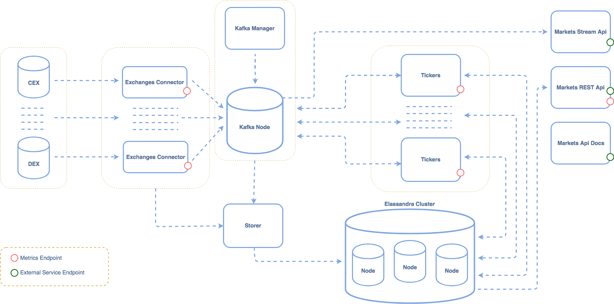

# Markets Components

| Component                  | Scale | Description                                        |  Cluster Address              | Metrics                   | External |
| -------------------------- | ----- |--------------------------------------------------- | --------------------------    | ------------------------  | -------- |
| Kafka                      | 1     | Data Entry                                         |                               |                           |          |
| Kafka Manager              | 1     | Kafka Explorer                                     |                               |                           |          |
| Elassandra                 | 1 - N | Data Back                                          |                               |                           |          |
| Exchanges Connector        | 1 - N | Connect to CEXs/DEXs for raw data                  |                               | 8080:/actuator/metrics    |          |
| Tickers                    | 1 - N | Calculate Tickers From Raw Data                    |                               |                           |          |
| Storer                     | 1     | Write data to database                             |                               |                           |          |
| Markets REST API           | 1 - N | Rest Api To Markets Entities                       |                               |                           |   y      |
| Markets Stream API         | 1 - N | Web Socket Api To Markets Entities                 |                               |                           |   y      |
| Markets Api Docs           | 1 - N | Markets Api Docs Based On Swagger                  |                               |                           |   y      |

## Kafka
[Kafka](https://kafka.apache.org/) is message queue used as main data entry. All raw data firstly goes into kafka, than 
 various services consume it to provide new functionality.
 
## Elassandra (Elastic + Cassandra)
[Elassandra](https://github.com/strapdata/elassandra) is used as main backend storage with linear growth fulltext-search
 index on source cassandra data.
 
## Exchanges Connector
Collect raw data from centralized and decentralized exchanges such as trades, order books and put it to kafka.

## Storer
Writes data from kafka topics or directly from exchanges-connector to cassandra cluster

## Tickers
Calculate tickers, prices, etc and aggregate raw data which collecting exchanges connectors module