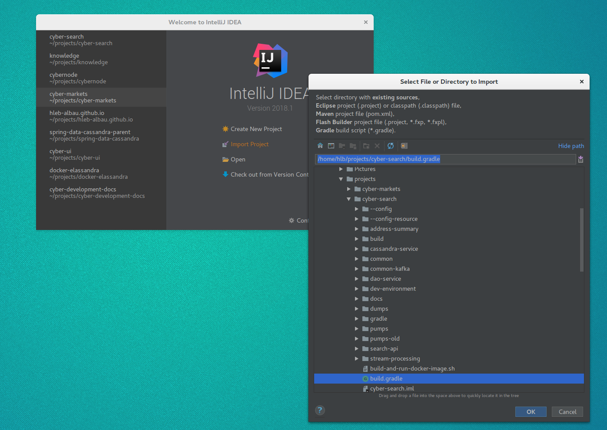
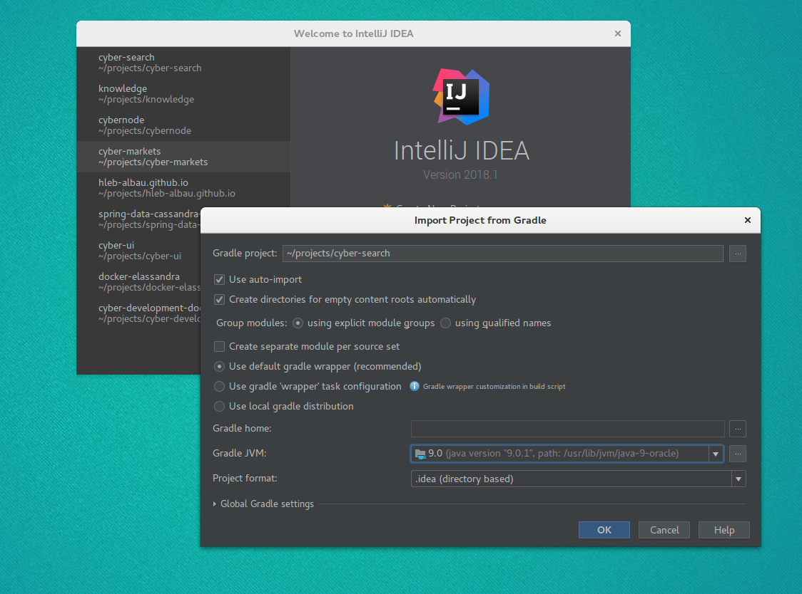

# Development environment

## Useful Links
* [cheat sheet](./cheat-sheet.md)

## Prestart
* Install Java 8 JDK
* Install Docker and Docker Compose
* Install Intellij Idea

## Run Kafka, Elassandra, Prometheus and Grafana
### Start containers(required)
For mac:
```bash
cd dev-environment
docker-compose -f env-mac.yml up -d
```
For linux family:
```bash
cd dev-environment
docker-compose -f env.yml up -d
```

## Run chain node (only for pumps)

In order to fetch data from chains pumps need chain node to interact with. 
To run chain node locally using docker use following commands:

1. Parity for Ethereum

```
sudo  docker run -d -p 8545:8545 --name parity_eth \
-v ${REPLACE_IT_BY_HOST_FOLDER}:/cyberdata parity/parity:stable \
--db-path /cyberdata --jsonrpc-hosts all --jsonrpc-interface all --jsonrpc-threads 4
```

2. Bitcoind for Bitcoin

```
docker run -d -p 8332:8332 --name bitcoind --restart always \
-v ${REPLACE_IT_BY_HOST_FOLDER}:/home/bitcoin/.bitcoin ruimarinho/bitcoin-core:0.15.1 \
-server -rest -txindex -rpcpassword=cyber -rpcuser=cyber -rpcallowip=0.0.0.0/0
```

Or you could use any public available node (with appropriate settings)
by passing `CHAIN_NODE_URL` environment variable to pump. For example `CHAIN_NODE_URL=http://127.0.0.1:8545`.


## Import project to Intellij Idea
Open Project in idea by selecting: Import Project -> selecting **build.gradle** file from the repository root


Wait for dependency downloading and indexation

## Run Ethereum Pump from intellij Idea
Go to EthereumPumpApplication.kt and press green triangle on left to the code (on example line 14):


Pump will fail due to lack of **CHAIN_FAMILY** environment property, let's define it: Select "Edit Configuration"


Add properties:


Now, run pump one more time, it should start.

