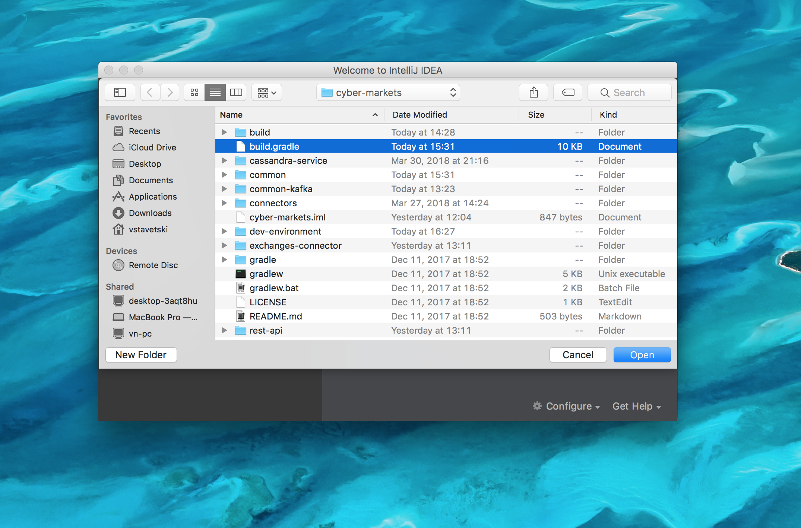
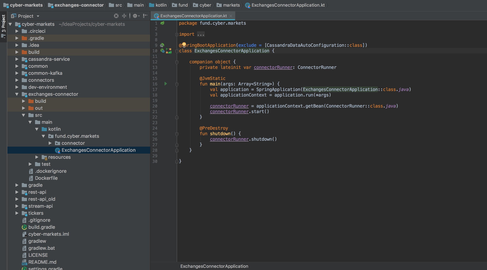
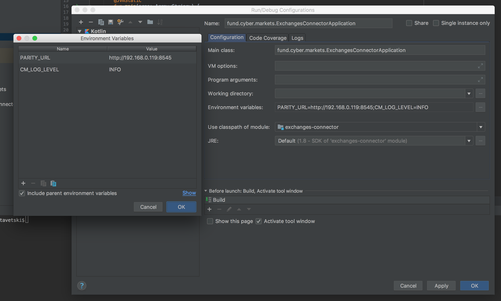

# Development environment

## Useful Links
* [cheat sheet](./cheat-sheet.md)

## Prestart
* Instal Java 8 JDK
* Install Docker and Docker Compose
* Install Intellij Idea

## Run Kafka, Elassandra, Prometheus and Grafana
### Start containers(required)
For mac:
```bash
docker-compose -f dev-environment/env-mac.yml up -d
```
For linux family:
```bash
docker-compose -f dev-environment/env.yml up -d
```
### Bootstrap Elassandra with keyspaces(required)
```bash
docker cp dev-environment/elassandra-bootstrap.cql  elassandra-markets:/elassandra-bootstrap.cql
docker exec -it elassandra-markets bash
cqlsh -f elassandra-bootstrap.cql
```

## Import project to Intellij Idea
Open Project in idea by selecting: Import Project -> selecting build.gradle file from the repository root



Wait for dependency downloading and indexation

## Run Exchanges Connector, Tickers, or API from intellij Idea
Go to ExchangesConnectorApplication.kt and press green triangle on left to the code (on example line 16):


If, you use parity endpoint different rather that localhost:8545, than Etherdelta connector will fail due to lack of environment property PARITY_URL.
Let's define it: Select "Edit Configurations"


Add next properties:



Now, run exchanges connector one more time then etherdelta connector should start.
You can add environment variables in the same way for Tickers, APIs and etc.
