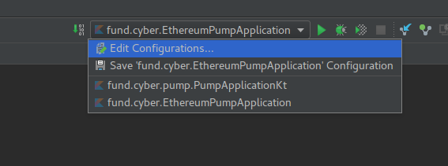
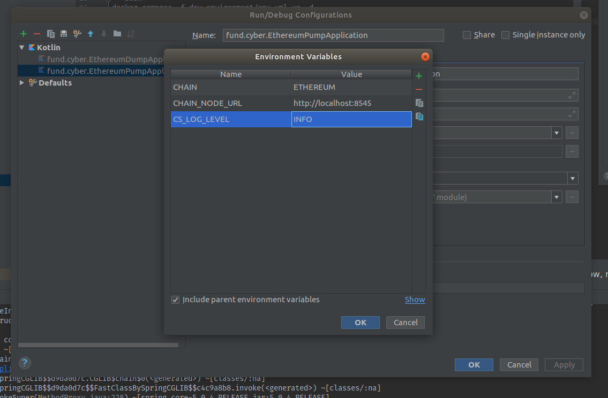

# Development environment

## Useful Links
* [cheat sheet](./cheat-sheet.md)

## Prestart
* Install Java 10 JDK
* Install Docker and Docker Compose
* Install Intellij Idea

## Run Kafka, Elassandra, Prometheus and Grafana
### Start containers(required)
For mac:
```bash
cd dev-environment
docker-compose -f dev-environment/env-mac.yml up -d
```
For linux family:
```bash
cd dev-environment
docker-compose -f dev-environment/env.yml up -d
```

## Import project to Intellij Idea
Open Project in idea by selecting: Import Project -> selecting **build.gradle** file from the repository root


Wait for dependency downloading and indexation

## Run Ethereum Pump from intellij Idea
Go to EthereumPumpApplication.kt and press green triangle on left to the code (on example line 23):


Pump will fail due to lack of **CHAIN** and **CHAIN_NODE_URL** environment properties, let's define it: Select "Edit Configuration"



Add properties:



Now, run pump one more time, it should start.

