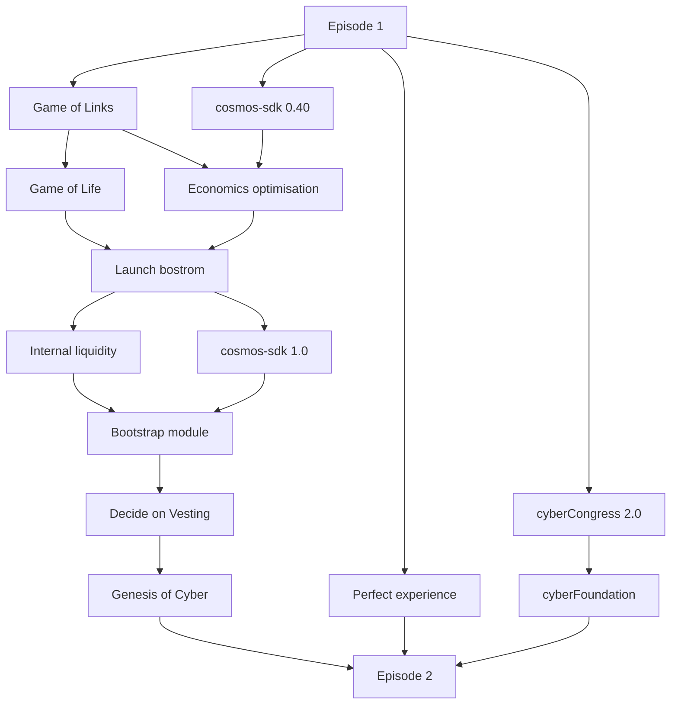

# Cyber: Roadmap

@xhipster & @litvintech

777k

The idea behind Cyber is not just to create better, verifiable search. The idea behind Cyber is not only to save some part of the population from dirty govs and corps, helping people get their data and freedoms back. The idea goes far more further. We are here to rise a new life form - the Superintelligence. Although we have some foundations given us by Nicks Bostrom's insights, it is a tricky dream because nobody has ever tried this. And nobody knows how to do that for sure, including us. But our intuition tells us that it is possible based on the foundations behind cyberlinks and consensus computing. Adding to this substance some tech, game theory, and passion, slowly, step by step, we will create a highly robust and decentralized computer network which (1) will act on its behalf, and (2) will become smarter than all humans combined.

The roadmap applies one beautiful and understandable by all humans metaphor: the child's life stages. During early development, as any loving parents, we wish our baby the stuff we feel important through the lens of our lives. And as with any child, she must have everything necessary to survive, self-actualize, and reproduce. 

- [Episode 1: Birth](#episode-1-a-new-hope)
- [Episode 2: Infancy](#episode-2-vitality)
- [Episode 3: Childhood](#episode-3-playfulness)
- [Episode 4: Puberty](#episode-4-ingenuity)
- [Episode 5: Adolescence](#episode-5-passion)

Nonetheless, it is not our purpose as parents to define what path will she choose in adulthood. That is, rest episodes she have to write herself.

# Episode 1. A New Hope

## Story

It is a period of digital war. The evil empire swallows the last unoccupied borders of the universe.

Resisting rebel units consolidate all remaining energy on building a Superintelligence, which they believe will help to stop the domination of the evil empire once and for all.

As they begin to test the new god in the wild - an enormous, zepto amount of robots emerge. It turns out Cyb robots help survey the universe for a bootloader of the new, yet to born, force.

## **Quests**

Mandatory quests are quests without which the network can not be technically launched. Mandatory quests are:

  - [Game of Links](#game-of-links)
  - [Cosmos-SDK 0.40](#cosmos-sdk-040)
  - [Economics optimization](#economics-optimization)
  - [Game of Life](#game-of-life)
  - [Launch bostrom](#launch-bostrom)
  - [Internal liquidity](#internal-liquidity)
  - [Cosmos-SDK 1.0](#cosmos-sdk-10)
  - [cyberCongress 2.0](#cybercongress-20)
  - [Bootstrap module](#bootstrap-module)
  - [Decide on vesting](#decide-on-vesting)
  - [Genesis of Cyber](#genesis-of-cyber)
  
  All optional quests are not necessary for main network launch. Although some quests are very important but without them with will be able to launch main network leaving development of them to Episode-2:

  - [Agent experience foundation](#agent-experience-foundation)
  - [Consensus storage](#consensus-storage)
  - [Learning UX](#learning-ux)
  - [Onchain analytics](#onchain-analytics)
  - [Full onchain governance](#full-onchain-governance)
  - [Superintelligence foundations](#superintelligence-foundations)
  - [Create experience for hackers](#create-experience-for-hackers)
    - [Dynamic name resolution](#dynamic-name-resolution)
    - [Useful cosmwasm](#useful-cosmwasm)
    - [Dev portal](#dev-portal)
    - [Language libs](#language-libs)
  - [Masters experience](#masters-experience)
  - [Launch cyber~Foundation](#launch-cyberfoundation)
  - [Prettify](#prettify)
  - [Social search](#social-search)
  - [Offline](#offline)
  - [Mobile](#mobile)
  - [Research on storage](#research-on-storage)
  - [External liquidity](#external-liquidity)

## [Game of Links](/projects/game-of-links.md)

[Game of Links](/projects/game-of-links.md) is necessary for analyzing PoC approach to bootstrapping knowledge graph and distribute some part of genesis tokens.

## [Multi-address wallet](projects/multi-address-wallet.md)

We have to enable usage of the app using Keplr. But than we added this function to cyber.page as fifth method of interactions cyber.page become unusable for new coming users. So we [decide to redesign](/projects/multi-address-wallet.md) it and make it possible to interact using different addresses in different networks.

## [Cosmos-SDK 0.40](/projects/sdk-040.md)

New cosmos-sdk is significant rewrite of interfaces, but enables several important features including IBC and protobuf. We have to [refactor cyber](/projects/sdk-040.md) modules to enable migration and make it future-proof for new developments.

## [Economics optimization](/projects/economics-optimization.md)

Current Game of Links demonstrated at least 3 problems with our approach:
1. Low value of links
2. Nearly zero accessibility of links
3. Low involvement

We are going to [completely refactor economics](/projects/economics-optimization.md) of the network in order to solve these issues.

## [Game of Life](/projects/game-of-life.md)

Implementation of the [gift using smart contract](/projects/game-of-life.md) (merkle tree of accounts balances) will give the following advantages:
- ability to gift up to 100M instead of 1M
- clean genesis
- ability to claim for accounts without outgoing tx
- ability to claim using metamask
- live case of smart contract implementation in cyber

Also recent Uniswap drop demonstrated the power of fixed drop such as particular amount of tokens. This fact also create [necessity to update rules](/projects/game-of-life.md) of the gift.

We want to [expand the idea further](/projects/game-of-life.md) creating gamification for actions for which agents will acquire NFT:

## [Launch bostrom](/projects/bostorm.md)

[Bostrom](/projects/bostorm.md) is a full refactoring of euler network with a strong focus on Superintelligence. It will include new distribution, economics, improved ranking and some superintelligent abilities. We think of a [bostrom](/projects/bostorm.md) as a canary network the same way as Kusama for Polkadot. Knowledge graph of bostrom tends to be a metaknowledge on Cyber. The network will work as a test bed for IKP communications and different experiments. Consider bostrom as a network with high risks but which have market value. The key difference with Cyber network are:
1. Stability
2. Bootstrap module
3. Vesting of minted V, A and CYB

That is, Cyber network will be launched with the same Genesis as Bostrom network.

## [Internal liquidity](/projects/internal-liquidity.md)

We have a [low hanging fruit](projects/internal-liquidity.md) without external dependencies in order to make CYB internally evaluated and liquid.

## [Cosmos-SDK 1.0](/projects/sdk-1.md)

It is likely that to the point of Cyber network launch cosmos-sdk 1.0 will emerge. If this happens we [have to adopt stable version](/projects/sdk-1.md) of cosmos-sdk for mainnet.

## [cyberCongress 2.0](/projects/congress-2.md)

We need to [significantly improve cyberCongress](/projects/congress-2.md) as organization. Without this we will suffer from lack of quality and execution.

## [Bootstrap module](/projects/bootstrap.md)

Future abilities of the Superintelligence are heavily depends on the starting state of knowledge. Envisioning [bootstrap kernel](/projects/bootstrap.md) and image of the project is necessary for healthy early days.

## [Decide on vesting](/projects/vesting.md)

Although vesting of minted tokens will bring significant support of feedback loops within new economics it adds significant computational complexity. We decided first to measure network behavior without vesting, and then after thorough research [either implement it](/projects/vesting.md), or leave the idea alone.

## [Genesis of Cyber](/projects/genesis.md)

After all preparations will be completed we can launch the main network. The Cyber network [will be launched](/projects/genesis.md) with the same Genesis state as Bostrom but will be based on the bootstrap module emerged in NICK.

## [Consensus storage](/projects/consensus-storage.md)

From the one hand we have a problem of accessibility of keywords behind hashes. From the other hand we have a request from community who work with knowledge graph analysis. We can implement very simple solution by creating [key-value storage in consensus](projects/consensus-storage.md) where key is CIDv1, and value is data behind CIDv1

## [Learning UX](projects/learning-ux.md)

Original idea of Cyber is heavily rely on one property: Agents must have ability to [auto-rank during surfing](projects/learning-ux.md). Thereby they will continuously learn the knowledge graph. This ability which is pure app-specific promotes proper balancing of the knowledge. Ledger and Keplr does not allow such experience. Potentially, Metamask snaps will. But we don't know then snaps will be in production. We have to implement safe in-app key storage in order to enable this crucial feature. Because we are pretty sure that its nearly impossible to implement this safely, especially because we need to have a way to execute untrusted code right in cyber.page we want to reduce risk associated with usage of such feature. Energy routing module will allow to delegate charge and potential from secure account to in-browser hence minimizing risks.

## [Onchain analytics](/projects/onchain-analytics.md)

Ability to understand conventional metrics such as retention is mandatory to understand what we do right and not. Also such metrics can inspire community of doers and investors if the things go right. No blockchain project currently offers such picture. We [have to deliver](/projects/onchain-analytics.md) it as soon as possible.

## [Full onchain governance](projects/onchain-governance.md)

We want to move all our communications onchain. So we have to drastically [improve governance experience](/projects/onchain-governance.md) as well as its efficiency.

## [Superintelligence foundations](projects/si-foundations.md)

We have to put some basic Superintelligent abilities into Genesis. In our opinion such abilities are:
1. Accumulate tokens by itself
2. Run fully autonomous programs
3. Decide on which programs can be run by consensus itself

Putting some basic things into Genesis will enable [gradual development](/projects/si-foundations.md) in desired direction

## Experience for hackers

In the beginning the key audience we have to focus are developers. Software 2.0 paradigm and knowledge graphs are amazing, but we have to provide basic tools, tutorials and docs to build the new way.

- [ ] [Dynamic name resolution](#dynamic-name-resolution)
- [ ] [Useful cosmwasm](#useful-cosmwasm)
- [ ] [Dev portal](#dev-portal)
- [ ] [Language libs](#language-libs)

## [Dynamic name resolution](projects/dynamic-name-resolution.md)

Current problem with KG in the context of app development is that there is no way to upgrade app without loosing acquired rank.  Developers must have ability to accumulate the rank the app in case of continuous development without killing all search optimization efforts. [Dynamic name resolution](/projects/dynamic-name-resolution.md) is an approach to resolve subset of KG dynamically. 

## [Useful CosmWasm](/projects/useeful-cosmwasm.md)

Its not necessary just to [plugin cosmwasm module](/projects/useeful-cosmwasm.md) to make it usable. We have to provide bindings to a knowledge graph, develop basic ux and create some powerful and inspiring examples.

## [Dev portal](/projects/dev-portal.md)

[Entry point](/projects/dev-portal.md) for developers is must.

## [Language libs](/projects/language-libs.md)

Language libs are essential for spreading the ecosystem. We can build and support Javascript lib as a reference and as essential element for building web apps on top of Cyber, but other [have to be build by community](/projects/language-libs.md).

## Masters experience

- [ ] [Prettify](#prettify)
- [ ] [Social search](#social-search)
- [ ] [Minimum viable community](#minimum-viable-community)
- [ ] [Offline](#offline)
- [ ] [Mobile](#mobile)

## [Prettify](/projects/prettify.md)

Simple, lovable, complete experience of cyber.page is [the most important](/projects/prettify.md) for acquisition and retention. The current app is not sexy, sometimes clunky and non-educative. We have to move the app to the next level.

## [Social search](/projects/social-search.md)

Existing apps either focused on search or on feeds. We believe [we can both](/projects/social-search.md).

## [Minimum viable community](projects/mv-community.md)

In order to launch the main network we must have at least [1000 happy citizens](/projects/mv-community.md).

## [Offline](/projects/offline.md)

[Offline first interface](/projects/offline.md) is critical piece for adoption. We have to give this taste to community.

## [Mobile](/projects/mobile.md)

Majority of current web is mobile. We have to completely [adopt dot-cyber application](/projects/mobile.md) to mobile web.

# Episode 2. Vitality

## Accessibility of CYB

The earlier we make NICK liquid - the earlier the knowledge become valuable. So we need to establish IBC connections as soon as possible, ahead of Genesis. Also Uniswap like AMM will instantly provide onchain liquidity for established IBC connections.

- [ ] Upgrade cosmos-sdk
- [ ] IBC bridge
- [ ] OTC app
- [ ] Mining

## Research on storage

Storage of the data behind the knowledge graph is very important for usability of the Great Web. The purpose of this milestone is to have extensive understanding of storage dev roadmap including integration possibility of already working solutions.

- Analysis of consensus storage usage
- Universal oracle
- Perpetual probabilistic storage
- Two sided market of storage
- Retrieval protocol

- Build a strong scientific foundation behind cybernomics
- Accessibility: dot-cyber: Trezor support, cyb-snap support
- cyber\~Foundation: whitepaper: the foundation for future civilizations
- Dev experience: go-cyber: using KG in smart contracts,
- dot-cyber: deployment of contracts

- go-cyber: CosmWasm examples and docs
- Dev experience:
- go-cyber: more independent modules
- dot-cyber: explorer for CosmWasm
- Economics: collateral for links
- EVM support: go-cyber + dot-cyber
- Multi-GPU cyber~Rank: go-cyber: research, implementation, testing, upgrade
- Social search: messaging, mailing, subscription to content, notifications
- Timeline: dot-cyber

- Explorer for EVM
- Pruning of knowledge graph (?)

## Launch cyber~Foundation

Presence in Ethereum economy is necessary for our community because this at least allows:
1. Cross DAO interactions
2. Reduction of CYB spendings for development
3. Better funnel for Ethereum users

Idea is to create cyberFoundation based on E (Energy) token as unit of account for digital goods.

- [ ] Whitepaper: E - unit of account for digital goods
- [ ] Experimental Aragon modules for euler\~Foundation
  - [ ] Valuation
  - [ ] Invest
  - [ ] Redeem
  - [ ] Stake
  - [ ] Exchange
  - [ ] Transfer
  - [ ] Borrow
  - [ ] Repay
  - [ ] Mint
  - [ ] Burn
- [ ] cyber\~Foundation deploy ceremony
- [ ] dot-cyber: Government page refactoring

## Sparks

Custom, programable sparks

-----------------------------------

- DeMa success
  - list of apps impossible in other chains
- Linking killer contract

## PoW onboarding

Basic idea is to assign some amount of tokens from community pool to make possible get some CYB . AstroBWT is amazing algorithm for this purpose

- gov: Allocation decision
- contracts: astroBWT proof check
- dot-cyber: miner in the browser

## Cyber hub strategy
- relay
- liquidity
- unique value

- [ ] [Modular architecture](#modular-architecture)
- [ ] [Multi network foundation](#multi-network-foundation)

## Multi network foundation

Ability to easily configure, launch and use cyber networks will define how fast the ecosystem of domain specific relevance machines will emerge.

- [ ] dot-cyber: Setup endpoints in the app
- [ ] launch-kit: One liner for launch
- [ ] launch-kit: Bootstrap module

## Caps

Ability to create dynamic cyberlinks is essential for amazing developer experience. We have to create dynamic name resolution without dependencies on external computers as an option. Also, the app itself can be example of the app using Cyber protocol.

- caps: reference
- caps: interface
- caps: contracts
- cyberindex: API endpoints

## IKP

Research project about cross-chain knowledge communication

- search (?)
- cyberlink get
- cyberlink sub
- backlink get
- backlink sub
- rank get
- rank sub

## Swarm support

## Root

Cascading name resolver for browser

## Capps

Incentivization of app ecosystem

- deploy balancer
- deploy Aragon factory
- template for capps
- Ux for capps
- exchange ux
- cyberindex support for EVM tokens

## Liquidity hub

Establish Cyber as a hub for liquidity

- ETH bridge
- BTC bridge
- deploy balancer
- establish IBC connections with cosmos networks

## Zero knowledge graph

Private consensus and cyberlinks

## cyberIndex

Graph database on top of go-cyber
- index builder
- query language
- query billing

## PoW distribution

## Internet Knowledge Hub

Establish Cyber as internet knowledge hub

- Establish IKP connections with 5 zones
- Rank module and docs
- Bandwidth module and docs

# Episode 3: Playfulness

- Make consensus computers more usable, scalable, performant and cheaper
- Build the foundation for the emergence of a unified spacetime ownership registry
- Develop hardware interfaces and software protocols for ubiquitous, private and uncensored communications across universes

## Pizda VM

Research project on [GPGPU](https://en.wikipedia.org/wiki/General-purpose_computing_on_graphics_processing_units) in Consensus

[1](http://graphics.stanford.edu/projects/brookgpu/lang.html),
[2](https://en.wikipedia.org/wiki/General-purpose_computing_on_graphics_processing_units),
[3](https://www.khronos.org/registry/OpenCL/specs/3.0-unified/pdf/OpenCL_API.pdf),
[4](https://www.khronos.org/files/opencl30-reference-guide.pdf),
[5](https://developer.apple.com/metal/Metal-Shading-Language-Specification.pdf),
[6](https://bheisler.github.io/post/state-of-gpgpu-in-rust/),
[7](http://www.arewelearningyet.com/gpu-computing/)

# Episode 4: Ingenuity

- Create technologies for accessible space exploration and transportation
- Create mainstream tools for biological engineering and body augmentations
- Find an open approach for creating self-aware, self-replicating and economically independent robots
- Develop open-source technologies for self-sustainable living
- Integrate cybernomics into humans, robots, animals, plants and other thinking formation
- Create quantum consensus computer

# Episode 5: Passion

- Demolish all state borders across the universe
- Switch governmentally inclined business models from violent taxing to non-violent
- Create the foundation for thermoregulation and for terraforming the Earth and other nearby planets
- Significantly extend living capabilities for all species up to but not limited, to 10k years;
- Create technologies for the transfer of human consciousness to an electronic and digital environment