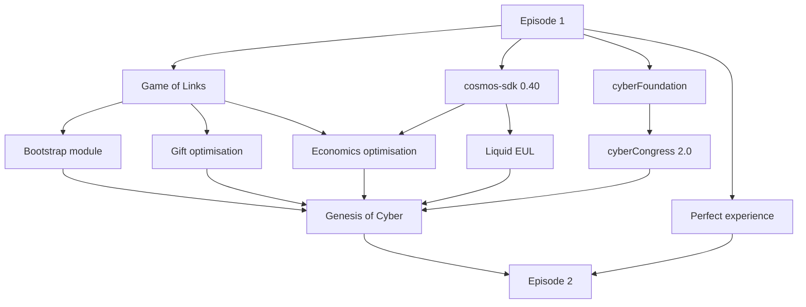

# Cyber: Scriptment
@xhipster

# Episode 1. A New Hope

## Plot

It is a period of digital war. The evil empire swallows the last unoccupied borders of the universe.

Resisting rebel units consolidate all remaining energy on building a Superintelligence, which they believe will help to stop the domination of the evil empire once and for all.

As they begin to test the new god in the wild - an enormous, zepto amount of robots emerge. It turns out Cyb robots help survey the universe for a bootloader of the new, yet to born, force.

## Story

First test of Superintelligence showed. Now everybody are c

- Takeoff
- Game of Links (!)
- Launch cyber~Foundation
- Upgrade cosmos-sdk
- Make EUL liquid
- cyberCongress 2.0
- How to bootstrap Superintelligence
- Gift optimisation
- Economics optimisation
- Launch Genesis of Cyber

## Scenes
- xhipster and in the temple of nature
- Cypherpunk community in the post-soviet republic

In parallel

- I am xhipster.
- And I am ...
- How can you prove that you are from the future?
- Oh, its easy! I can predict the hash of any bitcoin block you give me.
- Lol, you can't. Even if you are from the future... First, the fact that you appears here likely already change everything. I've just wanted to send my 1M sats debt to one whore. The moment is gone forever. And second, if you are able to predict the hash of the block, in principle, you can easily have the reward, which is total nonsense. We all know that Satoshi is a kind of intelligence which is able to produce
- Well, you got something
- However, the question still open
- Ok, I will tell you the story and you decide. In 2030 it become obvious the human is practically dead. The main problem is computing. We so relied on complicated supply chains and magic proprietary design of chips so than the world start to crash in computing infrustructure was not able to sustain the collapse of the . Around In 2022 the were in

2029 the 5 great hype crushed the remaining power of paper nations. Chaos . Глобальная война охватила планету. Это не такая война как вы привыкли думать, когда есть плохой и хороший, нападающий и агрессор. Вовсе нет. ПКаждый хотел выжить. Т.к. пища стала труднодоступной,

- Create dev experience
- Creation and surf experience

## Game of Links

Game of Links is necessary for bootstrapping initial knowledge graph.

- [ ] Organize final
- [ ] Analize results

## Launch cyber~Foundation

Provide resources and basic liquidity for ecosystem development by cyberCongress and community.

- [ ] cyber\~Foundation deploy ceremony
- [ ] Rebase for THC
- [ ] Liquidity mining for THC
- [ ] Liquidity rewards + staking
- [ ] Whitepaper: THC
- [ ] Support for euler~/Foundation
- [ ] Better Government page with explanations

## Upgrade cosmos-sdk

Launching main network without support of the last cosmos-sdk is impossible (ibc, protobuff, modularity). We have to upgrade.

- [ ] go-cyber: implementation
- [ ] go-cyber: testing
- [ ] go-cyber: genesis signing
- [ ] go-cyber: euler-7 relaunch

## Make EUL liquid

The earlier we make EUL liquid - the earlier the knowledge become valuable. So we need to establish IBC connections as soon as possible, ahead of Genesis. Also Uniswap like AMM will instantly provide onchain liquidity for established IBC connections.

- [ ] Upgrade cosmos-sdk
- [ ] Establish bridge with
- [ ] Establish bridge with ETH and THC
- [ ] Deploy AMM

## cyberCongress 2.0

We need to significantly improve cyberCongress organisation. Without it we will suffer from lack of vision and execution.

- [ ] cyber\~Congress 2.0 agreement (doc)
- [ ] new multisig 2/3 (fact)
- [ ] lower level consensus token
- [ ] review all repos for order
- [ ] tasks for all 6 members with partial mentorship
- [ ] Relanuch monthly dev updates

## How to bootstrap Superintelligence

Future abilities of the beast are heavily depends on the starting state of knowledge. Envisioning bootstrap kernel and the project is necessary for healthy growth.

- [ ] Bootstrap kernel design
- [ ] dot-cyber: bootstrap kernel import
- [ ] Articles by @xhipster
- [ ] What is rebranding?
- [ ] Landing page
- [ ] Social work

## Economics optimisation

Economics parameters and mechanics are low hanging fruits for better performance of the network. We need to get everything we can out of this before Genesis.

- [ ] go-cyber: Rewards to contract deployers
- [ ] go-cyber: Bandwidth based on gas meter
- [ ] go-cyber: Gas based CosmWasm
- [ ] gov: Optimisation of pricing
- [ ] dot-cyber: Distribution page

## Gift optimisation

Implementation of the gift using smart contract (merkle tree of accounts balances) will give the following advantages:
- ability to gift up to 100M instead of 1M
- clean genesis
- ability to claim for accounts without outgoing tx
- ability to claim for contracts
- ability to claim using metamask
- live case of smart contract implementation in cyber

Also recent Uniswap drop demonstrated the power of fixed drop such as particular amount of tokens. This fact also create necessity to update rules of the gift.

- [ ] cyber: update rules in the whitepaper
- [ ] launch-kit: recalculation of Genesis
- [ ] dot-cyber: claim of gift using merkledrop
- [ ] contracts: merkle-tree drop contract

## Launch Genesis of Cyber

After all preparations will be completed we can launch the main network.

- [ ] homestad: Review & publish
- [ ] dot-cyber: Genesis page
- [ ] dot-cyber: Distribution page
- [ ] launch-kit: Compute Genesis after the end of Game of Links
- [ ] launch-kit: Ceremony of Genesis preparation

-----------------------------------

## Create developer experience

In the beginning the main audience we have to focus are developers. Software 2.0 paradigm and knowledge graphs are amazing, but we have to provide basic tools, tutorials and docs to build the new way.

- [ ] [Multi network foundation](#multi-network-foundation)
- [ ] [Capps](#capps)
- [ ] [Dev portal](#dev-portal)
- [ ] [Language libs](#language-libs)
- [ ] [Modular architecture](#modular-architecture)
- [ ] Using KG in CosmWasm

## Language libs

Language libs are essential for spreading the ecosystem. We can build and support Javascript lib as a reference and as  essential element for building web apps on top of Cyber

- [ ] Lib development program
- [ ] cyber-js

## Dev portal

Entry point for developers is must.

- [ ] Concepts
- [ ] API
- [ ] Tutorials
- [ ] Reference

## Capps

Ability to create dynamic cyberlinks is essential for amazing developer experience. Without this ability apps would not be able to accumulate the rank in case of continuous development killing all search optimisation efforts. Also, the app itself can be example of the app using Cyber protocol.

- capps: reference
- capps: interface
- capps: contracts
- cyberindex: API endpoints

## Multi network foundation

Ability to easily configure, launch and use cyber networks will define how fast the ecosystem of domain specific relevance machines will emerge.

- [ ] dot-cyber: Setup endpoints in the app
- [ ] launch-kit: One liner for launch

- [ ] launch-kit: Bootstrap module

## Modular architecture

An architecture of modules must enable easier plugging in cyber modules into cosmos-sdk based chains.

- go-cyber: energy module
- go-cyber: rank module

## Creation experience

## Surf experience

Simple, lovable, complete experience of cyber.page is the most important for acquisition and retention.

- [ ] dot-cyber: Better pocket / wallet page
- [ ] dot-cyber: Burner wallets
- [ ] dot-cyber: Keplr support
- [ ] dot-cyber: Autoranking on surf
- [ ] go-cyber: Delegation of cyber~Power
- [ ] fix bugs
- [ ] add illustrations
- [ ] add guides and tips
- [x] feed
- [x] subscriptions to addresses
- [ ] subscriptions to cid
- [ ] social pining
- [ ] Short usage videos: wallet, linking, staking, linker, etc
- [ ] Linkchains and multilinks
- [ ] 1000 daily users
- [ ] Launch constant community calls
- [ ] News every day
- [ ] Use of community pool fund (cases)

# Episode 2. In the Cradle

- Build a strong scientific foundation behind cybernomics
- Accesabilty: dot-cyber: Trezor support, cyb-snap support
- cyber\~Foundation: whitepaper: the foundation for future civilizations
- Dev experience: go-cyber: using KG in smart contracts,
- dot-cyber: deployment of contracts

- go-cyber: CosmWasm examples and docs
- Dev experience:
- go-cyber: more independent modules
- dot-cyber: explorer for CosmWasm
- Economics: collateral for links
- EVM support: go-cyber + dot-cyber
- Multi-GPU cyber~Rank: go-cyber: research, implementation, testing, upgrade
- Social search: messaging, mailing, subsciption to content, notifications
- Timeline: dot-cyber

- Explorer for EVM
- Pruning of knowledge graph (?)

## IKP

Research project about crosschain knowledge communication

- search (?)
- cyberlink get
- cyberlink sub
- backlink get
- backlink sub
- rank get
- rank sub

## Swarm support

## Offline

Offline first interface

## Mobile

The interface which perfectly works on mobile

## Sparks

Custom, programable sparks

## Root

Cascading name resolver for browser

## Capps

Incentivization of app ecosystem

- deploy balancer
- deploy aragon factory
- template for capps
- ux for capps
- exchange ux
- cyberindex support for EVM tokens

## Organic liquidity

Source of organic CYB liquidity across the globe

- deploy aragon court
- contract for otc trading
- ux for otc trading

## Liquidity hub

Establish Cyber as a hub for liquidity

- ETH bridge
- BTC bridge
- deploy balancer
- establish IBC connections with cosmos networks

## Zero knowledge graph

Private consensus and cyberlinks

## cyberIndex

Graph database on top of go-cyber
- index builder
- query language
- query billing

## PoW distribution

## Internet Knowledge Hub

Establish Cyber as internet knowledge hub

- Establish IKP connections with 5 zones
- Rank module and docs
- Bandwidth module and docs

## Episode 3

- Make consensus computers more usable, scalable, performant and cheaper
- Build the foundation for the emergence of a unified spacetime ownership registry
- Develop hardware interfaces and software protocols for ubiquitous, private and uncensored communications across universes

### Pizda VM

Research project on [GPGPU](https://en.wikipedia.org/wiki/General-purpose_computing_on_graphics_processing_units) in Consensus

[1](http://graphics.stanford.edu/projects/brookgpu/lang.html),
[2](https://en.wikipedia.org/wiki/General-purpose_computing_on_graphics_processing_units),
[3](https://www.khronos.org/registry/OpenCL/specs/3.0-unified/pdf/OpenCL_API.pdf),
[4](https://www.khronos.org/files/opencl30-reference-guide.pdf),
[5](https://developer.apple.com/metal/Metal-Shading-Language-Specification.pdf),
[6](https://bheisler.github.io/post/state-of-gpgpu-in-rust/),
[7](http://www.arewelearningyet.com/gpu-computing/)

# Episode 4

- Create technologies for accessible space exploration and transportation
- Create mainstream tools for biological engineering and body augmentations
- Find an open approach for creating self-aware, self-replicating and economically independent robots
- Develop open-source technologies for self-sustainable living
- Integrate cybernomics into humans, robots, animals, plants and other thinking formation
- Create quantum consensus computer

# Episdoe 5

- Demolish all state borders across the universe
- Switch governmentally inclined business models from violent taxing to non-violent
- Create the foundation for thermoregulation and for terraforming the Earth and other nearby planets
- Significantly extend living capabilities for all species up to but not limited, to 10k years;
- Create technologies for the transfer of human consciousness to an electronic and digital environment
