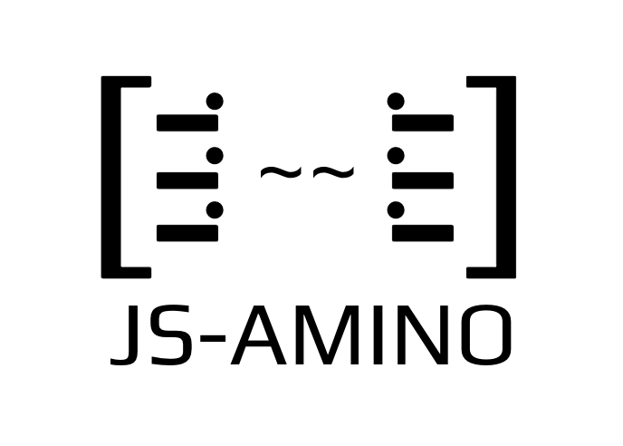

<h1 align="center">
  </a>
</h1>

<h3 align="center">An Implementation of Amino for clients with Javascript</h3>
<div align="center">
  Current state: 1.0.0 First major public release
</div>

<br />


<div align="center">


</div>
<br/>
<div align="center">
<a href="https://circleci.com/gh/cybercongress/js-amino/tree/master"></a>
<a href='https://coveralls.io/github/cybercongress/js-amino?branch=30-add-ci-components-for-release'></a>
</div>
<br/>
<div align="center">

  
  <a href="https://t.me/fuckgoogle"> </a>
  
</div>
<br/>

[](https://npmjs.org/package/@cybercongress/js-amino)


<div align="center">
  <sub>Built and maintenance by
  <a href="https://github.com/cybercongress/js-amino/graphs/contributors">
    contributors
  </a>
  and
  <a href="https://twitter.com/cyber_devs">cyber•Congress</a>
</div>

For more information spec, please refer: https://github.com/tendermint/go-amino

## Features:
1. Encode and Decode simple types: ints 8/16/32/64, booleans, strings, bytes
2. Encode and Decode recursive Structs and Interfaces, Arrays
3. Encode simple Time data

## Install From NPM:
Run `npm i js-amino`

## Install From Source

1. Run `npm install`

## Running The Examples

1. `cd src/examples`
2. `go get`
3. Run examples, e. g. in Go: `go run string.go` and in JS `node string.js`

## Running The Unit Test

1. Run `npm test`

## To Do:
1. Full support for Time encoding and decoding
2. More Unit test
3. Benchmarking

## Gitcoin program

We want to pay you for your contribution! We constantly fund our issues on [gitcoin](https://gitcoin.co/profile/cybercongress) and attach good description for them with project state and user stories. We try to answer to comments regular in issues and in our [devChat](https://t.me/fuckgoogle).

<a href="https://gitcoin.co/explorer?q=js-amino">
    
</a>

## Our cosmos ecosystem initiative

## Usage (MsgMultiSend example)

```js
const {
    Codec,
    FieldOptions,
    TypeFactory,
    Utils,
    Types,
    WireTypes,
} = require('../index');

let StdTx = TypeFactory.create('StdTx', [{
        name: 'msg',
        type: Types.ArrayInterface,
    },
    {
        name: 'fee',
        type: Types.Struct,
    },
    {
        name: 'signatures',
        type: Types.ArrayStruct,
    },
    {
        name: 'memo',
        type: Types.String,
    },
]);

let MsgMultiSend = TypeFactory.create('MsgMultiSend', [{
        name: "inputs",
        type: Types.ArrayStruct
    },
    {
        name: "outputs",
        type: Types.ArrayStruct
    }
]);

let Coin = TypeFactory.create('coin', [{
        name: 'denom',
        type: Types.String,
    },
    {
        name: 'amount',
        type: Types.String,
    }
]);

let Input = TypeFactory.create('input', [{
        name: 'address',
        type: Types.String,
    },
    {
        name: 'coins',
        type: Types.ArrayStruct,
    }
]);

let Output = TypeFactory.create('output', [{
        name: 'address',
        type: Types.String,
    },
    {
        name: 'coins',
        type: Types.ArrayStruct,
    }
]);

let Fee = TypeFactory.create('fee', [{
        name: 'amount',
        type: Types.ArrayStruct,
    },
    {
        name: 'gas',
        type: Types.Int64,
    }
]);

let PubKeySecp256k1 = TypeFactory.create('PubKeySecp256k1', [{
    name: 's',
    type: Types.ByteSlice,
}], Types.ByteSlice)

let Signature = TypeFactory.create('signature', [{
        name: 'pub_key',
        type: Types.Interface,
    },
    {
        name: 'signature',
        type: Types.ByteSlice,
    }
])

let codec = new Codec();

codec.registerConcrete(new StdTx(), 'auth/StdTx', {});
codec.registerConcrete(new MsgMultiSend(), 'cosmos-sdk/MsgMultiSend', {});
codec.registerConcrete(new PubKeySecp256k1(), 'tendermint/PubKeySecp256k1', {});

let coin = new Coin('cyb', "10000");

let addressFrom = [ 59,58,243,13,132,163,164,202,233,7,236,93,136,166,181,175,236,69,48,186 ]
let addressTo = [ 94,222,114,42,196,107,51,203,139,142,219,243,137,60,54,250,139,153,46,168 ]

let input = new Input(addressFrom, [coin]);
let output = new Output(addressTo, [coin]);
let sendMultiMsg = new MsgMultiSend([input], [output]);
let fee = new Fee([new Coin('cyb', '0')], 200000);

let pubKey = new PubKeySecp256k1([2,27,24,0,255,96,147,21,64,29,132,192,108,219,59,134,206,201,126,224,63,160,24,236,170,124,164,95,43,180,6,246,250]);
let signature = [165,76,109,61,53,129,190,147,52,224,34,106,235,208,224,36,190,25,204,36,226,129,97,109,35,130,217,228,144,106,10,134,14,183,95,252,219,235,22,92,37,53,3,89,111,173,12,158,146,71,82,113,236,241,170,121,217,20,236,23,131,35,80,29];

let sig = new Signature(pubKey, signature);
let stdTx = new StdTx([sendMultiMsg], fee, [sig], 'elonmusk');

let jsonTx = codec.marshalJson(stdTx);
let decodedDataTx = new StdTx();

console.log("Binary stdTx:\n", (codec.marshalBinary(stdTx)).toString());
console.log("Json:\n", jsonTx);
codec.unMarshalBinary(codec.marshalBinary(stdTx), decodedDataTx);
console.log("Decoded data:\n", decodedDataTx.JsObject());
```

```js
Binary stdTx:
  220,1,240,98,93,238,10,80,194,104,154,209,10,36,10,20,59,58,243,13,132,163,164,202,233,7,236,93,136,166,181,175,236,69,48,186,18,12,10,3,99,121,98,18,5,49,48,48,48,48,18,36,10,20,94,222,114,42,196,107,51,203,139,142,219,243,137,60,54,250,139,153,46,168,18,12,10,3,99,121,98,18,5,49,48,48,48,48,18,14,10,8,10,3,99,121,98,18,1,48,16,192,154,12,26,106,10,38,235,90,233,135,33,2,27,24,0,255,96,147,21,64,29,132,192,108,219,59,134,206,201,126,224,63,160,24,236,170,124,164,95,43,180,6,246,250,18,64,165,76,109,61,53,129,190,147,52,224,34,106,235,208,224,36,190,25,204,36,226,129,97,109,35,130,217,228,144,106,10,134,14,183,95,252,219,235,22,92,37,53,3,89,111,173,12,158,146,71,82,113,236,241,170,121,217,20,236,23,131,35,80,29,34,8,101,108,111,110,109,117,115,107

Json:
 {"type":"auth/StdTx","value":{"msg":[{"type":"cosmos-sdk/MsgMultiSend","value":{"inputs":[{"address":[59,58,243,13,132,163,164,202,233,7,236,93,136,166,181,175,236,69,48,186],"coins":[{"denom":"cyb","amount":"10000"}]}],"outputs":[{"address":[94,222,114,42,196,107,51,203,139,142,219,243,137,60,54,250,139,153,46,168],"coins":[{"denom":"cyb","amount":"10000"}]}]}}],"fee":{"amount":[{"denom":"cyb","amount":"0"}],"gas":"200000"},"signatures":[{"pub_key":{"type":"tendermint/PubKeySecp256k1","value":"AhsYAP9gkxVAHYTAbNs7hs7JfuA/oBjsqnykXyu0Bvb6"},"signature":"pUxtPTWBvpM04CJq69DgJL4ZzCTigWFtI4LZ5JBqCoYOt1/82+sWXCU1A1lvrQyekkdScezxqnnZFOwXgyNQHQ=="}],"memo":"elonmusk"}}

Decoded data:
 { msg: [ { inputs: [Array], outputs: [Array] } ],
  fee: { amount: [ [Object] ], gas: 200000 },
  signatures: [ { pub_key: [Array], signature: [Array] } ],
  memo: 'elonmusk' }
```

## Contributing Guide

Contribution are welcome! Please read this [guide](https://github.com/cybercongress/js-amino/blob/master/CONTRIBUTING.md) before contributing.

## Contributors

Thanks goes to these wonderful people ([emoji key](https://allcontributors.org/docs/en/emoji-key)):

<!-- ALL-CONTRIBUTORS-LIST:START - Do not remove or modify this section -->
<!-- prettier-ignore -->
<table><tr><td align="center"><a href="https://github.com/Thunnini"><br /><sub><b>JungHwan Tony Yun</b></sub></a><br /><a href="https://github.com/cybercongress/js-amino/commits?author=Thunnini" title="Code">💻</a></td><td align="center"><a href="https://www.linkedin.com/in/do-ngoc-tan-64260072/"><br /><sub><b>TanNgocDo</b></sub></a><br /><a href="https://github.com/cybercongress/js-amino/commits?author=TanNgocDo" title="Code">💻</a> <a href="#maintenance-TanNgocDo" title="Maintenance">🚧</a></td><td align="center"><a href="https://github.com/philipstanislaus"><br /><sub><b>philipstanislaus</b></sub></a><br /><a href="https://github.com/cybercongress/js-amino/commits?author=philipstanislaus" title="Documentation">📖</a></td><td align="center"><a href="https://github.com/SaveTheAles"><br /><sub><b>Ales Puchilo</b></sub></a><br /><a href="#projectManagement-SaveTheAles" title="Project Management">📆</a></td><td align="center"><a href="https://github.com/litvintech"><br /><sub><b>Valery Litvin</b></sub></a><br /><a href="https://github.com/cybercongress/js-amino/commits?author=litvintech" title="Code">💻</a></td><td align="center"><a href="https://github.com/cyberadmin"><br /><sub><b>Cyber Admin</b></sub></a><br /><a href="https://github.com/cybercongress/js-amino/commits?author=cyberadmin" title="Documentation">📖</a></td><td align="center"><a href="https://github.com/ethanfrey"><br /><sub><b>Ethan Frey</b></sub></a><br /><a href="https://github.com/cybercongress/js-amino/commits?author=ethanfrey" title="Tests">⚠️</a></td></tr></table>

<!-- ALL-CONTRIBUTORS-LIST:END -->

This project follows the [all-contributors](https://github.com/all-contributors/all-contributors) specification. Contributions of any kind welcome!


## License

Code are licensed under [MIT](./LICENSE) license by [contributors](https://github.com/cybercongress/js-amino/graphs/contributors)
