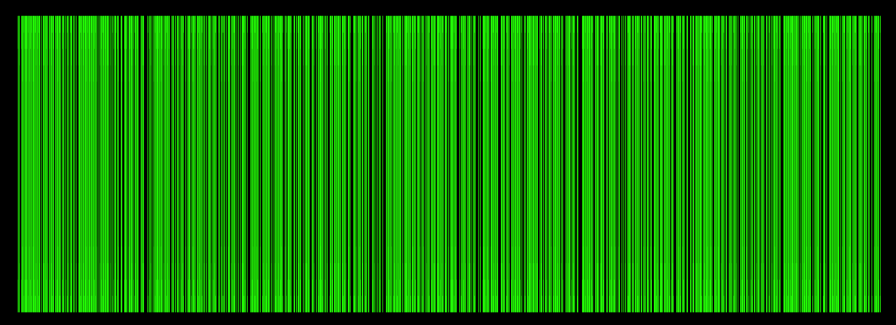
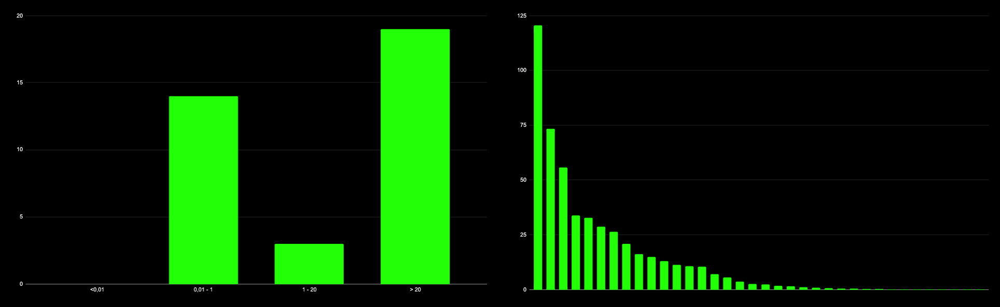
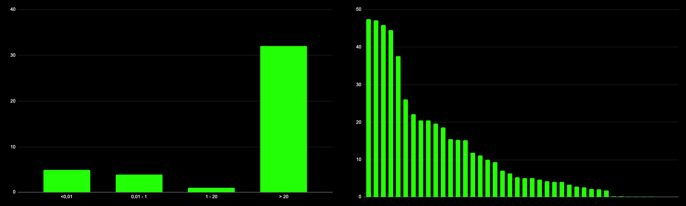

# TL;DR 

The Game of Links started at the end of December 2019 and finished on June 11th at block height 6,200,000 of the `euler-6` network.

There are no analogs by complexity and action coverage to this Game. The Game was involving players with a very simple goal: win as many tokens as possible. But the design of the Game helped to load the network with cyberlinks, showed real value of the cyberlinks to the Graph building, helped to find devs and projects critically important for the Graph, and got the partnership with them. It helped to find bugs and to clarify params in the network and attracted the community.

One of the goals of the Game is involvement early adopters and tokens distribution to them. The joining to the Game didn't require KYC, face control, captchas, or whatever. It fully corresponds to the cyber\~Congress values.

To the `cyber` network this Game showed possible attack vectors to the Graph, real value of cyberlinks, unknown bugs. Also, it was a huge step for understanding how UI/UX should go in apps on top of the Graph.

The distribution completed on 13.33% out of desireable, but it completed only on strong, quality community. It means there is more than 20 TCYBs was distributed and this is more than 2% out of Genesis supply.

The cyber\~Congress team want to say "thank you a lot guys" to each hero and master who joined us on this difficult way the Great Web building. We're ready for the next steps and hope you stay with us.

# Intro

The main goal of the Game of Links participants was to win as many tokens as possible, from cyber\~Congress.

The key idea behind the Game of Links is to establish a starting value of relevance for the knowledge graph. It is crucial for getting quality search results from the inception of the network. All the disciplines were an integral part of the preparation and testing of the network before the launch of the `bostrom` network and the mainnet.

The goals was defined according to the key idea:

- To distribute 10% of CYB tokens to the donors who will participate in the takeoff donation round

- To distribute up to 5% of CYB tokens to the participants of the 7 disciplines of the game, depending on how many tokens participants win against cyber\~Congress

- To carry out publicly incentivized testing of [go-cyber](https://github.com/cybercongress/go-cyber) and [cyber\~Foundation](https://github.com/cybercongress/foundation) before the launch of the mainnet

Anyone could have joined the Game by getting tokens with preferred or available options such as:

- [gift]()
- [takeoff round]()
- [GOL auction]()
- [port]() 
- [cyberbot]()

Not one of the mentioned options didn't require KYC, face control, captchas, or whatever. It fully corresponds to the cyber\~Congress values.

For 17 months of the Game, we faced network bugs, minor distribution issues, and a few prolongs. All issues were transparent and were get resolve with the community by submitting network proposals. The cyber\~Congress team appreciates the participation of the community in the network government. Also, it is awesome to recognize daily community increases and involvement.

This report contains the Game of Links stats, current distribution, and conclusion about the Game of Links. Enjoy!

# Distribution

The distribution of the Game was depend on the takeoff donation round and was to be 15% of the Genesis supply. The [result]() of takeoff donation round was 5% of target and this is obviously influenced on the final distribution: only 12,1 TCYBs out of 100 was won in the takeoff and 2 TCYBs of 38 in the takeoff depended disciplines.

The [minor changes]() was proposed for the community inside the depended on takeoff disciplines to equalize them between heroes and masters.

The final distribution of the Game got available only after the last block of the game. Here is summary table:

| Discipline | GCYBs was available| % supply | GCYBs won | % supply|
| :--- | ---:| ---:|---:|---:|
| takeoff | 100,000 | 10.00 | 12,141 | 1.21 |
| relevance | 20,000| 2.00 | 500 | 0.05 |
| load | 10,000| 1.00 | 500 | 0.05 |
| delegation | 5,000 | 0.50 | 500 | 0.05 |
| lifetime | 3,000 | 0.3 | 500 | 0.05 |
| full validator set | 5,000 | 0.50 | 0 | 0.00 |
| euler-4 rewards | 5,000 | 0.50 | 5,000 | 0.50 |
| community pool | 2,000 | 0.20 | 1,240 | 0.12 |
|**sum**| 150,000 | 15.00 | 20,381 | 2.04 |

The `pre-bostrom` distribution is different `bostrom` only for validators rewards during `pre-bostrom` validating.

The current distribution provided below, 70% is a [gift ](), 10% is a government (including the community pool and euler\~Foundation), 17.96% goes to cyber\~Congress (including port, pre-euler fundraisers, inventors, etc.), and 2.04% goes to Game of Links participants:

# Disciplines

There were 7 disciplines that were subdivided further into 2 different types: dependent on takeoff donations and independent of takeoff donations. We will not go into `euler-4` and `full validator set` disciplines cause `euler-4` has been [described]() already. The `full validator set` didn't play this game cause didn't meet the minimal terms such as getting 42 active validators in a 10,000 block period.

## Relevance

Let's start with the most difficult discipline of the Game. This discipline reflects the key idea of the Game of Links - building the knowledge Graph. The relevance discipline shows the top content of the Graph that means the most important particles in the Graph. The availability of content is very important that why:

> Only retrievable CIDs take part in the Game

For calculating rewards of this discipline the top 1000 of particles (cids) [was tested]() on accessibility throw 3 public IPFS gateways, including `ipfs.io`. Each cid was tested 10 times with timeout 360 seconds.

There are 749 particles responded the content. The availability signal is on the pic below.

Mostly (713 particles) there are pdf articles in physics, maths, computer sience, biology, bioinformatics, astronomy, medicine and etc. Then (30) are strings, only 5 are pics, and one md file. The main reason for this top are bots were launched by masters for crawling and submitting cyberlinks with scientific articles from arxiv.org.

The most ranked CID is string `class`. On the second place pdf article `The extremely low-metallicity tail of the Sculptor dwarf spheroidal galaxy`, on the thrid is string again `united states`.

10 of the top 15 CIDs are [an experiment](https://github.com/Snedashkovsky/knowledge_graph_research) was provided by Sergey Nedashkovsky where he researches the Graph by attack the cyber algorithm.

The first 10 string CIDs excluding the experiment are:
class, united states, city, japan, canada, property, thing, england, list of latin words with english derivatives, united kingdom

All pic are photos from the cyber Academy events.

There are 36 unique addresses took a part in this discipline. The rewards distribution and the histogram provided below.

The amount of users who got less than 20 GCYBs almost equal the amount of users who get more than 20. The 1st place address won by a landslide. It means this address holds most particles in the top. The distribution looks like power law and seems like expected.

The main conclusion of this discipline is that cyberlinks have to be expensive. That will lead to improving the Graph building quality and will defend the Graph from those kinds of attacks and bot attacks in general.

## Load

This discipline was created to load the network with cyberlinks from different nodes for monitoring the network behavior with different loads. Due to this, we detected a [critical bug]() in high load periods. After we discovered this bug in the network,  the continuations of the discipline carried no logic for the development of the network, graph, etc. The community closed this discipline on block height 3,638,501 by the text [proposal #28]().

For calculating rewards was provided a [script]() that collects all cyberlinks from 1 to 3,638,501 block heights. The karma for cyberlinks was changing from 0 to 4, according to the network load, but 0 values were changed to 1 by the script because 0 karma value is impossible. It was a minor bug in network API that fixed in the reward script.

There are 74 unique addresses took part in that discipline. Here the result is less beautiful as before, cause of one address was linking like a man possessed. Some addresses tried to catch piece of pie but finally the result is as expected. More than one-half of the rewards gets crazy linker :)

The load discipline wasn't bringing a lot of value to the Graph building but the value exactly load-testing the network IRL.

## Delegation and Lifetime

Those disciplines are about earning your validators' reputation by having an efficient infrastructure and providing a constant lifetime. This works as a promotion of your services to the early community. They are grouped in one section because they bring similar values.

All calculations are based on [cyberindex-euler indexer](). Also, it should be noted the `lifetime` discipline includes not only the `euler-6` precommits, but `euler-5` according to the [migration protocol]().

There are 42(!) validators took part in the delegation discipline. 32 validators got more than 20 GCYBs, another 10 less cause of they were in a `unbonded` status mostly till the network runs. Nice distribution, no comments.

There are 57 validators took part in the lifetime discipline during `euler-5` and `euler-6` testnets. 41 validators got more than 20 GCYBs. The different amount of validators in comparison with delegation discipline cause of someone change the operator address, someone stopped to support the next version of the network.
Anyway, delegation and lifetime disciplines have the most beautiful distribution pictures. The cyber\~Congress team appreciate all responsible validators for that.

## Community pool

During the `euler` testnets, we expected some experiments with governance from the community. All of the governance decisions of the community pool spend during the testnet, will be migrated to `bostrom` and `cyber` networks.

With this discipline was get partnerships between the Graph and [Confio](), [Keplr](), [Cosmos-cap]() teams. Those partnerships have and will be brought value to future Graph development. Also, the [cyber gift research]() was developed by Sergey Nedashkovskiy that really improved the drop mechanisms for different types of blockchain communities. Moreover, a lot of community members came to the `fuckgoogle` community cause of the [evangelism program]() by Sergey Simanovskiy and less by the video bounty program by Posthuman.

In the moment of rewards calculating the cyber\~Congress team decided to add additional 0.01 GCYB to each address with reward less than 1 GCYB cause of to provide availability to link in a future networks.

There are 207 agents took part in the community pool discipline. The distribution is uneven cause of it's manual. The addresses fall into two groups:

- Group with agents who bring a significant value to the project (Nedashkovskiy, Ethan from Confio,  Keplr team, etc.)
- Bounty hunters group

# GOL holders

For ERC20 GOL holders was accepted [the proposal]() to allocate network main tokens of `bostrom` and `cyber` in 1 to 1 proportion.

This option will be available as soon as bridges will have developed. As a result, the GOL holders can change their tokens to network tokens in 1 to 1 and vice-versa if tokens available in the bridge liquidity pool.

# Port

For the Port visitors was prepared the migration protocol.

Port will be working with `pre-bostrom`, `bostrom`, and `cyber` networks and any port visitor will get tokens of the current network according to the port distribution rules. Port will have launched in any network as soon as the software be able to send tokens.

At the current moment, more than 500 ETHs were donated, which lead the project market cap to 458019 ETHs.

# Conclusion

The distribution in PoS networks is a over complex issue. The distribution games must be a part of the future networks development. The Game of Links was the first game with such complexity. Not all things was as expected but this Game is a good example how distribution should go according to principles and values of opensourse and blockchain communities, such as transparent, trustless, privacy, etc.

To the `cyber` network this Game showed possible attack vectors to the Graph, real value of cyberlinks, unknown bugs. Also, it was a huge step for understanding how UI/UX should go in apps on top of the Graph.

The distribution completed on 13.33% out of desireable, but it completed only on strong, quality community.

There are 383 addresses took part in the Game of Links (424 if include takeoff). Unfortunately, 30 addresses got less than 1 MCYB, but in general the distribution happened by agent activity.

The cyber\~Congress team want to say "thank you a lot guys" to each hero and master who joined us on this difficult way the Great Web building. We're ready for the next steps and hope you stay with us.

Fuckgoogle!

# Points of truth

ipfs hashes here of all .csv files

# References

1.
2.
3.