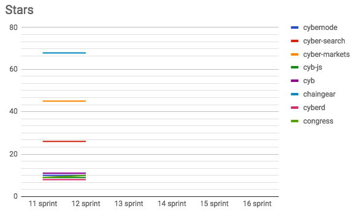
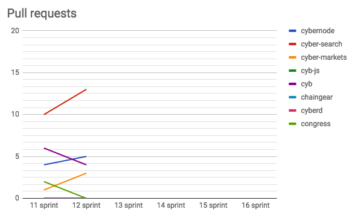

# Sprint 12 by cyber•Search
Start: 2018-06-03

End: 2018-06-16

### Сonclusion
---
Progress till MVP is 25.00%. One issue was closed with gitcoin. Cyber-search project is very closed to MVP. Four issues was funded at gitcoin.

### Changelog
---
##### [cybernode](https://github.com/cybercongress/cybernode)
##### [cyber-search](https://github.com/cybercongress/cyber-search)
[[0.6.0] - Bitcoin mempool. Improve bitcoin pump performance.](https://github.com/cybercongress/cyber-search/blob/master/CHANGELOG.md#060---bitcoin-mempool-improve-bitcoin-pump-performance)
##### [cyber-markets](https://github.com/cybercongress/cyber-markets)
[[0.4.0] - Storer component](https://github.com/cybercongress/cyber-markets/blob/master/CHANGELOG.md#040-2018-06-08)
##### [cyb-js](https://github.com/cybercongress/cyb-js)
##### [cyb](https://github.com/cybercongress/cyb)
##### [chaingear](https://github.com/cybercongress/chaingear)
##### [cyberd](https://github.com/cybercongress/cyberd)
##### [congress](https://github.com/cybercongress/congress)
##### [library](https://github.com/cybercongress/Library)

### Developers metrics
---
##### Epics done:
- [Custom {chainName} support cyber-search#102](https://github.com/cybercongress/cyber-search/issues/102)

##### Epics next sprint TODO:

- [Unit/Integration Testing cyber-search#179](https://github.com/cybercongress/cyber-search/issues/179)
- [Cleanup docs congress#34](https://github.com/cybercongress/congress/issues/34)
- [Browser shell cyb#105](https://github.com/cybercongress/cyb/issues/105)
- [Main page cyb#108](https://github.com/cybercongress/cyb/issues/108)
- [Kafka Replication cyber-search#182](https://github.com/cybercongress/cyber-search/issues/182)
- [Chaingear app chaingear#109](https://github.com/cybercongress/cyb/issues/109)

##### Till MVP progress is 25,00% (`done epics amount / epics amount`)

Burndown | Storypoints done
:---: | :---:
 | 121

Stars | Forks | PRs
:---: | :---: |:---:
 |  | 

##### KPI's

- cybernode: $$$ amount of pumps & dumps;

- cyber-search: 571339108 TX's in index;

- cyber-markets: $$$ trades in index (tokens);

- cyb-js: $$$ `npm` installs;

- cyb: $$$ apps + $$$ user's TX's;

- chaingear: $$$ registries total revenue;

- cyberd: $$$ chains amount

- congress: valuation;

- library: $$$ of papers;

##### Community:

- [Telegram channel](https://t.me/fuckgoogle): 0 subscribers;
- [Telegram devChat](https://t.me/fuckgoogle): 0 subscribers;
- [Steemit](): 0 subscribers;
- [Medium](https://medium.com/cyber-search): 0 subscribers;
- [Reddit](): 0 subscribers;
- [Twitter](): 0 subscribers;
- [YouTube](): 0 subscribers;

##### Gitcoin Community:

Four issues was funded at gitcoin.

**Closed:**

[Make Circle Ci docker builds cacheable cyber-search#184](https://github.com/cybercongress/cyber-search/issues/184)

**Open:**

[BTC Supply Service cyber-search#194](https://github.com/cybercongress/cyber-search/issues/194)

[Ethereum: Store uncles full data alongside with block cyber-search#187](https://github.com/cybercongress/cyber-search/issues/187)

[Ethereum block and uncles rewards should be calculated by block traces cyber-search#185](https://github.com/cybercongress/cyber-search/issues/185)
