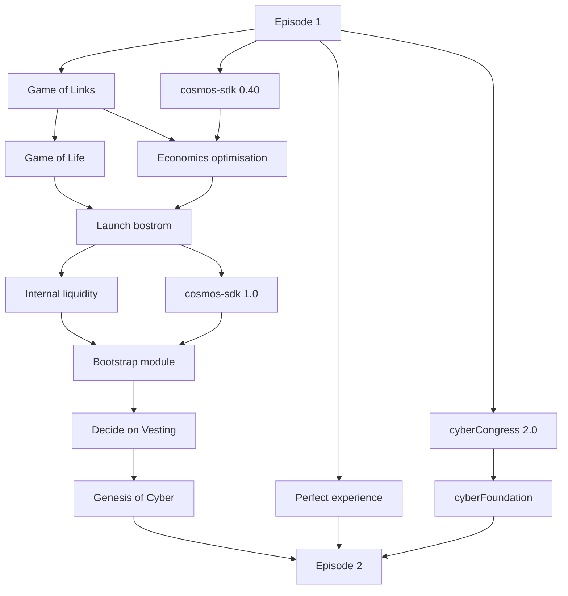

## **Quests**

## Port

Unify experience of landing to Cyber. The port allows to claim gift and get CYB in Genesis

## [Prettify](/projects/prettify.md)

Simple, lovable, complete experience of cyber.page is [the most important](/projects/prettify.md) for acquisition and retention. The current app is not sexy, sometimes clunky and non-educative. We have to move the app to the next level.

- Knowledge graph fixes: add block, link count, fix rank

- Gas fee discount
- Amper and Volt Staking to particles + 
- BLAS
- 